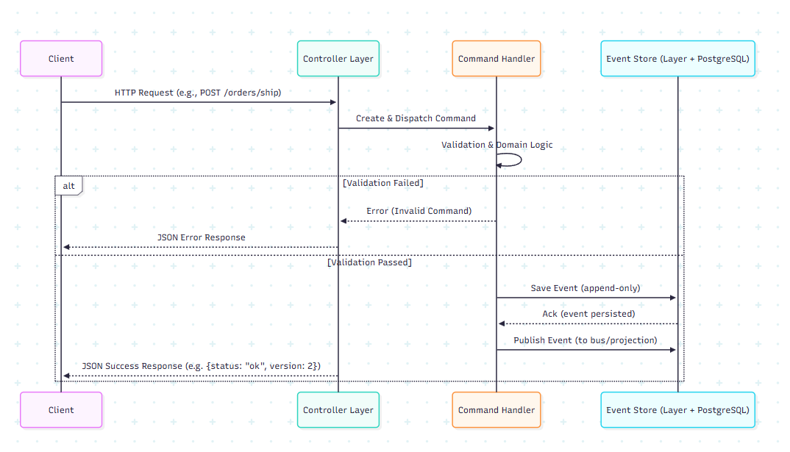
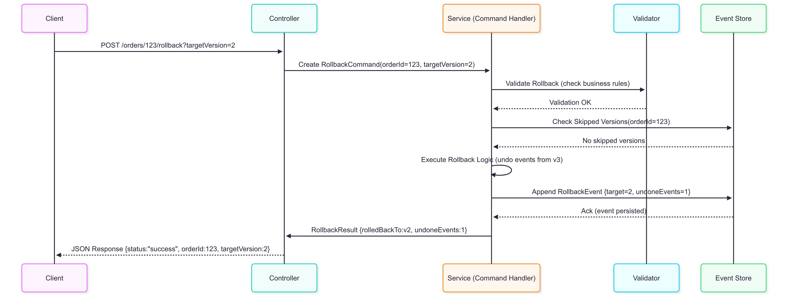

# Phân tích Đặc tính Chất lượng - Event Sourcing Order Management System (Phần 2)

## 3. Sơ đồ lưu trữ của thiết kế đề xuất

### 3.1 Kiến trúc lưu trữ tổng thể

```
┌─────────────────────────────────────────────────────────────┐
│                    Event Store Layer                        │
├─────────────────────────────────────────────────────────────┤
│  ┌─────────────────┐    ┌─────────────────┐                 │
│  │   PostgreSQL    │    │   In-Memory     │                 │
│  │   Event Store   │    │   Event Store   │                 │
│  │   (Primary)     │    │   (Fallback)    │                 │
│  └─────────────────┘    └─────────────────┘                 │
└─────────────────────────────────────────────────────────────┘
                              │
                              ▼
┌─────────────────────────────────────────────────────────────┐
│                    Database Schema                          │
├─────────────────────────────────────────────────────────────┤
│  ┌────────────────────────────────────────────────────────┐ │
│  │                    events table                        │ │
│  │  ┌─────────────┐ ┌─────────────┐ ┌─────────────────┐   │ │
│  │  │     id      │ │aggregate_id │ │   event_type    │   │ │
│  │  │   (UUID)    │ │  (VARCHAR)  │ │   (VARCHAR)     │   │ │
│  │  └─────────────┘ └─────────────┘ └─────────────────┘   │ │
│  │  ┌─────────────┐ ┌─────────────┐ ┌─────────────────┐   │ │
│  │  │ event_data  │ │   version   │ │   timestamp     │   │ │
│  │  │   (JSONB)   │ │  (INTEGER)  │ │  (TIMESTAMP)    │   │ │
│  │  └─────────────┘ └─────────────┘ └─────────────────┘   │ │
│  └────────────────────────────────────────────────────────┘ │
│  ┌────────────────────────────────────────────────────────┐ │
│  │                  snapshots table                       │ │
│  │  ┌─────────────┐ ┌─────────────┐ ┌─────────────────┐   │ │
│  │  │aggregate_id │ │   version   │ │ snapshot_data   │   │ │
│  │  │  (VARCHAR)  │ │  (INTEGER)  │ │    (JSONB)      │   │ │
│  │  └─────────────┘ └─────────────┘ └─────────────────┘   │ │V
│  └────────────────────────────────────────────────────────┘ │
└─────────────────────────────────────────────────────────────┘
```

### 3.2 Sơ đồ Event Flow



#### 🟢 1. Client Request

**Ai**: Ứng dụng web/mobile hoặc service khác

**Làm gì**: 
- Gửi request (HTTP, gRPC, …) để tạo/cập nhật/thực hiện hành động trên Order, Customer, v.v.
- *Ví dụ: POST /orders/123/ship*

#### 🟢 2. Controller Layer

**Vai trò**:
- Nhận request từ client
- Mapping input → Command
- Gọi Command Handler

**Ví dụ**: Request JSON `{ "status": "SHIPPED" }` → Controller tạo ra `UpdateOrderStatusCommand`

#### 🟢 3. Command Handler

**Vai trò**:
- Xử lý command theo business logic
- Kiểm tra trạng thái aggregate hiện tại
- Nếu hợp lệ → sinh ra Domain Event

**Ví dụ**:
- `UpdateOrderStatusCommand` → kiểm tra order đang ở `PENDING`
- Nếu hợp lệ → sinh ra `OrderStatusUpdatedEvent`

**Bao gồm**:

**Validation & Error Handling**:
- Validate dữ liệu đầu vào, check quyền, check trạng thái
- Nếu lỗi → trả về Response JSON error

**Domain Logic**:
- Nơi cài đặt rule nghiệp vụ
- *Ví dụ: "Chỉ cho phép ship khi order đang ở trạng thái PENDING"*

#### 🟢 4. Event Store Layer

**Vai trò**:
- Lưu event vừa sinh ra vào Event Store (append-only)
- Đảm bảo version tăng tuần tự (no skip)
- Persist event vào PostgreSQL Database

**Ví dụ**: Lưu event `OrderStatusUpdated` (version 2)

**Bao gồm**:

**Event Creation**: 
- Từ domain logic, tạo object event

**Event Publishing**: 
- Gửi event ra message bus (Kafka, RabbitMQ) để các service khác consume

**Event Persistence**: 
- Ghi event vào DB (PostgreSQL) để đảm bảo durability

#### 🟢 5. Response (JSON)

**Vai trò**: 
- Trả về kết quả cho client
- Có thể chỉ đơn giản là `{ "status": "ok", "version": 2 }`
- Client không trực tiếp nhận state đầy đủ (state có thể được query từ Read Model khác)

---

#### 📌 Tóm tắt Flow

1. **Client gửi request** (ví dụ: ship order)
2. **Controller tạo command** và gửi cho Command Handler
3. **Command Handler chạy validation + domain logic**
   - Nếu fail → trả lỗi
   - Nếu pass → sinh event
4. **Event được ghi vào Event Store** (Postgres), đồng thời có thể publish ra các consumer khác
5. **Client nhận về JSON response** (thành công hoặc lỗi)

### 3.3 Sơ đồ Rollback Protection

```
┌─────────────────────────────────────────────────────────────┐
│                    Rollback Protection Flow                 │
├─────────────────────────────────────────────────────────────┤
│                                                             │
│  ┌─────────────┐    ┌─────────────┐    ┌─────────────┐      │
│  │ Rollback    │───▶│ Validation  │───▶│ Skipped     │      │
│  │ Request     │    │  Phase      │    │ Version     │      │
│  └─────────────┘    └─────────────┘    │  Check      │      │
│                              │         └─────────────┘      │
│                              ▼                   │          │
│  ┌─────────────┐    ┌─────────────┐    ┌─────────────┐      │
│  │ Rollback    │◀───│ Event       │◀───│ Rollback    │      │
│  │ Response    │    │ Creation    │    │ Execution   │      │
│  └─────────────┘    └─────────────┘    └─────────────┘      │
│                              │                   │          │
│                              ▼                   ▼          │
│  ┌─────────────┐    ┌─────────────┐    ┌─────────────┐      │
│  │ State       │    │ Rollback    │    │ Event       │      │
│  │ Snapshot    │    │ Event       │    │ Store       │      │
│  │ (Before)    │    │ (Metadata)  │    │ Update      │      │
│  └─────────────┘    └─────────────┘    └─────────────┘      │
│                                                             │
└─────────────────────────────────────────────────────────────┘
```

#### 🟢 1. Rollback Request

**Mô tả**: Người dùng hoặc hệ thống gửi yêu cầu rollback một order (hoặc aggregate) về một trạng thái trước đó

**Ví dụ**: Order đã chuyển sang `DELIVERED` nhưng do lỗi vận hành, cần rollback về `SHIPPED`

#### 🟢 2. Validation Phase

**Kiểm tra điều kiện rollback**:
- Order có tồn tại không?
- Có quyền rollback không?
- Có trạng thái nào không thể rollback (ví dụ: từ `DELIVERED` → `PENDING`)?

**Kết quả**: Nếu validation fail → trả về lỗi ngay, không ghi event rollback

#### 🟢 3. Skipped Version Check

**Mục tiêu**: Đảm bảo không có version nào bị skip trong chuỗi sự kiện

**Xử lý**:
- Nếu phát hiện mất event (event stream bị hỏng) → rollback sẽ bị chặn
- Tránh rollback trên một event log không toàn vẹn

#### 🟢 4. Rollback Execution

**Thực hiện logic rollback**:
- Tính toán trạng thái trước đó
- Xác định các event cần undo
- Không xoá event cũ, mà sinh ra Rollback Event mới

#### 🟢 5. Event Creation

**Tạo Rollback Event**:
- Mô tả hành động vừa diễn ra
- Ghi lại `targetVersion`, `eventsUndone`, `reason`, `actor`

**Ví dụ**: `OrderRolledBack { targetVersion=2, undoneEvents=1 }`

#### 🟢 6. Rollback Response

**Kết quả**: Hệ thống trả về kết quả cho client: rollback thành công hoặc thất bại

**Ví dụ JSON**:
```json
{
  "orderId": "12345",
  "rolledBackTo": "SHIPPED",
  "targetVersion": 2,
  "undoneEvents": 1
}
```

#### 🟢 7. State Snapshot (Before)

**Mục đích**: Trước khi rollback, hệ thống có thể lưu lại snapshot của state hiện tại

**Sử dụng**: Dùng cho audit hoặc trong trường hợp rollback cần được rollback ngược (double rollback 😅)

#### 🟢 8. Rollback Event (Metadata)

**Lưu metadata của rollback**:
- Ai rollback?
- Lúc nào?
- Lý do?
- Target version là gì?

**Lợi ích**: Điều này giúp audit trail minh bạch

#### 🟢 9. Event Store Update

**Nguyên tắc**:
- Rollback Event được append vào Event Store giống như mọi event khác
- Event stream vẫn nguyên vẹn (append-only), không xoá hay sửa event cũ
- Đảm bảo tính immutability và khả năng audit

---

#### 📌 Tóm tắt

1. **Rollback không xoá event**, mà tạo Rollback Event mới
2. **Có Validation + Skipped Version Check** để tránh rollback sai
3. **Lưu thêm Snapshot + Metadata** để đảm bảo an toàn và audit
4. **Kết quả**: Hệ thống rollback an toàn mà vẫn giữ nguyên tính toàn vẹn của event stream



#### 📌 Diễn giải từng bước

1. **Client gửi request** rollback về `targetVersion=2`
2. **Controller nhận request**, tạo `RollbackCommand`
3. **Service (Command Handler) gọi Validator** để kiểm tra:
   - Có quyền rollback không?
   - Trạng thái cho phép rollback không?
   - Validator OK → tiếp tục
4. **Service hỏi Event Store** xem có skipped versions không. Nếu có → rollback bị chặn
5. **Nếu hợp lệ**, Service thực thi rollback logic: xác định các event cần "undo" (ở đây là v3: `OrderStatusUpdated` → `DELIVERED`)
6. **Tạo một Rollback Event mới**, append vào Event Store (append-only)
7. **Event Store xác nhận** đã ghi
8. **Service trả kết quả** rollback thành công
9. **Client nhận JSON response**: order đã quay về version 2 (`SHIPPED`)

## 4. Công cụ và bước thực hiện cài đặt sơ đồ lưu trữ

### 4.1 Cài đặt Database Schema

#### Công cụ:
- **PostgreSQL**: Database server
- **psql**: Command line client
- **pgAdmin**: GUI client
- **PowerShell/Batch scripts**: Automation

#### Bước thực hiện:

```bash
# 1. Cài đặt PostgreSQL
# Windows: Download từ postgresql.org
# Linux: sudo apt-get install postgresql postgresql-contrib

# 2. Tạo database
sudo -u postgres createdb order_management

# 3. Chạy schema script
psql -U postgres -d order_management -f database/schema.sql

# 4. Kiểm tra schema
psql -U postgres -d order_management -c "\dt"
psql -U postgres -d order_management -c "\df"
```

### 4.2 Cài đặt Application Layer

#### Công cụ:
- **Node.js**: Runtime environment
- **npm/pnpm**: Package manager
- **TypeScript**: Type checking
- **Docker**: Containerization (optional)

#### Bước thực hiện:

```bash
# 1. Cài đặt dependencies
cd Order-management
npm install

# 2. Build TypeScript
npm run build

# 3. Cấu hình environment
cp .env.example .env
# Edit .env với database credentials

# 4. Chạy database setup script
cd database
./setup.ps1

# 5. Start application
cd ..
npm run dev
```

### 4.3 Cài đặt Monitoring và Logging

#### Công cụ:
- **Winston**: Logging framework
- **Prometheus**: Metrics collection
- **Grafana**: Visualization
- **PM2**: Process manager

#### Bước thực hiện:

```bash
# 1. Cài đặt logging dependencies
npm install winston winston-daily-rotate-file

# 2. Cài đặt monitoring
npm install prom-client express-prom-bundle

# 3. Cài đặt PM2
npm install -g pm2

# 4. Cấu hình PM2
pm2 start ecosystem.config.js
pm2 save
pm2 startup
```

### 4.4 Cài đặt Testing Infrastructure

#### Công cụ:
- **Jest**: Testing framework
- **Supertest**: API testing
- **Testcontainers**: Database testing
- **Artillery**: Load testing

#### Bước thực hiện:

```bash
# 1. Cài đặt testing dependencies
npm install --save-dev jest @types/jest supertest @types/supertest

# 2. Cấu hình Jest
# Thêm vào package.json:
# "scripts": { "test": "jest", "test:watch": "jest --watch" }

# 3. Tạo test database
createdb order_management_test

# 4. Chạy tests
npm test
```

## 5. Giải thích mã nguồn ghi và đọc events

### 5.1 Ghi Events (Event Writing)

#### 5.1.1 Command Handler Pattern

```typescript
// src/commands/handlers.ts
export class OrderCommandHandlers {
  constructor(private eventStore: EventStore) {}

  async handleCreateOrder(command: CreateOrderCommand): Promise<string> {
    // 1. Tạo domain object
    const order = new Order(command.customerId, command.items);
    
    // 2. Tạo event từ domain state
    const event: OrderCreatedEvent = {
      type: 'OrderCreated',
      aggregateId: order.id,
      version: 1,
      timestamp: new Date(),
      data: {
        orderId: order.id,
        customerId: order.customerId,
        items: order.items,
        status: order.status,
        totalAmount: order.totalAmount
      }
    };

    // 3. Lưu event vào event store
    await this.eventStore.saveEvent(event);
    return order.id;
  }
}
```

**Giải thích:**
- **Domain Logic**: Tạo Order aggregate với business rules
- **Event Creation**: Chuyển đổi domain state thành immutable event
- **Event Persistence**: Lưu event vào event store với version control

#### 5.1.2 PostgreSQL Event Store Implementation

```typescript
// src/infrastructure/postgres-event-store.ts
export class PostgresEventStore implements EventStore {
  async saveEvent(event: BaseEvent): Promise<void> {
    const client = await this.pool.connect();
    
    try {
      await client.query('BEGIN');
      
      // Sử dụng database function để append event
      const result = await client.query(
        'SELECT * FROM append_event($1, $2, $3, $4)',
        [event.aggregateId, event.type, JSON.stringify(event.data), null]
      );

      await client.query('COMMIT');
      
      const { event_id, version } = result.rows[0];
      console.log(`📝 Event saved: ${event.type} for ${event.aggregateId} (version ${version})`);
      
    } catch (error) {
      await client.query('ROLLBACK');
      throw error;
    } finally {
      client.release();
    }
  }
}
```

**Giải thích:**
- **Transaction Management**: Sử dụng database transactions để đảm bảo ACID
- **Atomic Operations**: Database function `append_event` đảm bảo atomicity
- **Version Control**: Tự động tăng version cho mỗi event
- **Connection Pooling**: Quản lý database connections hiệu quả

#### 5.1.3 Database Function for Event Appending

```sql
-- database/schema.sql
CREATE OR REPLACE FUNCTION append_event(
    p_aggregate_id VARCHAR(255),
    p_event_type VARCHAR(100),
    p_event_data JSONB,
    p_expected_version INTEGER DEFAULT NULL
)
RETURNS TABLE(event_id UUID, version INTEGER) AS $$
DECLARE
    v_event_id UUID;
    v_version INTEGER;
    v_current_version INTEGER;
BEGIN
    -- Lấy current version
    SELECT COALESCE(MAX(events.version), 0)
    INTO v_current_version
    FROM events
    WHERE aggregate_id = p_aggregate_id;
    
    -- Kiểm tra expected version (optimistic concurrency)
    IF p_expected_version IS NOT NULL AND v_current_version != p_expected_version THEN
        RAISE EXCEPTION 'Concurrency conflict: expected version %, current version %', 
            p_expected_version, v_current_version;
    END IF;
    
    -- Tính next version
    v_version := v_current_version + 1;
    
    -- Insert event
    INSERT INTO events (aggregate_id, event_type, event_data, version)
    VALUES (p_aggregate_id, p_event_type, p_event_data, v_version)
    RETURNING id INTO v_event_id;
    
    RETURN QUERY SELECT v_event_id, v_version;
END;
$$ LANGUAGE plpgsql;
```

**Giải thích:**
- **Optimistic Concurrency**: Kiểm tra version conflict
- **Atomic Versioning**: Tự động tăng version trong transaction
- **Error Handling**: Raise exception cho concurrency conflicts
- **Return Values**: Trả về event ID và version mới

### 5.2 Đọc Events (Event Reading)

#### 5.2.1 Event Retrieval

```typescript
// src/infrastructure/postgres-event-store.ts
async getEvents(aggregateId: string): Promise<BaseEvent[]> {
  const client = await this.pool.connect();
  
  try {
    const result = await client.query(
      `SELECT id, aggregate_id, event_type as type, event_data as data, version, timestamp 
       FROM events 
       WHERE aggregate_id = $1 
       ORDER BY version ASC`,
      [aggregateId]
    );

    return result.rows.map(row => ({
      type: row.type,
      aggregateId: row.aggregate_id,
      data: row.data,
      timestamp: new Date(row.timestamp),
      version: row.version
    }));
  } catch (error) {
    console.error('❌ Failed to get events:', error);
    throw error;
  } finally {
    client.release();
  }
}
```

**Giải thích:**
- **Ordered Retrieval**: Sắp xếp theo version ASC để đảm bảo thứ tự
- **Data Mapping**: Chuyển đổi database rows thành event objects
- **Error Handling**: Proper error handling và logging
- **Connection Management**: Sử dụng connection pool

#### 5.2.2 Event Replay và State Reconstruction

```typescript
// src/api/controller.ts
private rebuildOrderFromEvents(events: BaseEvent[]): Order | null {
  if (events.length === 0) return null;

  // Sắp xếp theo version tăng dần
  const sortedEvents = [...events].sort((a, b) => a.version - b.version);

  // Tìm rollback mới nhất (nếu có)
  const rollbackEvents = sortedEvents.filter(e => e.type === 'OrderRolledBack');
  const latestRollback = rollbackEvents.length > 0
    ? rollbackEvents.reduce((latest, current) =>
        current.version > latest.version ? current : latest)
    : null;

  // Lọc ra danh sách event cần xử lý
  let eventsToProcess = sortedEvents;

  if (latestRollback) {
    const rollbackData = latestRollback.data;
    const nonRollbackEvents = sortedEvents.filter(e => e.type !== 'OrderRolledBack');

    if (rollbackData.rollbackType === 'version') {
      const finalVersion = this.resolveNestedRollbackVersion(sortedEvents, rollbackData.rollbackValue);
      const eventsBeforeRollback = nonRollbackEvents.filter(e => e.version <= finalVersion);
      const eventsAfterRollback = nonRollbackEvents.filter(e => e.version > latestRollback.version);
      eventsToProcess = [...eventsBeforeRollback, ...eventsAfterRollback].sort((a, b) => a.version - b.version);
    }
  }

  // Tái dựng trạng thái Order từ các sự kiện
  let order: Order | null = null;

  for (const event of eventsToProcess) {
    switch (event.type) {
      case 'OrderCreated':
        order = new Order(
          event.data.customerId,
          event.data.items,
          event.data.status,
          event.data.orderId
        );
        break;

      case 'OrderStatusUpdated':
        if (order) {
          order = order.updateStatus(event.data.newStatus);
        }
        break;

      case 'OrderItemAdded':
        if (order) {
          order = order.addItem(event.data.item);
        }
        break;

      case 'OrderItemRemoved':
        if (order) {
          order = order.removeItem(event.data.productId);
        }
        break;

      case 'OrderRolledBack':
        // Đã xử lý ở trên
        break;

      default:
        console.warn(`[WARN] Unrecognized event type: ${event.type}`);
        break;
    }
  }

  return order;
}
```

**Giải thích:**
- **Event Sorting**: Sắp xếp events theo version để đảm bảo thứ tự
- **Rollback Handling**: Xử lý rollback events để tính toán state hiện tại
- **State Machine**: Apply từng event để rebuild domain state
- **Immutable Updates**: Mỗi event tạo ra Order instance mới

#### 5.2.3 Rollback Protection Logic

```typescript
// src/api/controller.ts
private getSkippedVersionsForOrder(events: BaseEvent[]): number[] {
  const sortedEvents = [...events].sort((a, b) => a.version - b.version);
  const rollbackEvents = sortedEvents.filter(e => e.type === 'OrderRolledBack');
  
  if (rollbackEvents.length === 0) {
    return []; // Không có rollback, không có version nào bị skip
  }

  const skippedVersions = new Set<number>();
  
  // Với mỗi rollback event, tìm ra các version bị skip
  for (const rollbackEvent of rollbackEvents) {
    const rollbackData = rollbackEvent.data;
    const nonRollbackEvents = sortedEvents.filter(e => e.type !== 'OrderRolledBack');
    
    if (rollbackData.rollbackType === 'version') {
      const targetVersion = rollbackData.rollbackValue;
      
      // Tìm các events có version > targetVersion và < rollbackEvent.version
      const skippedEvents = nonRollbackEvents.filter(e => 
        e.version > targetVersion && e.version < rollbackEvent.version
      );
      
      skippedEvents.forEach(event => skippedVersions.add(event.version));
    }
  }
  
  return Array.from(skippedVersions).sort((a, b) => a - b);
}
```

**Giải thích:**
- **Skipped Version Tracking**: Theo dõi các version bị bỏ qua do rollback
- **Rollback Analysis**: Phân tích rollback events để xác định skipped versions
- **Version Protection**: Ngăn chặn rollback về các version không hợp lệ
- **Data Integrity**: Đảm bảo tính nhất quán của event stream

### 5.3 API Endpoints cho Event Operations

#### 5.3.1 Event Writing Endpoints

```typescript
// src/api/routes.ts
// Tạo order mới
POST /api/orders
{
  "customerId": "customer-001",
  "items": [
    {
      "productId": "product-001",
      "productName": "Laptop Dell XPS",
      "quantity": 1,
      "price": 1500.00
    }
  ]
}

// Cập nhật status
PUT /api/orders/:id/status
{
  "status": "CONFIRMED"
}

// Thêm item
POST /api/orders/:id/items
{
  "item": {
    "productId": "product-002",
    "productName": "Mouse Wireless",
    "quantity": 2,
    "price": 25.00
  }
}
```

#### 5.3.2 Event Reading Endpoints

```typescript
// src/api/routes.ts
// Lấy order hiện tại (rebuilt from events)
GET /api/orders/:id

// Lấy tất cả events của order
GET /api/debug/orders/:id/events

// Lấy tất cả events trong system
GET /api/debug/events

// Rollback order
POST /api/debug/orders/:id/rollback
{
  "toVersion": 3
}

// Kiểm tra skipped versions
GET /api/debug/orders/:id/skipped-versions
```

### 5.4 Performance Optimizations

#### 5.4.1 Database Indexing

```sql
-- database/schema.sql
-- Indexes for better query performance
CREATE INDEX IF NOT EXISTS idx_events_aggregate_id ON events(aggregate_id);
CREATE INDEX IF NOT EXISTS idx_events_aggregate_type ON events(aggregate_type);
CREATE INDEX IF NOT EXISTS idx_events_event_type ON events(event_type);
CREATE INDEX IF NOT EXISTS idx_events_timestamp ON events(timestamp);
```

#### 5.4.2 Connection Pooling

```typescript
// src/infrastructure/postgres-event-store.ts
constructor(config: PostgresConfig) {
  this.pool = new Pool({
    ...config,
    max: 20,                    // Maximum connections
    idleTimeoutMillis: 30000,   // Close idle connections after 30s
    connectionTimeoutMillis: 2000, // Connection timeout
  });
}
```

#### 5.4.3 Pagination Support

```typescript
// src/api/controller.ts
async getAllOrders(req: Request, res: Response): Promise<void> {
  const page = parseInt(req.query.page as string) || 1;
  const limit = Math.min(parseInt(req.query.limit as string) || 10, 100);
  const offset = (page - 1) * limit;

  // Apply pagination to results
  const paginatedOrders = allOrders.slice(offset, offset + limit);
}
```

## 6. Kết luận

Thiết kế Event Sourcing trong dự án Order Management System đã đạt được các đặc tính chất lượng quan trọng:

1. **Tính toàn vẹn dữ liệu** được đảm bảo thông qua immutable events, version control, và rollback protection
2. **Khả năng truy vết** được cung cấp bởi complete event log với metadata đầy đủ
3. **Khả năng phục hồi** được thực hiện qua event replay và time travel functionality
4. **Khả năng mở rộng** được hỗ trợ bởi stateless design và database optimization
5. **Tính sẵn sàng** được đảm bảo qua fallback strategy và health monitoring
6. **Tính bảo mật** được thực hiện qua input validation và error handling
7. **Hiệu suất** được tối ưu qua indexing, connection pooling, và pagination

Hệ thống cung cấp foundation vững chắc cho việc mở rộng và maintenance trong các enterprise applications, với rollback protection tiên tiến và comprehensive testing infrastructure.
