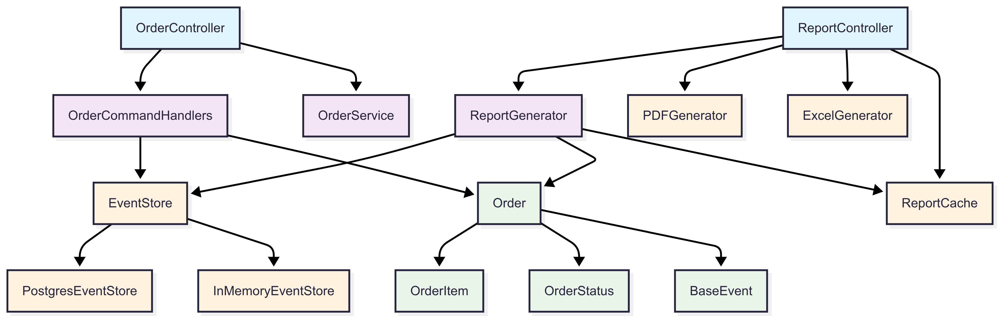
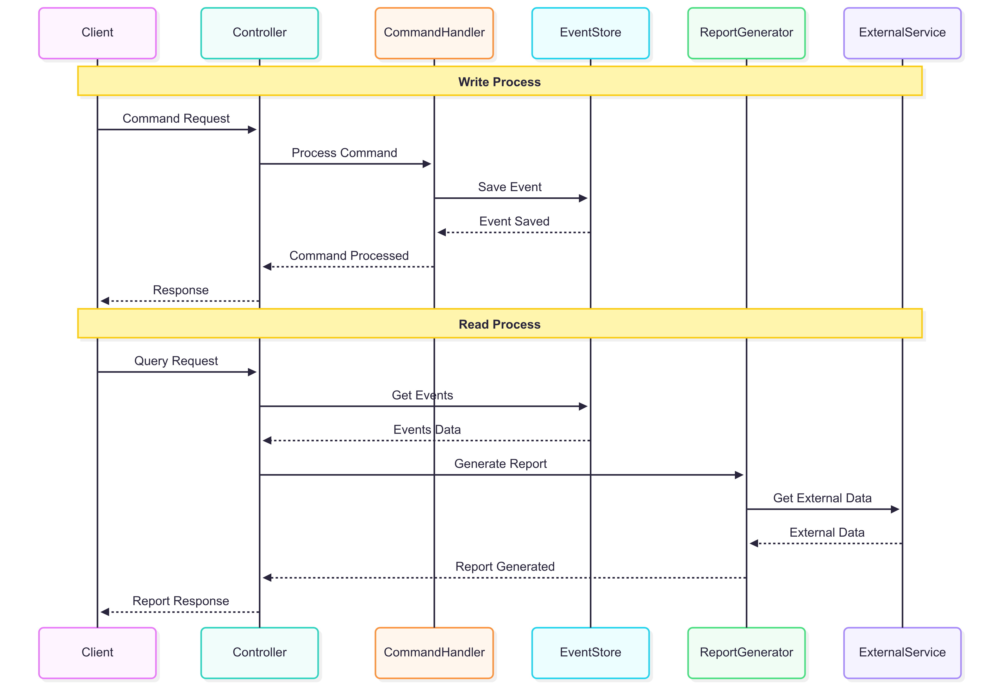
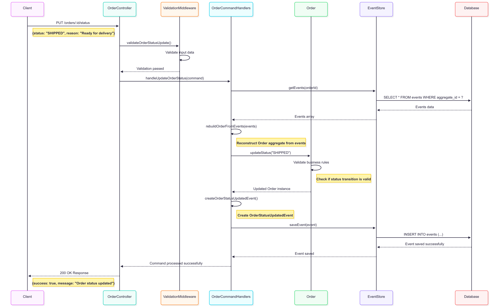
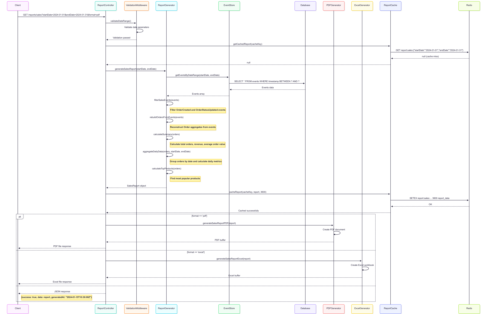
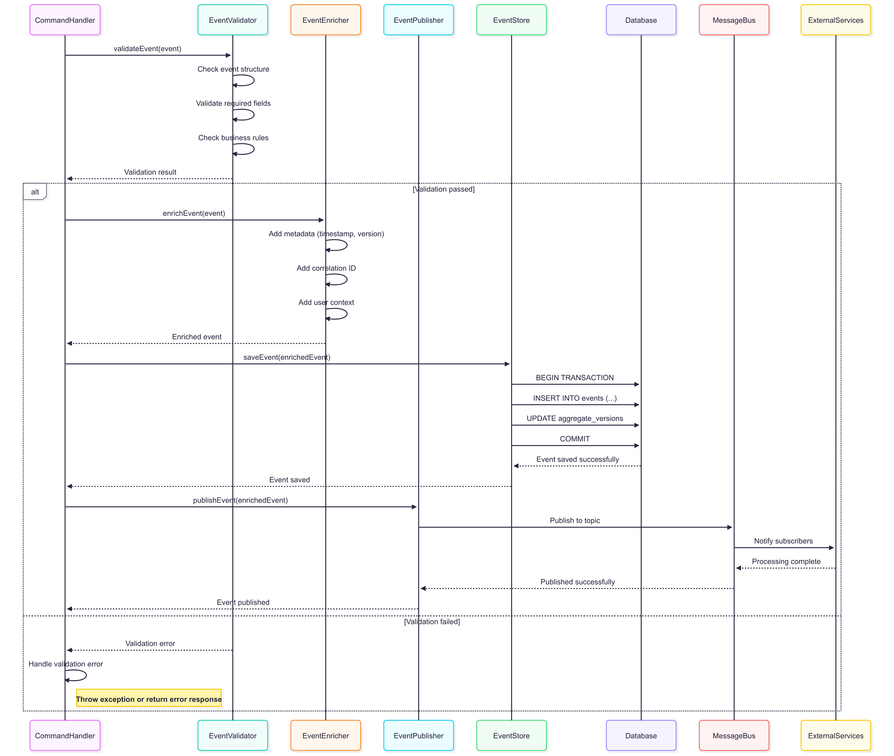

# Phân tích Góc nhìn Logic và Process - Event Sourcing Order Management System

## 1. Góc nhìn Logic (Logical View)

### 1.1 Kiến trúc Logic tổng thể

```
┌─────────────────────────────────────────────────────────────┐
│                    Logical Architecture                     │
├─────────────────────────────────────────────────────────────┤
│                                                             │
│  ┌─────────────────┐    ┌─────────────────┐                 │
│  │   Presentation  │    │   API Gateway   │                 │
│  │     Layer       │    │     Layer       │                 │
│  │                 │    │                 │                 │
│  │ • Web UI        │    │ • REST API      │                 │
│  │ • Mobile App    │    │ • GraphQL       │                 │
│  │ • Admin Panel   │    │ • WebSocket     │                 │
│  └─────────────────┘    └─────────────────┘                 │
│           │                       │                         │
│           ▼                       ▼                         │
│  ┌────────────────────────────────────────────────────────┐ │
│  │                Application Layer                       │ │
│  │  ┌─────────────┐  ┌─────────────┐  ┌─────────────┐     │ │
│  │  │ Controllers │  │  Services   │  │  Commands   │     │ │
│  │  │             │  │             │  │             │     │ │
│  │  │ • OrderCtrl │  │ • OrderSvc  │  │ • CreateCmd │     │ │
│  │  │ • ReportCtrl│  │ • ReportSvc │  │ • UpdateCmd │     │ │
│  │  │ • UserCtrl  │  │ • UserSvc   │  │ • DeleteCmd │     │ │
│  │  └─────────────┘  └─────────────┘  └─────────────┘     │ │
│  └────────────────────────────────────────────────────────┘ │
│           │                       │                         │
│           ▼                       ▼                         │
│  ┌────────────────────────────────────────────────────────┐ │
│  │                 Domain Layer                           │ │
│  │  ┌─────────────┐  ┌─────────────┐  ┌─────────────┐     │ │
│  │  │ Aggregates  │  │   Events    │  │   Value     │     │ │
│  │  │             │  │             │  │  Objects    │     │ │
│  │  │ • Order     │  │ • OrderEvt  │  │ • Money     │     │ │
│  │  │ • Customer  │  │ •CustomerEvt│  │ • Address   │     │ │
│  │  │ • Product   │  │ • ProductEvt│  │ • OrderItem │     │ │
│  │  └─────────────┘  └─────────────┘  └─────────────┘     │ │
│  └────────────────────────────────────────────────────────┘ │
│           │                       │                         │
│           ▼                       ▼                         │
│  ┌────────────────────────────────────────────────────────┐ │
│  │              Infrastructure Layer                      │ │
│  │  ┌─────────────┐  ┌─────────────┐  ┌─────────────┐     │ │
│  │  │ Event Store │  │   Database  │  │   External  │     │ │
│  │  │             │  │             │  │  Services   │     │ │
│  │  │ • PostgreSQL│  │ • ReadModel │  │ • Payment   │     │ │
│  │  │ • InMemory  │  │ • Snapshots │  │ • Shipping  │     │ │
│  │  │ • EventBus  │  │ • Analytics │  │ • Notification│   │ │
│  │  └─────────────┘  └─────────────┘  └─────────────┘     │ │
│  └────────────────────────────────────────────────────────┘ │
└─────────────────────────────────────────────────────────────┘
```
### 1.2 Các thành phần Logic chính

#### **1.2.1 Presentation Layer**
- **Mục đích**: Giao diện người dùng và API endpoints
- **Thành phần**:
  - Web UI 
  - REST API endpoints
- **Trách nhiệm**:
  - Nhận request từ client
  - Validate input data
  - Chuyển đổi request thành commands
  - Trả về response cho client

#### **1.2.2 Application Layer**
- **Mục đích**: Orchestration và business logic coordination
- **Thành phần**:
  - **Controllers**: Xử lý HTTP requests, routing
  - **Services**: Business logic coordination
  - **Commands**: Command objects và handlers
- **Trách nhiệm**:
  - Điều phối giữa các layer
  - Transaction management
  - Error handling và logging

#### **1.2.3 Domain Layer**
- **Mục đích**: Core business logic và domain rules
- **Thành phần**:
  - **Aggregates**: Order, Customer, Product
  - **Events**: Domain events (OrderCreated, OrderStatusUpdated)
  - **Value Objects**: Money, Address, OrderItem
- **Trách nhiệm**:
  - Business rules enforcement
  - Domain logic implementation
  - Event generation

#### **1.2.4 Infrastructure Layer**
- **Mục đích**: Technical concerns và external integrations
- **Thành phần**:
  - **Event Store**: PostgreSQL event store
  - **Database**: Read models, snapshots
  - **External Services**: Payment, Shipping, Notification
- **Trách nhiệm**:
  - Data persistence
  - External service integration
  - Technical infrastructure

### 1.3 Mối quan hệ Logic - Dependency Relationships



## 2. Góc nhìn Process (Process View)

### 2.1 Process Flow tổng thể - High Level Sequence



### 2.2 Các Process chính

#### **2.2.1 Write Process (Command Processing) - Sequence Diagram**



#### **2.2.2 Read Process (Query Processing) - Sequence Diagram**



#### **2.2.3 Event Processing Pipeline - Sequence Diagram**



## 3. Công cụ và bước thực hiện viết mã nguồn

### 3.1 Tính năng ghi dữ liệu (Write Feature)

#### **3.1.1 Công cụ sử dụng**

**Development Tools**:
- **IDE**: Visual Studio Code, WebStorm
- **Version Control**: Git, GitHub/GitLab
- **Package Manager**: npm, pnpm
- **TypeScript**: Type checking và IntelliSense

**Testing Tools**:
- **Jest**: Unit testing framework
- **Supertest**: API testing
- **Testcontainers**: Database testing
- **Postman/Insomnia**: Manual API testing

**Database Tools**:
- **PostgreSQL**: Primary database
- **pgAdmin**: Database management
- **psql**: Command line client
- **Database Migrations**: Schema versioning

**Monitoring Tools**:
- **Winston**: Logging
- **Prometheus**: Metrics collection
- **Grafana**: Visualization
- **PM2**: Process management

#### **3.1.2 Bước thực hiện viết mã nguồn**

**Bước 1: Phân tích yêu cầu**
```bash
# 1. Tạo user story
# As a customer service representative
# I want to update order status to SHIPPED
# So that I can track order delivery progress

# 2. Xác định domain events
# - OrderStatusUpdatedEvent
# - OrderShippedEvent (nếu cần)

# 3. Xác định command
# - UpdateOrderStatusCommand
```

**Bước 2: Thiết kế Domain Model**
```typescript
// src/domain/Order.ts
export class Order {
  constructor(
    public readonly id: string,
    public readonly customerId: string,
    public items: OrderItem[],
    public status: OrderStatus
  ) {}

  updateStatus(newStatus: OrderStatus): Order {
    // Business logic validation
    if (this.status === OrderStatus.DELIVERED && newStatus === OrderStatus.PENDING) {
      throw new Error('Cannot rollback from DELIVERED to PENDING');
    }
    
    return new Order(this.id, this.customerId, this.items, newStatus);
  }
}
```

**Bước 3: Định nghĩa Events**
```typescript
// src/events/types.ts
export interface OrderStatusUpdatedEvent extends BaseEvent {
  type: 'OrderStatusUpdated';
  data: {
    orderId: string;
    oldStatus: OrderStatus;
    newStatus: OrderStatus;
    updatedBy: string;
    reason?: string;
  };
}
```

**Bước 4: Tạo Command Handler**
```typescript
// src/commands/handlers.ts
export class OrderCommandHandlers {
  async handleUpdateOrderStatus(command: UpdateOrderStatusCommand): Promise<void> {
    // 1. Load current order state
    const events = await this.eventStore.getEvents(command.orderId);
    const order = this.rebuildOrderFromEvents(events);
    
    if (!order) {
      throw new Error(`Order ${command.orderId} not found`);
    }
    
    // 2. Apply business logic
    const updatedOrder = order.updateStatus(command.newStatus);
    
    // 3. Create event
    const event: OrderStatusUpdatedEvent = {
      type: 'OrderStatusUpdated',
      aggregateId: order.id,
      version: events.length + 1,
      timestamp: new Date(),
      data: {
        orderId: order.id,
        oldStatus: order.status,
        newStatus: command.newStatus,
        updatedBy: command.updatedBy,
        reason: command.reason
      }
    };
    
    // 4. Save event
    await this.eventStore.saveEvent(event);
  }
}
```

**Bước 5: Tạo Controller**
```typescript
// src/api/controller.ts
export class OrderController {
  async updateOrderStatus(req: Request, res: Response): Promise<void> {
    try {
      const { orderId } = req.params;
      const { status, reason } = req.body;
      const updatedBy = req.user?.id || 'system';
      
      const command: UpdateOrderStatusCommand = {
        orderId,
        newStatus: status,
        updatedBy,
        reason
      };
      
      await this.commandHandlers.handleUpdateOrderStatus(command);
      
      res.json({
        success: true,
        message: `Order ${orderId} status updated to ${status}`,
        timestamp: new Date()
      });
      
    } catch (error) {
      res.status(400).json({
        success: false,
        error: error.message
      });
    }
  }
}
```

**Bước 6: Cập nhật Routes**
```typescript
// src/api/routes.ts
router.put('/orders/:orderId/status', 
  validateOrderStatusUpdate,
  orderController.updateOrderStatus.bind(orderController)
);
```

**Bước 7: Viết Tests**
```typescript
// tests/commands/update-order-status.test.ts
describe('UpdateOrderStatus', () => {
  it('should update order status successfully', async () => {
    // Arrange
    const orderId = 'order-001';
    const command: UpdateOrderStatusCommand = {
      orderId,
      newStatus: OrderStatus.SHIPPED,
      updatedBy: 'user-001'
    };
    
    // Act
    await commandHandlers.handleUpdateOrderStatus(command);
    
    // Assert
    const events = await eventStore.getEvents(orderId);
    const lastEvent = events[events.length - 1];
    expect(lastEvent.type).toBe('OrderStatusUpdated');
    expect(lastEvent.data.newStatus).toBe(OrderStatus.SHIPPED);
  });
});
```

**Bước 8: Database Migration (nếu cần)**
```sql
-- migrations/003_add_order_status_reason.sql
ALTER TABLE events 
ADD COLUMN IF NOT EXISTS metadata JSONB DEFAULT '{}';

-- Index for better query performance
CREATE INDEX IF NOT EXISTS idx_events_metadata 
ON events USING GIN (metadata);
```

### 3.2 Tính năng xuất báo cáo (Report Feature)

#### **3.2.1 Công cụ sử dụng**

**Report Generation Tools**:
- **Chart.js/D3.js**: Data visualization
- **PDF Generation**: jsPDF, Puppeteer
- **Excel Export**: xlsx, csv-writer
- **Email Service**: Nodemailer, SendGrid

**Data Processing Tools**:
- **Lodash**: Data manipulation
- **Date-fns**: Date handling
- **BigNumber.js**: Precise calculations
- **Stream Processing**: Node.js streams

**Caching Tools**:
- **Redis**: In-memory caching
- **Node-cache**: Application-level caching
- **Database Views**: Materialized views

#### **3.2.2 Bước thực hiện viết mã nguồn**

**Bước 1: Phân tích yêu cầu báo cáo**
```bash
# 1. Xác định loại báo cáo
# - Sales Report (Doanh thu theo thời gian)
# - Order Status Report (Trạng thái đơn hàng)
# - Customer Activity Report (Hoạt động khách hàng)

# 2. Xác định data sources
# - Events từ Event Store
# - Read models (nếu có)
# - External data (nếu cần)
```

**Bước 2: Thiết kế Report Model**
```typescript
// src/reports/models/SalesReport.ts
export interface SalesReport {
  period: {
    start: Date;
    end: Date;
  };
  summary: {
    totalOrders: number;
    totalRevenue: number;
    averageOrderValue: number;
  };
  dailyData: DailySalesData[];
  topProducts: ProductSalesData[];
}

export interface DailySalesData {
  date: string;
  orders: number;
  revenue: number;
  items: number;
}
```

**Bước 3: Tạo Report Generator**
```typescript
// src/reports/generators/SalesReportGenerator.ts
export class SalesReportGenerator {
  constructor(private eventStore: EventStore) {}
  
  async generateSalesReport(startDate: Date, endDate: Date): Promise<SalesReport> {
    // 1. Lấy tất cả events trong khoảng thời gian
    const events = await this.eventStore.getEventsByDateRange(startDate, endDate);
    
    // 2. Lọc events liên quan đến sales
    const salesEvents = events.filter(event => 
      event.type === 'OrderCreated' || 
      event.type === 'OrderStatusUpdated'
    );
    
    // 3. Rebuild orders từ events
    const orders = this.rebuildOrdersFromEvents(salesEvents);
    
    // 4. Tính toán metrics
    const summary = this.calculateSummary(orders);
    const dailyData = this.aggregateDailyData(orders, startDate, endDate);
    const topProducts = this.calculateTopProducts(orders);
    
    return {
      period: { start: startDate, end: endDate },
      summary,
      dailyData,
      topProducts
    };
  }
  
  private calculateSummary(orders: Order[]): SalesReport['summary'] {
    const completedOrders = orders.filter(o => o.status === OrderStatus.DELIVERED);
    
    return {
      totalOrders: completedOrders.length,
      totalRevenue: completedOrders.reduce((sum, order) => 
        sum + order.totalAmount, 0),
      averageOrderValue: completedOrders.length > 0 
        ? completedOrders.reduce((sum, order) => sum + order.totalAmount, 0) / completedOrders.length
        : 0
    };
  }
}
```

**Bước 4: Tạo Report Controller**
```typescript
// src/api/report-controller.ts
export class ReportController {
  async generateSalesReport(req: Request, res: Response): Promise<void> {
    try {
      const { startDate, endDate, format = 'json' } = req.query;
      
      const start = new Date(startDate as string);
      const end = new Date(endDate as string);
      
      // Validate date range
      if (end < start) {
        throw new Error('End date must be after start date');
      }
      
      // Generate report
      const report = await this.reportGenerator.generateSalesReport(start, end);
      
      // Format response based on requested format
      switch (format) {
        case 'pdf':
          const pdfBuffer = await this.pdfGenerator.generatePDF(report);
          res.setHeader('Content-Type', 'application/pdf');
          res.setHeader('Content-Disposition', 'attachment; filename=sales-report.pdf');
          res.send(pdfBuffer);
          break;
          
        case 'excel':
          const excelBuffer = await this.excelGenerator.generateExcel(report);
          res.setHeader('Content-Type', 'application/vnd.openxmlformats-officedocument.spreadsheetml.sheet');
          res.setHeader('Content-Disposition', 'attachment; filename=sales-report.xlsx');
          res.send(excelBuffer);
          break;
          
        default:
          res.json({
            success: true,
            data: report,
            generatedAt: new Date()
          });
      }
      
    } catch (error) {
      res.status(400).json({
        success: false,
        error: error.message
      });
    }
  }
}
```

**Bước 5: Tạo Report Routes**
```typescript
// src/api/report-routes.ts
router.get('/reports/sales', 
  validateDateRange,
  reportController.generateSalesReport.bind(reportController)
);

router.get('/reports/orders/status', 
  reportController.generateOrderStatusReport.bind(reportController)
);

router.get('/reports/customers/activity', 
  reportController.generateCustomerActivityReport.bind(reportController)
);
```

**Bước 6: Tạo PDF Generator**
```typescript
// src/reports/generators/PDFGenerator.ts
export class PDFGenerator {
  async generateSalesReportPDF(report: SalesReport): Promise<Buffer> {
    const doc = new jsPDF();
    
    // Header
    doc.setFontSize(20);
    doc.text('Sales Report', 20, 20);
    
    // Summary section
    doc.setFontSize(12);
    doc.text(`Period: ${report.period.start.toLocaleDateString()} - ${report.period.end.toLocaleDateString()}`, 20, 40);
    doc.text(`Total Orders: ${report.summary.totalOrders}`, 20, 50);
    doc.text(`Total Revenue: $${report.summary.totalRevenue.toFixed(2)}`, 20, 60);
    doc.text(`Average Order Value: $${report.summary.averageOrderValue.toFixed(2)}`, 20, 70);
    
    // Daily data table
    this.generateDailyDataTable(doc, report.dailyData, 90);
    
    return doc.output('arraybuffer');
  }
  
  private generateDailyDataTable(doc: jsPDF, data: DailySalesData[], startY: number): void {
    // Table headers
    doc.setFontSize(10);
    doc.text('Date', 20, startY);
    doc.text('Orders', 60, startY);
    doc.text('Revenue', 100, startY);
    doc.text('Items', 140, startY);
    
    // Table data
    data.forEach((row, index) => {
      const y = startY + 10 + (index * 8);
      doc.text(row.date, 20, y);
      doc.text(row.orders.toString(), 60, y);
      doc.text(`$${row.revenue.toFixed(2)}`, 100, y);
      doc.text(row.items.toString(), 140, y);
    });
  }
}
```

**Bước 7: Tạo Excel Generator**
```typescript
// src/reports/generators/ExcelGenerator.ts
export class ExcelGenerator {
  async generateSalesReportExcel(report: SalesReport): Promise<Buffer> {
    const workbook = new ExcelJS.Workbook();
    
    // Summary worksheet
    const summarySheet = workbook.addWorksheet('Summary');
    summarySheet.columns = [
      { header: 'Metric', key: 'metric', width: 20 },
      { header: 'Value', key: 'value', width: 15 }
    ];
    
    summarySheet.addRows([
      { metric: 'Total Orders', value: report.summary.totalOrders },
      { metric: 'Total Revenue', value: report.summary.totalRevenue },
      { metric: 'Average Order Value', value: report.summary.averageOrderValue }
    ]);
    
    // Daily data worksheet
    const dailySheet = workbook.addWorksheet('Daily Data');
    dailySheet.columns = [
      { header: 'Date', key: 'date', width: 15 },
      { header: 'Orders', key: 'orders', width: 10 },
      { header: 'Revenue', key: 'revenue', width: 15 },
      { header: 'Items', key: 'items', width: 10 }
    ];
    
    dailySheet.addRows(report.dailyData);
    
    return await workbook.xlsx.writeBuffer();
  }
}
```

**Bước 8: Viết Tests cho Report**
```typescript
// tests/reports/sales-report.test.ts
describe('SalesReportGenerator', () => {
  it('should generate sales report correctly', async () => {
    // Arrange
    const startDate = new Date('2024-01-01');
    const endDate = new Date('2024-01-31');
    
    // Mock events
    const mockEvents = [
      {
        type: 'OrderCreated',
        aggregateId: 'order-001',
        data: { totalAmount: 100, status: 'PENDING' },
        timestamp: new Date('2024-01-15')
      },
      {
        type: 'OrderStatusUpdated',
        aggregateId: 'order-001',
        data: { newStatus: 'DELIVERED' },
        timestamp: new Date('2024-01-16')
      }
    ];
    
    // Act
    const report = await reportGenerator.generateSalesReport(startDate, endDate);
    
    // Assert
    expect(report.summary.totalOrders).toBe(1);
    expect(report.summary.totalRevenue).toBe(100);
    expect(report.dailyData).toHaveLength(31); // 31 days in January
  });
});
```

**Bước 9: Performance Optimization**
```typescript
// src/reports/cache/ReportCache.ts
export class ReportCache {
  constructor(private redis: Redis) {}
  
  async getCachedReport(key: string): Promise<SalesReport | null> {
    const cached = await this.redis.get(key);
    return cached ? JSON.parse(cached) : null;
  }
  
  async cacheReport(key: string, report: SalesReport, ttl: number = 3600): Promise<void> {
    await this.redis.setex(key, ttl, JSON.stringify(report));
  }
  
  generateCacheKey(reportType: string, params: any): string {
    return `report:${reportType}:${JSON.stringify(params)}`;
  }
}
```

## 4. Kết luận

Thiết kế Event Sourcing với góc nhìn Logic và Process cung cấp:

### **4.1 Lợi ích của góc nhìn Logic**
- **Separation of Concerns**: Tách biệt rõ ràng các layer
- **Maintainability**: Dễ bảo trì và mở rộng
- **Testability**: Dễ dàng unit test từng component
- **Scalability**: Có thể scale từng layer độc lập

### **4.2 Lợi ích của góc nhìn Process**
- **Traceability**: Theo dõi được flow dữ liệu
- **Performance**: Tối ưu từng process step
- **Monitoring**: Dễ dàng monitor và debug
- **Error Handling**: Xử lý lỗi ở từng step

### **4.3 Best Practices**
1. **Command-Query Separation**: Tách biệt write và read operations
2. **Event Sourcing**: Sử dụng events làm source of truth
3. **CQRS**: Tối ưu read và write models riêng biệt
4. **Domain-Driven Design**: Tập trung vào business logic
5. **Test-Driven Development**: Viết test trước khi implement

Hệ thống Event Sourcing với thiết kế này cung cấp foundation vững chắc cho việc xây dựng các ứng dụng enterprise với khả năng mở rộng cao và maintainability tốt.
