# Deployment View - Event Sourcing Order Management System

## Tổng Quan

Deployment View mô tả cách các thành phần phần mềm được triển khai trên infrastructure vật lý và logic. Đối với hệ thống Event Sourcing Order Management, chúng ta cần xem xét các yếu tố về performance, scalability, reliability và security trong việc triển khai.

## 1. Kiến Trúc Deployment Tổng Quan

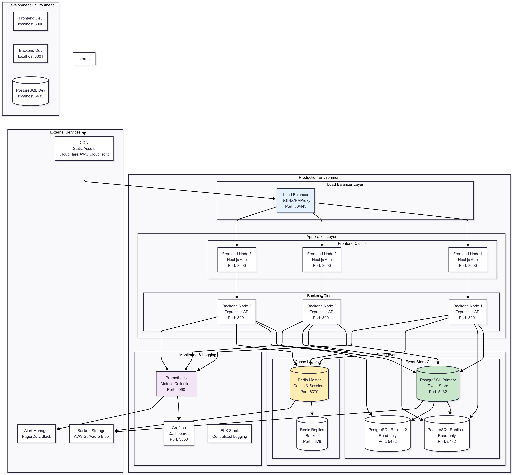

## 2. Chi Tiết Các Tầng Deployment

### 2.1 Internet & CDN Layer

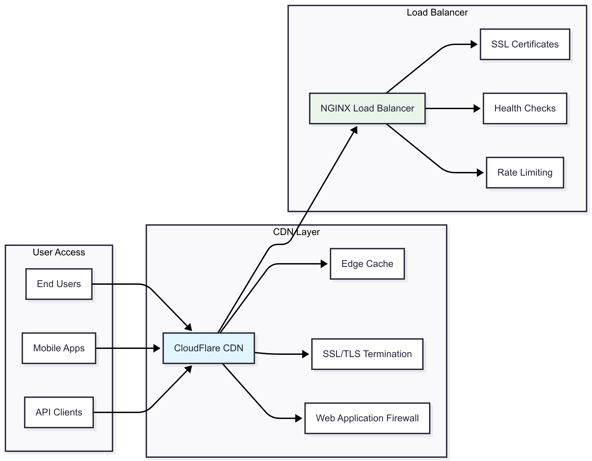

**Cấu hình CDN:**
- **Static Assets**: CSS, JS, Images được cache tại edge locations
- **Cache TTL**: 24 hours cho static files, 5 minutes cho API responses
- **Compression**: Gzip/Brotli compression enabled
- **Security**: DDoS protection, WAF rules, Bot management

### 2.2 Application Layer

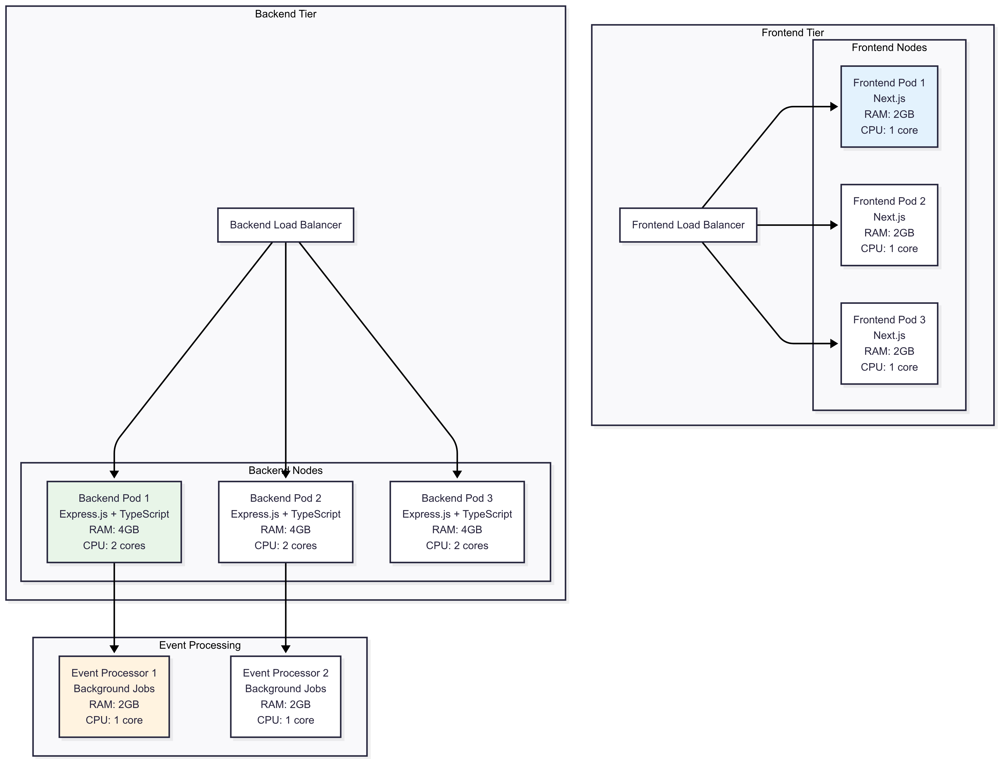

**Đặc điểm Application Layer:**
- **Stateless Design**: Tất cả nodes đều stateless để dễ scale
- **Session Management**: Session data stored in Redis
- **Health Checks**: `/health` endpoint cho load balancer
- **Graceful Shutdown**: Handle SIGTERM properly
- **Resource Limits**: CPU và memory limits được set

### 2.3 Data Layer

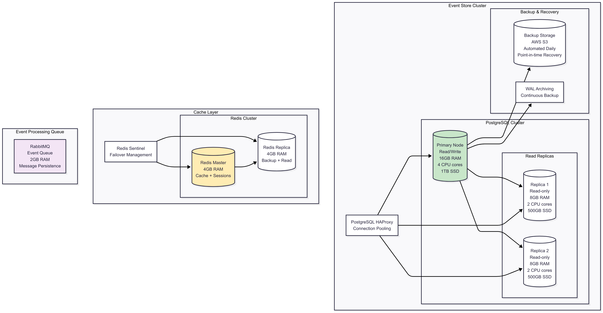

**Cấu hình Database:**
- **PostgreSQL Version**: 15.x với Event Sourcing optimizations
- **Connection Pooling**: pgBouncer/HAProxy cho connection management
- **Replication**: Streaming replication với automatic failover
- **Backup Strategy**: Daily full backup + continuous WAL archiving
- **Monitoring**: pg_stat_statements, slow query log

## 3. Deployment Environments

### 3.1 Environment Matrix

| Environment | Purpose | Infrastructure | Database | Monitoring |
|-------------|---------|----------------|----------|------------|
| **Development** | Local development | Docker Compose | PostgreSQL container | Basic logging |
| **Testing** | Automated testing | Kubernetes (minikube) | Testcontainers | Unit test reports |
| **Staging** | Pre-production testing | AWS EKS (2 nodes) | RDS PostgreSQL | Full monitoring |
| **Production** | Live system | AWS EKS (6 nodes) | RDS Multi-AZ | Comprehensive monitoring |

### 3.2 Development Environment

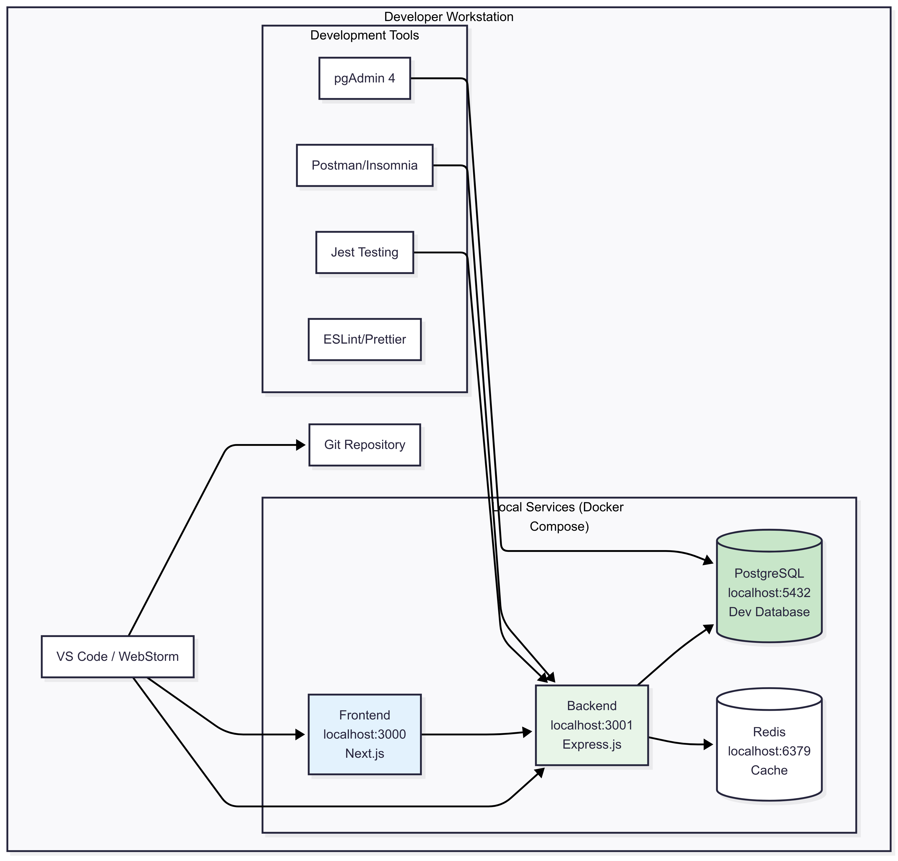

**Development Setup Commands:**
```bash
# Clone repository
git clone https://github.com/your-org/order-management.git
cd order-management

# Start development environment
docker-compose up -d

# Install dependencies
npm run install:all

# Run database migrations
npm run db:migrate

# Start development servers
npm run dev

# Run tests
npm test
```

### 3.3 Production Environment

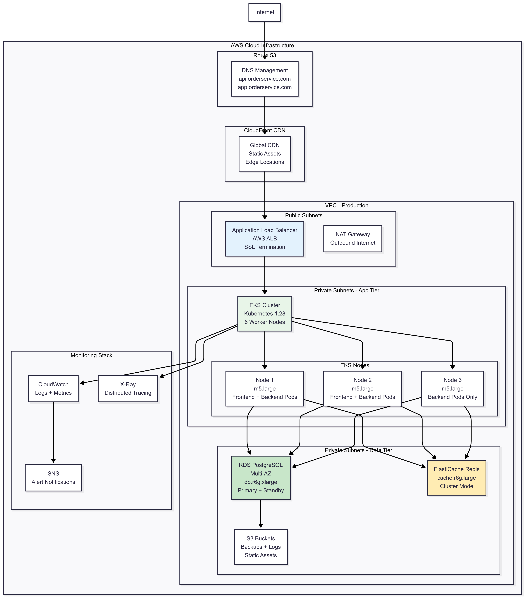

## 4. Công Cụ Deployment

### 4.1 Container Orchestration

| Công Cụ | Môi Trường | Mục Đích | Cấu Hình |
|---------|------------|----------|----------|
| **Docker** | All environments | Containerization | Dockerfile, docker-compose.yml |
| **Kubernetes** | Staging/Production | Orchestration | Helm charts, YAML manifests |
| **Helm** | Staging/Production | Package management | values.yaml, templates |
| **kubectl** | Staging/Production | CLI management | kubeconfig, contexts |

### 4.1.1 Docker Configuration Chi Tiết

**Backend Dockerfile:**
```dockerfile
# Backend Application Dockerfile
FROM node:18-alpine AS builder

# Set working directory
WORKDIR /app

# Copy package files
COPY package*.json ./
COPY tsconfig.json ./

# Install dependencies
RUN npm ci --only=production && npm cache clean --force

# Copy source code
COPY src/ ./src/

# Build TypeScript
RUN npm run build

# Production stage
FROM node:18-alpine AS production

# Create app user
RUN addgroup -g 1001 -S nodejs
RUN adduser -S nextjs -u 1001

# Set working directory
WORKDIR /app

# Copy built application
COPY --from=builder --chown=nextjs:nodejs /app/dist ./dist
COPY --from=builder --chown=nextjs:nodejs /app/node_modules ./node_modules
COPY --from=builder --chown=nextjs:nodejs /app/package*.json ./

# Health check
HEALTHCHECK --interval=30s --timeout=3s --start-period=5s --retries=3 \
  CMD node dist/health-check.js

# Switch to non-root user
USER nextjs

# Expose port
EXPOSE 3001

# Start application
CMD ["node", "dist/index.js"]
```

**Frontend Dockerfile:**
```dockerfile
# Frontend Application Dockerfile
FROM node:18-alpine AS deps

WORKDIR /app
COPY package*.json ./
RUN npm ci --only=production

FROM node:18-alpine AS builder

WORKDIR /app
COPY --from=deps /app/node_modules ./node_modules
COPY . .

# Build Next.js application
RUN npm run build

FROM node:18-alpine AS runner

WORKDIR /app

ENV NODE_ENV production

# Create nextjs user
RUN addgroup --system --gid 1001 nodejs
RUN adduser --system --uid 1001 nextjs

# Copy built application
COPY --from=builder /app/public ./public
COPY --from=builder --chown=nextjs:nodejs /app/.next/standalone ./
COPY --from=builder --chown=nextjs:nodejs /app/.next/static ./.next/static

USER nextjs

EXPOSE 3000

ENV PORT 3000
ENV HOSTNAME "0.0.0.0"

CMD ["node", "server.js"]
```

### 4.1.2 Docker Compose Development Setup

```yaml
# docker-compose.yml - Development Environment
version: '3.8'

services:
  # PostgreSQL Database
  postgres:
    image: postgres:15-alpine
    container_name: order-management-db
    environment:
      POSTGRES_DB: order_management
      POSTGRES_USER: postgres
      POSTGRES_PASSWORD: development_password
      POSTGRES_INITDB_ARGS: "--encoding=UTF-8 --lc-collate=C --lc-ctype=C"
    ports:
      - "5432:5432"
    volumes:
      - postgres_data:/var/lib/postgresql/data
      - ./database/schema.sql:/docker-entrypoint-initdb.d/01-schema.sql
      - ./database/seed.sql:/docker-entrypoint-initdb.d/02-seed.sql
    networks:
      - order-management
    healthcheck:
      test: ["CMD-SHELL", "pg_isready -U postgres"]
      interval: 10s
      timeout: 5s
      retries: 5

  # Redis Cache
  redis:
    image: redis:7-alpine
    container_name: order-management-redis
    ports:
      - "6379:6379"
    volumes:
      - redis_data:/data
    networks:
      - order-management
    healthcheck:
      test: ["CMD", "redis-cli", "ping"]
      interval: 10s
      timeout: 3s
      retries: 5

  # Backend Application
  backend:
    build:
      context: ./Order-management
      dockerfile: Dockerfile
    container_name: order-management-backend
    ports:
      - "3001:3001"
    environment:
      NODE_ENV: development
      PORT: 3001
      DB_HOST: postgres
      DB_PORT: 5432
      DB_NAME: order_management
      DB_USERNAME: postgres
      DB_PASSWORD: development_password
      REDIS_HOST: redis
      REDIS_PORT: 6379
      LOG_LEVEL: debug
    volumes:
      - ./Order-management:/app
      - /app/node_modules
    networks:
      - order-management
    depends_on:
      postgres:
        condition: service_healthy
      redis:
        condition: service_healthy
    restart: unless-stopped

  # Frontend Application
  frontend:
    build:
      context: ./frontend
      dockerfile: Dockerfile.dev
    container_name: order-management-frontend
    ports:
      - "3000:3000"
    environment:
      NODE_ENV: development
      NEXT_PUBLIC_API_URL: http://localhost:3001
      NEXT_PUBLIC_WS_URL: ws://localhost:3001
    volumes:
      - ./frontend:/app
      - /app/node_modules
      - /app/.next
    networks:
      - order-management
    depends_on:
      - backend
    restart: unless-stopped

  # Database Migration Runner
  migration:
    build:
      context: ./Order-management
      dockerfile: Dockerfile
    container_name: order-management-migration
    environment:
      NODE_ENV: development
      DB_HOST: postgres
      DB_PORT: 5432
      DB_NAME: order_management
      DB_USERNAME: postgres
      DB_PASSWORD: development_password
    command: npm run db:migrate
    networks:
      - order-management
    depends_on:
      postgres:
        condition: service_healthy
    restart: "no"

volumes:
  postgres_data:
  redis_data:

networks:
  order-management:
    driver: bridge
```

### 4.1.3 Kubernetes Helm Charts Chi Tiết

**Backend Helm Chart Values:**
```yaml
# helm/values-backend.yaml
replicaCount: 3

image:
  repository: your-registry/order-management-backend
  pullPolicy: IfNotPresent
  tag: "latest"

imagePullSecrets: []
nameOverride: ""
fullnameOverride: ""

serviceAccount:
  create: true
  annotations: {}
  name: ""

podAnnotations:
  prometheus.io/scrape: "true"
  prometheus.io/port: "3001"
  prometheus.io/path: "/metrics"

podSecurityContext:
  fsGroup: 1001
  runAsUser: 1001
  runAsGroup: 1001
  runAsNonRoot: true

securityContext:
  allowPrivilegeEscalation: false
  capabilities:
    drop:
    - ALL
  readOnlyRootFilesystem: true
  runAsNonRoot: true
  runAsUser: 1001

service:
  type: ClusterIP
  port: 80
  targetPort: 3001

ingress:
  enabled: false

resources:
  limits:
    cpu: 2000m
    memory: 4Gi
  requests:
    cpu: 1000m
    memory: 2Gi

autoscaling:
  enabled: true
  minReplicas: 3
  maxReplicas: 10
  targetCPUUtilizationPercentage: 70
  targetMemoryUtilizationPercentage: 80

nodeSelector: {}

tolerations: []

affinity:
  podAntiAffinity:
    preferredDuringSchedulingIgnoredDuringExecution:
    - weight: 100
      podAffinityTerm:
        labelSelector:
          matchExpressions:
          - key: app.kubernetes.io/name
            operator: In
            values:
            - order-management-backend
        topologyKey: kubernetes.io/hostname

# Environment variables
env:
  NODE_ENV: production
  PORT: 3001
  LOG_LEVEL: info
  METRICS_PORT: 9090

# Secret references
secrets:
  database:
    name: db-credentials
    keys:
      host: DB_HOST
      username: DB_USERNAME
      password: DB_PASSWORD
      name: DB_NAME
  redis:
    name: redis-credentials
    keys:
      host: REDIS_HOST
      password: REDIS_PASSWORD

# Health checks
livenessProbe:
  httpGet:
    path: /health
    port: 3001
  initialDelaySeconds: 30
  periodSeconds: 10
  timeoutSeconds: 5
  failureThreshold: 3

readinessProbe:
  httpGet:
    path: /ready
    port: 3001
  initialDelaySeconds: 5
  periodSeconds: 5
  timeoutSeconds: 3
  failureThreshold: 3

# Persistent volumes
persistence:
  enabled: true
  logs:
    storageClass: gp3
    size: 10Gi
    accessMode: ReadWriteOnce
```

**Frontend Helm Chart Values:**
```yaml
# helm/values-frontend.yaml
replicaCount: 3

image:
  repository: your-registry/order-management-frontend
  pullPolicy: IfNotPresent
  tag: "latest"

service:
  type: ClusterIP
  port: 80
  targetPort: 3000

resources:
  limits:
    cpu: 1000m
    memory: 2Gi
  requests:
    cpu: 500m
    memory: 1Gi

autoscaling:
  enabled: true
  minReplicas: 3
  maxReplicas: 8
  targetCPUUtilizationPercentage: 70

env:
  NODE_ENV: production
  PORT: 3000
  NEXT_PUBLIC_API_URL: https://api.your-domain.com
  NEXT_PUBLIC_WS_URL: wss://api.your-domain.com

# Health checks
livenessProbe:
  httpGet:
    path: /
    port: 3000
  initialDelaySeconds: 30
  periodSeconds: 10

readinessProbe:
  httpGet:
    path: /
    port: 3000
  initialDelaySeconds: 5
  periodSeconds: 5
```

### 4.2 Infrastructure as Code

```yaml
# Terraform Configuration Example
resource "aws_eks_cluster" "order_management" {
  name     = "order-management-prod"
  role_arn = aws_iam_role.eks_cluster.arn
  version  = "1.28"

  vpc_config {
    subnet_ids = [
      aws_subnet.private_1.id,
      aws_subnet.private_2.id,
      aws_subnet.public_1.id,
      aws_subnet.public_2.id
    ]
    endpoint_private_access = true
    endpoint_public_access  = true
  }

  depends_on = [
    aws_iam_role_policy_attachment.eks_cluster_policy,
    aws_iam_role_policy_attachment.eks_service_policy,
  ]
}

resource "aws_rds_instance" "event_store" {
  identifier = "order-management-events"
  
  engine         = "postgres"
  engine_version = "15.4"
  instance_class = "db.r6g.xlarge"
  
  allocated_storage     = 1000
  max_allocated_storage = 5000
  storage_type          = "gp3"
  storage_encrypted     = true
  
  db_name  = "order_management"
  username = var.db_username
  password = var.db_password
  
  multi_az               = true
  backup_retention_period = 30
  backup_window          = "03:00-04:00"
  maintenance_window     = "sun:04:00-sun:05:00"
  
  vpc_security_group_ids = [aws_security_group.rds.id]
  db_subnet_group_name   = aws_db_subnet_group.main.name
  
  monitoring_interval = 60
  performance_insights_enabled = true
  
  tags = {
    Name        = "OrderManagement-EventStore"
    Environment = "production"
  }
}
```

### 4.2.1 Application Layer Deployment Templates

**Backend Application Template:**
```yaml
# helm/templates/backend-deployment.yaml
apiVersion: apps/v1
kind: Deployment
metadata:
  name: {{ include "backend.fullname" . }}
  namespace: {{ .Values.global.namespace }}
  labels:
    {{- include "backend.labels" . | nindent 4 }}
    component: backend
    tier: application
spec:
  {{- if not .Values.autoscaling.enabled }}
  replicas: {{ .Values.replicaCount }}
  {{- end }}
  strategy:
    type: RollingUpdate
    rollingUpdate:
      maxSurge: {{ .Values.deployment.maxSurge | default "25%" }}
      maxUnavailable: {{ .Values.deployment.maxUnavailable | default "25%" }}
  selector:
    matchLabels:
      {{- include "backend.selectorLabels" . | nindent 6 }}
  template:
    metadata:
      annotations:
        checksum/config: {{ include (print $.Template.BasePath "/configmap.yaml") . | sha256sum }}
        checksum/secret: {{ include (print $.Template.BasePath "/secret.yaml") . | sha256sum }}
        {{- with .Values.podAnnotations }}
        {{- toYaml . | nindent 8 }}
        {{- end }}
      labels:
        {{- include "backend.selectorLabels" . | nindent 8 }}
        version: {{ .Values.image.tag | default .Chart.AppVersion }}
    spec:
      {{- with .Values.imagePullSecrets }}
      imagePullSecrets:
        {{- toYaml . | nindent 8 }}
      {{- end }}
      serviceAccountName: {{ include "backend.serviceAccountName" . }}
      securityContext:
        {{- toYaml .Values.podSecurityContext | nindent 8 }}
      
      # Init containers for database migration
      initContainers:
      - name: wait-for-database
        image: postgres:15-alpine
        command:
        - sh
        - -c
        - |
          until pg_isready -h $DB_HOST -p 5432 -U $DB_USERNAME; do
            echo "Waiting for database..."
            sleep 2
          done
        env:
        - name: DB_HOST
          valueFrom:
            secretKeyRef:
              name: {{ .Values.secrets.database.name }}
              key: host
        - name: DB_USERNAME
          valueFrom:
            secretKeyRef:
              name: {{ .Values.secrets.database.name }}
              key: username
      
      - name: database-migration
        image: "{{ .Values.image.repository }}:{{ .Values.image.tag | default .Chart.AppVersion }}"
        command:
        - npm
        - run
        - db:migrate
        env:
        {{- range $key, $value := .Values.env }}
        - name: {{ $key }}
          value: {{ $value | quote }}
        {{- end }}
        {{- range $secretName, $secret := .Values.secrets }}
        {{- range $secretKey, $envVar := $secret.keys }}
        - name: {{ $envVar }}
          valueFrom:
            secretKeyRef:
              name: {{ $secret.name }}
              key: {{ $secretKey }}
        {{- end }}
        {{- end }}
      
      containers:
      - name: {{ .Chart.Name }}
        securityContext:
          {{- toYaml .Values.securityContext | nindent 12 }}
        image: "{{ .Values.image.repository }}:{{ .Values.image.tag | default .Chart.AppVersion }}"
        imagePullPolicy: {{ .Values.image.pullPolicy }}
        
        ports:
        - name: http
          containerPort: {{ .Values.env.PORT }}
          protocol: TCP
        - name: metrics
          containerPort: {{ .Values.env.METRICS_PORT | default 9090 }}
          protocol: TCP
        
        env:
        {{- range $key, $value := .Values.env }}
        - name: {{ $key }}
          value: {{ $value | quote }}
        {{- end }}
        {{- range $secretName, $secret := .Values.secrets }}
        {{- range $secretKey, $envVar := $secret.keys }}
        - name: {{ $envVar }}
          valueFrom:
            secretKeyRef:
              name: {{ $secret.name }}
              key: {{ $secretKey }}
        {{- end }}
        {{- end }}
        
        resources:
          {{- toYaml .Values.resources | nindent 12 }}
        
        livenessProbe:
          {{- toYaml .Values.livenessProbe | nindent 12 }}
        
        readinessProbe:
          {{- toYaml .Values.readinessProbe | nindent 12 }}
        
        volumeMounts:
        - name: app-logs
          mountPath: /app/logs
        - name: temp-dir
          mountPath: /tmp
        {{- if .Values.persistence.enabled }}
        - name: persistent-storage
          mountPath: /app/data
        {{- end }}
      
      volumes:
      - name: app-logs
        emptyDir: {}
      - name: temp-dir
        emptyDir: {}
      {{- if .Values.persistence.enabled }}
      - name: persistent-storage
        persistentVolumeClaim:
          claimName: {{ include "backend.fullname" . }}-pvc
      {{- end }}
      
      {{- with .Values.nodeSelector }}
      nodeSelector:
        {{- toYaml . | nindent 8 }}
      {{- end }}
      {{- with .Values.affinity }}
      affinity:
        {{- toYaml . | nindent 8 }}
      {{- end }}
      {{- with .Values.tolerations }}
      tolerations:
        {{- toYaml . | nindent 8 }}
      {{- end }}

---
# Service for Backend
apiVersion: v1
kind: Service
metadata:
  name: {{ include "backend.fullname" . }}
  namespace: {{ .Values.global.namespace }}
  labels:
    {{- include "backend.labels" . | nindent 4 }}
  annotations:
    service.beta.kubernetes.io/aws-load-balancer-type: nlb
spec:
  type: {{ .Values.service.type }}
  ports:
  - port: {{ .Values.service.port }}
    targetPort: http
    protocol: TCP
    name: http
  - port: 9090
    targetPort: metrics
    protocol: TCP
    name: metrics
  selector:
    {{- include "backend.selectorLabels" . | nindent 4 }}

---
# ConfigMap for application configuration
apiVersion: v1
kind: ConfigMap
metadata:
  name: {{ include "backend.fullname" . }}-config
  namespace: {{ .Values.global.namespace }}
  labels:
    {{- include "backend.labels" . | nindent 4 }}
data:
  app-config.json: |
    {
      "server": {
        "port": {{ .Values.env.PORT }},
        "host": "0.0.0.0",
        "cors": {
          "origin": ["https://{{ .Values.global.frontendDomain }}", "https://{{ .Values.global.adminDomain }}"],
          "credentials": true
        }
      },
      "database": {
        "pool": {
          "min": 5,
          "max": 20,
          "idle": 10000,
          "acquire": 60000
        },
        "retry": {
          "max": 3,
          "delay": 1000
        }
      },
      "redis": {
        "keyPrefix": "order-mgmt:",
        "retryDelayOnFailover": 100,
        "maxRetriesPerRequest": 3
      },
      "eventSourcing": {
        "snapshotFrequency": 100,
        "maxEventsPerRead": 1000,
        "eventBatchSize": 50
      },
      "monitoring": {
        "metrics": {
          "enabled": true,
          "port": {{ .Values.env.METRICS_PORT | default 9090 }}
        },
        "healthCheck": {
          "timeout": 5000,
          "interval": 30000
        }
      }
    }
```

**Frontend Application Template:**
```yaml
# helm/templates/frontend-deployment.yaml
apiVersion: apps/v1
kind: Deployment
metadata:
  name: {{ include "frontend.fullname" . }}
  namespace: {{ .Values.global.namespace }}
  labels:
    {{- include "frontend.labels" . | nindent 4 }}
    component: frontend
    tier: presentation
spec:
  {{- if not .Values.autoscaling.enabled }}
  replicas: {{ .Values.replicaCount }}
  {{- end }}
  strategy:
    type: RollingUpdate
    rollingUpdate:
      maxSurge: 50%
      maxUnavailable: 25%
  selector:
    matchLabels:
      {{- include "frontend.selectorLabels" . | nindent 6 }}
  template:
    metadata:
      annotations:
        checksum/config: {{ include (print $.Template.BasePath "/frontend-configmap.yaml") . | sha256sum }}
        {{- with .Values.podAnnotations }}
        {{- toYaml . | nindent 8 }}
        {{- end }}
      labels:
        {{- include "frontend.selectorLabels" . | nindent 8 }}
        version: {{ .Values.image.tag | default .Chart.AppVersion }}
    spec:
      {{- with .Values.imagePullSecrets }}
      imagePullSecrets:
        {{- toYaml . | nindent 8 }}
      {{- end }}
      serviceAccountName: {{ include "frontend.serviceAccountName" . }}
      securityContext:
        {{- toYaml .Values.podSecurityContext | nindent 8 }}
      
      containers:
      - name: {{ .Chart.Name }}
        securityContext:
          {{- toYaml .Values.securityContext | nindent 12 }}
        image: "{{ .Values.image.repository }}:{{ .Values.image.tag | default .Chart.AppVersion }}"
        imagePullPolicy: {{ .Values.image.pullPolicy }}
        
        ports:
        - name: http
          containerPort: {{ .Values.env.PORT }}
          protocol: TCP
        
        env:
        {{- range $key, $value := .Values.env }}
        - name: {{ $key }}
          value: {{ $value | quote }}
        {{- end }}
        
        resources:
          {{- toYaml .Values.resources | nindent 12 }}
        
        livenessProbe:
          {{- toYaml .Values.livenessProbe | nindent 12 }}
        
        readinessProbe:
          {{- toYaml .Values.readinessProbe | nindent 12 }}
        
        volumeMounts:
        - name: nextjs-cache
          mountPath: /app/.next/cache
        - name: temp-dir
          mountPath: /tmp
      
      volumes:
      - name: nextjs-cache
        emptyDir:
          sizeLimit: 1Gi
      - name: temp-dir
        emptyDir: {}
      
      {{- with .Values.nodeSelector }}
      nodeSelector:
        {{- toYaml . | nindent 8 }}
      {{- end }}
      {{- with .Values.affinity }}
      affinity:
        {{- toYaml . | nindent 8 }}
      {{- end }}
      {{- with .Values.tolerations }}
      tolerations:
        {{- toYaml . | nindent 8 }}
      {{- end }}

---
# Service for Frontend
apiVersion: v1
kind: Service
metadata:
  name: {{ include "frontend.fullname" . }}
  namespace: {{ .Values.global.namespace }}
  labels:
    {{- include "frontend.labels" . | nindent 4 }}
spec:
  type: {{ .Values.service.type }}
  ports:
  - port: {{ .Values.service.port }}
    targetPort: http
    protocol: TCP
    name: http
  selector:
    {{- include "frontend.selectorLabels" . | nindent 4 }}
```

### 4.2.2 Configuration Management Chi Tiết

**Environment-specific Values:**
```yaml
# helm/values-production.yaml
global:
  namespace: production
  frontendDomain: app.your-domain.com
  adminDomain: admin.your-domain.com
  backendDomain: api.your-domain.com

# Backend configuration
backend:
  replicaCount: 5
  
  image:
    repository: 123456789012.dkr.ecr.us-west-2.amazonaws.com/order-management-backend
    tag: "v1.2.3"
    pullPolicy: IfNotPresent
  
  resources:
    limits:
      cpu: 2000m
      memory: 4Gi
    requests:
      cpu: 1000m
      memory: 2Gi
  
  autoscaling:
    enabled: true
    minReplicas: 5
    maxReplicas: 20
    targetCPUUtilizationPercentage: 70
    targetMemoryUtilizationPercentage: 80
  
  env:
    NODE_ENV: production
    PORT: 3001
    LOG_LEVEL: warn
    METRICS_PORT: 9090
    CORS_ORIGIN: "https://app.your-domain.com,https://admin.your-domain.com"
    JWT_EXPIRY: "24h"
    RATE_LIMIT_WINDOW: "900000"
    RATE_LIMIT_MAX: "1000"
  
  secrets:
    database:
      name: production-db-credentials
      keys:
        host: DB_HOST
        username: DB_USERNAME
        password: DB_PASSWORD
        name: DB_NAME
        ssl_cert: DB_SSL_CERT
    redis:
      name: production-redis-credentials
      keys:
        host: REDIS_HOST
        password: REDIS_PASSWORD
        tls_cert: REDIS_TLS_CERT
    jwt:
      name: production-jwt-secret
      keys:
        secret: JWT_SECRET
        refresh_secret: JWT_REFRESH_SECRET

# Frontend configuration  
frontend:
  replicaCount: 4
  
  image:
    repository: 123456789012.dkr.ecr.us-west-2.amazonaws.com/order-management-frontend
    tag: "v1.2.3"
    pullPolicy: IfNotPresent
  
  resources:
    limits:
      cpu: 1000m
      memory: 2Gi
    requests:
      cpu: 500m
      memory: 1Gi
  
  autoscaling:
    enabled: true
    minReplicas: 4
    maxReplicas: 12
    targetCPUUtilizationPercentage: 70
  
  env:
    NODE_ENV: production
    PORT: 3000
    NEXT_PUBLIC_API_URL: https://api.your-domain.com
    NEXT_PUBLIC_WS_URL: wss://api.your-domain.com
    NEXT_PUBLIC_APP_VERSION: "v1.2.3"
    NEXT_PUBLIC_SENTRY_DSN: https://your-sentry-dsn.ingest.sentry.io
```

**Staging Values:**
```yaml
# helm/values-staging.yaml
global:
  namespace: staging
  frontendDomain: staging-app.your-domain.com
  backendDomain: staging-api.your-domain.com

backend:
  replicaCount: 2
  
  resources:
    limits:
      cpu: 1000m
      memory: 2Gi
    requests:
      cpu: 500m
      memory: 1Gi
  
  autoscaling:
    enabled: true
    minReplicas: 2
    maxReplicas: 5
  
  env:
    NODE_ENV: staging
    LOG_LEVEL: debug
    RATE_LIMIT_MAX: "500"

frontend:
  replicaCount: 2
  
  resources:
    limits:
      cpu: 500m
      memory: 1Gi
    requests:
      cpu: 250m
      memory: 512Mi
  
  autoscaling:
    enabled: true
    minReplicas: 2
    maxReplicas: 4
```

### 4.2.3 Application Layer Health Checks & Monitoring

**Backend Health Check Implementation:**
```typescript
// src/infrastructure/health/health-check.ts
import { Request, Response } from 'express';
import { DatabaseConnection } from '../database/connection';
import { RedisConnection } from '../cache/redis-connection';
import { EventStore } from '../events/event-store';

export interface HealthStatus {
  status: 'healthy' | 'unhealthy' | 'degraded';
  timestamp: string;
  version: string;
  uptime: number;
  dependencies: {
    database: DependencyHealth;
    redis: DependencyHealth;
    eventStore: DependencyHealth;
  };
  metrics: {
    memory: MemoryMetrics;
    cpu: CpuMetrics;
    eventProcessing: EventProcessingMetrics;
  };
}

interface DependencyHealth {
  status: 'healthy' | 'unhealthy';
  responseTime: number;
  lastChecked: string;
  error?: string;
}

export class HealthCheckService {
  constructor(
    private dbConnection: DatabaseConnection,
    private redisConnection: RedisConnection,
    private eventStore: EventStore
  ) {}

  async checkHealth(): Promise<HealthStatus> {
    const startTime = Date.now();
    
    const [dbHealth, redisHealth, eventStoreHealth] = await Promise.allSettled([
      this.checkDatabase(),
      this.checkRedis(),
      this.checkEventStore()
    ]);

    const overallStatus = this.determineOverallStatus([
      dbHealth,
      redisHealth,
      eventStoreHealth
    ]);

    return {
      status: overallStatus,
      timestamp: new Date().toISOString(),
      version: process.env.APP_VERSION || 'unknown',
      uptime: process.uptime(),
      dependencies: {
        database: this.extractResult(dbHealth),
        redis: this.extractResult(redisHealth),
        eventStore: this.extractResult(eventStoreHealth)
      },
      metrics: {
        memory: this.getMemoryMetrics(),
        cpu: await this.getCpuMetrics(),
        eventProcessing: await this.getEventProcessingMetrics()
      }
    };
  }

  private async checkDatabase(): Promise<DependencyHealth> {
    const startTime = Date.now();
    try {
      await this.dbConnection.query('SELECT 1');
      return {
        status: 'healthy',
        responseTime: Date.now() - startTime,
        lastChecked: new Date().toISOString()
      };
    } catch (error) {
      return {
        status: 'unhealthy',
        responseTime: Date.now() - startTime,
        lastChecked: new Date().toISOString(),
        error: error.message
      };
    }
  }

  private async checkRedis(): Promise<DependencyHealth> {
    const startTime = Date.now();
    try {
      await this.redisConnection.ping();
      return {
        status: 'healthy',
        responseTime: Date.now() - startTime,
        lastChecked: new Date().toISOString()
      };
    } catch (error) {
      return {
        status: 'unhealthy',
        responseTime: Date.now() - startTime,
        lastChecked: new Date().toISOString(),
        error: error.message
      };
    }
  }

  private async checkEventStore(): Promise<DependencyHealth> {
    const startTime = Date.now();
    try {
      await this.eventStore.getLastEventSequence();
      return {
        status: 'healthy',
        responseTime: Date.now() - startTime,
        lastChecked: new Date().toISOString()
      };
    } catch (error) {
      return {
        status: 'unhealthy',
        responseTime: Date.now() - startTime,
        lastChecked: new Date().toISOString(),
        error: error.message
      };
    }
  }

  private getMemoryMetrics(): MemoryMetrics {
    const memUsage = process.memoryUsage();
    return {
      rss: memUsage.rss,
      heapTotal: memUsage.heapTotal,
      heapUsed: memUsage.heapUsed,
      external: memUsage.external,
      arrayBuffers: memUsage.arrayBuffers
    };
  }
}

// Health check endpoints
export const healthRoutes = (healthService: HealthCheckService) => {
  return {
    // Kubernetes liveness probe
    liveness: async (req: Request, res: Response) => {
      try {
        const health = await healthService.checkHealth();
        if (health.status === 'unhealthy') {
          return res.status(503).json({ status: 'unhealthy' });
        }
        res.json({ status: 'ok' });
      } catch (error) {
        res.status(503).json({ status: 'error', error: error.message });
      }
    },

    // Kubernetes readiness probe
    readiness: async (req: Request, res: Response) => {
      try {
        const health = await healthService.checkHealth();
        if (health.status === 'unhealthy' || health.dependencies.database.status === 'unhealthy') {
          return res.status(503).json({ status: 'not ready' });
        }
        res.json({ status: 'ready' });
      } catch (error) {
        res.status(503).json({ status: 'error', error: error.message });
      }
    },

    // Detailed health check for monitoring
    health: async (req: Request, res: Response) => {
      try {
        const health = await healthService.checkHealth();
        const statusCode = health.status === 'healthy' ? 200 : 
                          health.status === 'degraded' ? 200 : 503;
        res.status(statusCode).json(health);
      } catch (error) {
        res.status(503).json({
          status: 'error',
          error: error.message,
          timestamp: new Date().toISOString()
        });
      }
    }
  };
};
```

**Application Metrics Configuration:**
```typescript
// src/infrastructure/monitoring/metrics.ts
import prometheus from 'prom-client';

// Create metrics registry
export const register = new prometheus.Registry();

// Default metrics (CPU, Memory, etc.)
prometheus.collectDefaultMetrics({ register });

// Custom application metrics
export const httpRequestDuration = new prometheus.Histogram({
  name: 'http_request_duration_seconds',
  help: 'Duration of HTTP requests in seconds',
  labelNames: ['method', 'route', 'status_code'],
  buckets: [0.1, 0.3, 0.5, 0.7, 1, 3, 5, 7, 10]
});

export const httpRequestsTotal = new prometheus.Counter({
  name: 'http_requests_total',
  help: 'Total number of HTTP requests',
  labelNames: ['method', 'route', 'status_code']
});

export const eventsProcessedTotal = new prometheus.Counter({
  name: 'events_processed_total',
  help: 'Total number of events processed',
  labelNames: ['event_type', 'status']
});

export const orderReconstructionDuration = new prometheus.Histogram({
  name: 'order_reconstruction_duration_seconds',
  help: 'Time taken to reconstruct order from events',
  labelNames: ['order_id'],
  buckets: [0.1, 0.2, 0.5, 1, 2, 5]
});

export const databaseConnectionPool = new prometheus.Gauge({
  name: 'database_connection_pool_active',
  help: 'Number of active database connections'
});

export const redisConnectionsActive = new prometheus.Gauge({
  name: 'redis_connections_active',
  help: 'Number of active Redis connections'
});

// Register custom metrics
register.registerMetric(httpRequestDuration);
register.registerMetric(httpRequestsTotal);
register.registerMetric(eventsProcessedTotal);
register.registerMetric(orderReconstructionDuration);
register.registerMetric(databaseConnectionPool);
register.registerMetric(redisConnectionsActive);

// Middleware for request metrics
export const metricsMiddleware = (req: any, res: any, next: any) => {
  const start = Date.now();
  
  res.on('finish', () => {
    const duration = (Date.now() - start) / 1000;
    
    httpRequestDuration
      .labels(req.method, req.route?.path || req.path, res.statusCode)
      .observe(duration);
    
    httpRequestsTotal
      .labels(req.method, req.route?.path || req.path, res.statusCode)
      .inc();
  });
  
  next();
};

// Metrics endpoint
export const metricsHandler = async (req: any, res: any) => {
  res.set('Content-Type', register.contentType);
  const metrics = await register.metrics();
  res.end(metrics);
};
```

**Environment-specific Monitoring Configuration:**
```yaml
# helm/templates/monitoring-config.yaml
apiVersion: v1
kind: ConfigMap
metadata:
  name: {{ include "backend.fullname" . }}-monitoring
  namespace: {{ .Values.global.namespace }}
  labels:
    {{- include "backend.labels" . | nindent 4 }}
data:
  monitoring-config.json: |
    {
      "healthChecks": {
        "enabled": true,
        "interval": 30000,
        "timeout": 5000,
        "endpoints": {
          "liveness": "/health/live",
          "readiness": "/health/ready",
          "health": "/health"
        }
      },
      "metrics": {
        "enabled": true,
        "port": {{ .Values.env.METRICS_PORT | default 9090 }},
        "path": "/metrics",
        "collect": {
          "defaultMetrics": true,
          "httpMetrics": true,
          "eventSourcingMetrics": true,
          "businessMetrics": true
        }
      },
      "logging": {
        "level": "{{ .Values.env.LOG_LEVEL | default "info" }}",
        "format": "json",
        "output": "stdout",
        "fields": {
          "service": "order-management-backend",
          "version": "{{ .Values.image.tag | default .Chart.AppVersion }}",
          "environment": "{{ .Values.global.environment }}"
        }
      },
      "tracing": {
        "enabled": {{ .Values.monitoring.tracing.enabled | default false }},
        "serviceName": "order-management-backend",
        "endpoint": "{{ .Values.monitoring.tracing.endpoint }}"
      },
      "alerts": {
        "enabled": true,
        "thresholds": {
          "responseTime": {
            "warning": 500,
            "critical": 2000
          },
          "errorRate": {
            "warning": 0.01,
            "critical": 0.05
          },
          "memoryUsage": {
            "warning": 0.8,
            "critical": 0.9
          },
          "cpuUsage": {
            "warning": 0.7,
            "critical": 0.9
          }
        }
      }
    }

---
apiVersion: v1
kind: Service
metadata:
  name: {{ include "backend.fullname" . }}-metrics
  namespace: {{ .Values.global.namespace }}
  labels:
    {{- include "backend.labels" . | nindent 4 }}
  annotations:
    prometheus.io/scrape: "true"
    prometheus.io/port: "{{ .Values.env.METRICS_PORT | default 9090 }}"
    prometheus.io/path: "/metrics"
spec:
  type: ClusterIP
  ports:
  - port: {{ .Values.env.METRICS_PORT | default 9090 }}
    targetPort: metrics
    protocol: TCP
    name: metrics
  selector:
    {{- include "backend.selectorLabels" . | nindent 4 }}
```

### 4.2.4 Application Layer Security Configuration

**Pod Security Standards:**
```yaml
# helm/templates/pod-security-policy.yaml
apiVersion: policy/v1beta1
kind: PodSecurityPolicy
metadata:
  name: {{ include "backend.fullname" . }}-psp
  namespace: {{ .Values.global.namespace }}
spec:
  privileged: false
  allowPrivilegeEscalation: false
  requiredDropCapabilities:
    - ALL
  volumes:
    - 'configMap'
    - 'emptyDir'
    - 'projected'
    - 'secret'
    - 'downwardAPI'
    - 'persistentVolumeClaim'
  hostNetwork: false
  hostIPC: false
  hostPID: false
  runAsUser:
    rule: 'MustRunAsNonRoot'
  seLinux:
    rule: 'RunAsAny'
  fsGroup:
    rule: 'RunAsAny'

---
apiVersion: networking.k8s.io/v1
kind: NetworkPolicy
metadata:
  name: {{ include "backend.fullname" . }}-netpol
  namespace: {{ .Values.global.namespace }}
spec:
  podSelector:
    matchLabels:
      {{- include "backend.selectorLabels" . | nindent 6 }}
  policyTypes:
  - Ingress
  - Egress
  
  ingress:
  # Allow ingress from frontend
  - from:
    - podSelector:
        matchLabels:
          {{- include "frontend.selectorLabels" . | nindent 10 }}
    ports:
    - protocol: TCP
      port: 3001
  
  # Allow ingress for health checks
  - from:
    - namespaceSelector:
        matchLabels:
          name: kube-system
    ports:
    - protocol: TCP
      port: 3001
  
  # Allow metrics scraping
  - from:
    - namespaceSelector:
        matchLabels:
          name: monitoring
    ports:
    - protocol: TCP
      port: 9090
  
  egress:
  # Allow egress to database
  - to: []
    ports:
    - protocol: TCP
      port: 5432
  
  # Allow egress to Redis
  - to: []
    ports:
    - protocol: TCP
      port: 6379
  
  # Allow DNS resolution
  - to: []
    ports:
    - protocol: UDP
      port: 53
  
  # Allow HTTPS for external API calls
  - to: []
    ports:
    - protocol: TCP
      port: 443
```

### 4.3 CI/CD Pipeline Tools

| Công Cụ | Mục Đích | Cấu Hình File |
|---------|----------|---------------|
| **GitHub Actions** | CI/CD Pipeline | `.github/workflows/` |
| **Docker Hub** | Container Registry | `Dockerfile` |
| **AWS ECR** | Production Registry | `terraform/ecr.tf` |
| **ArgoCD** | GitOps Deployment | `argocd/applications/` |
| **SonarQube** | Code Quality | `sonar-project.properties` |

### 4.4 Monitoring và Logging

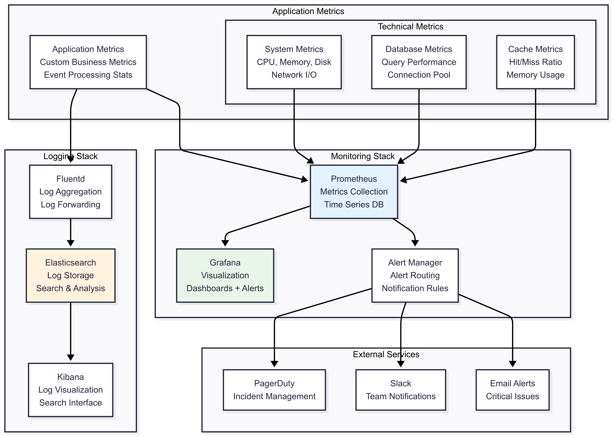

## 5. Các Bước Triển Khai Chi Tiết

### 5.1 Phase 1: Infrastructure Setup

```bash
# Step 1: Setup AWS Infrastructure
cd terraform/
terraform init
terraform plan -var-file="prod.tfvars"
terraform apply -var-file="prod.tfvars"

# Step 2: Configure kubectl
aws eks update-kubeconfig --region us-west-2 --name order-management-prod

# Step 3: Install cluster components
kubectl apply -f k8s/namespaces/
kubectl apply -f k8s/ingress-controller/
kubectl apply -f k8s/cert-manager/

# Step 4: Database setup
kubectl apply -f k8s/database/migrations-job.yaml
kubectl logs -f job/db-migrations

# Step 5: Verify infrastructure
kubectl get nodes
kubectl get namespaces
```

### 5.2 Phase 2: Application Configuration & Secrets

```bash
# Step 1: Create application secrets
kubectl create secret generic db-credentials \
  --from-literal=host=order-management-events.region.rds.amazonaws.com \
  --from-literal=username=postgres \
  --from-literal=password=your-secure-password \
  --from-literal=database=order_management \
  --namespace production

kubectl create secret generic redis-credentials \
  --from-literal=host=order-management-redis.cache.amazonaws.com \
  --from-literal=password=your-redis-password \
  --namespace production

# Step 2: Create ConfigMaps for application settings
kubectl create configmap app-config \
  --from-literal=NODE_ENV=production \
  --from-literal=PORT=3001 \
  --from-literal=LOG_LEVEL=info \
  --namespace production

# Step 3: Verify secrets and configs
kubectl get secrets -n production
kubectl get configmaps -n production
```

### 5.3 Phase 3: Backend Application Deployment

```yaml
# Step 1: Deploy Backend Application
# File: k8s/backend-deployment.yaml
apiVersion: apps/v1
kind: Deployment
metadata:
  name: order-management-backend
  namespace: production
  labels:
    app: order-management-backend
    tier: backend
spec:
  replicas: 3
  selector:
    matchLabels:
      app: order-management-backend
  template:
    metadata:
      labels:
        app: order-management-backend
        tier: backend
    spec:
      containers:
      - name: backend
        image: your-registry/order-management-backend:latest
        ports:
        - containerPort: 3001
          name: http
        env:
        - name: NODE_ENV
          valueFrom:
            configMapKeyRef:
              name: app-config
              key: NODE_ENV
        - name: PORT
          valueFrom:
            configMapKeyRef:
              name: app-config
              key: PORT
        - name: DB_HOST
          valueFrom:
            secretKeyRef:
              name: db-credentials
              key: host
        - name: DB_USERNAME
          valueFrom:
            secretKeyRef:
              name: db-credentials
              key: username
        - name: DB_PASSWORD
          valueFrom:
            secretKeyRef:
              name: db-credentials
              key: password
        - name: DB_NAME
          valueFrom:
            secretKeyRef:
              name: db-credentials
              key: database
        - name: REDIS_HOST
          valueFrom:
            secretKeyRef:
              name: redis-credentials
              key: host
        - name: REDIS_PASSWORD
          valueFrom:
            secretKeyRef:
              name: redis-credentials
              key: password
        resources:
          requests:
            memory: "2Gi"
            cpu: "1000m"
          limits:
            memory: "4Gi"
            cpu: "2000m"
        livenessProbe:
          httpGet:
            path: /health
            port: 3001
          initialDelaySeconds: 30
          periodSeconds: 10
          timeoutSeconds: 5
          failureThreshold: 3
        readinessProbe:
          httpGet:
            path: /health
            port: 3001
          initialDelaySeconds: 5
          periodSeconds: 5
          timeoutSeconds: 3
          failureThreshold: 3
        volumeMounts:
        - name: app-logs
          mountPath: /app/logs
      volumes:
      - name: app-logs
        emptyDir: {}
      restartPolicy: Always
---
apiVersion: v1
kind: Service
metadata:
  name: order-management-backend-service
  namespace: production
  labels:
    app: order-management-backend
spec:
  selector:
    app: order-management-backend
  ports:
  - port: 80
    targetPort: 3001
    protocol: TCP
    name: http
  type: ClusterIP
```

```bash
# Deploy backend
kubectl apply -f k8s/backend-deployment.yaml

# Verify backend deployment
kubectl get deployments -n production
kubectl get pods -n production -l app=order-management-backend
kubectl logs -f deployment/order-management-backend -n production
```

### 5.4 Phase 4: Frontend Application Deployment

```yaml
# Step 1: Deploy Frontend Application
# File: k8s/frontend-deployment.yaml
apiVersion: apps/v1
kind: Deployment
metadata:
  name: order-management-frontend
  namespace: production
  labels:
    app: order-management-frontend
    tier: frontend
spec:
  replicas: 3
  selector:
    matchLabels:
      app: order-management-frontend
  template:
    metadata:
      labels:
        app: order-management-frontend
        tier: frontend
    spec:
      containers:
      - name: frontend
        image: your-registry/order-management-frontend:latest
        ports:
        - containerPort: 3000
          name: http
        env:
        - name: NODE_ENV
          value: "production"
        - name: NEXT_PUBLIC_API_URL
          value: "https://api.your-domain.com"
        - name: PORT
          value: "3000"
        resources:
          requests:
            memory: "1Gi"
            cpu: "500m"
          limits:
            memory: "2Gi"
            cpu: "1000m"
        livenessProbe:
          httpGet:
            path: /
            port: 3000
          initialDelaySeconds: 30
          periodSeconds: 10
        readinessProbe:
          httpGet:
            path: /
            port: 3000
          initialDelaySeconds: 5
          periodSeconds: 5
      restartPolicy: Always
---
apiVersion: v1
kind: Service
metadata:
  name: order-management-frontend-service
  namespace: production
  labels:
    app: order-management-frontend
spec:
  selector:
    app: order-management-frontend
  ports:
  - port: 80
    targetPort: 3000
    protocol: TCP
    name: http
  type: ClusterIP
```

```bash
# Deploy frontend
kubectl apply -f k8s/frontend-deployment.yaml

# Verify frontend deployment
kubectl get deployments -n production
kubectl get pods -n production -l app=order-management-frontend
kubectl logs -f deployment/order-management-frontend -n production
```

### 5.5 Phase 5: Ingress & Load Balancer Setup

```yaml
# Step 1: Configure Ingress
# File: k8s/ingress.yaml
apiVersion: networking.k8s.io/v1
kind: Ingress
metadata:
  name: order-management-ingress
  namespace: production
  annotations:
    kubernetes.io/ingress.class: "alb"
    alb.ingress.kubernetes.io/scheme: internet-facing
    alb.ingress.kubernetes.io/target-type: ip
    alb.ingress.kubernetes.io/healthcheck-path: /health
    alb.ingress.kubernetes.io/ssl-redirect: '443'
    cert-manager.io/cluster-issuer: "letsencrypt-prod"
spec:
  tls:
  - hosts:
    - app.your-domain.com
    - api.your-domain.com
    secretName: order-management-tls
  rules:
  - host: app.your-domain.com
    http:
      paths:
      - path: /
        pathType: Prefix
        backend:
          service:
            name: order-management-frontend-service
            port:
              number: 80
  - host: api.your-domain.com
    http:
      paths:
      - path: /
        pathType: Prefix
        backend:
          service:
            name: order-management-backend-service
            port:
              number: 80
```

```bash
# Deploy ingress
kubectl apply -f k8s/ingress.yaml

# Verify ingress
kubectl get ingress -n production
kubectl describe ingress order-management-ingress -n production

# Check ALB creation (AWS)
aws elbv2 describe-load-balancers --region us-west-2
```

### 5.6 Phase 6: Auto-scaling Configuration

```yaml
# Step 1: Horizontal Pod Autoscaler for Backend
# File: k8s/hpa-backend.yaml
apiVersion: autoscaling/v2
kind: HorizontalPodAutoscaler
metadata:
  name: order-management-backend-hpa
  namespace: production
spec:
  scaleTargetRef:
    apiVersion: apps/v1
    kind: Deployment
    name: order-management-backend
  minReplicas: 3
  maxReplicas: 10
  metrics:
  - type: Resource
    resource:
      name: cpu
      target:
        type: Utilization
        averageUtilization: 70
  - type: Resource
    resource:
      name: memory
      target:
        type: Utilization
        averageUtilization: 80
---
# Step 2: Horizontal Pod Autoscaler for Frontend
apiVersion: autoscaling/v2
kind: HorizontalPodAutoscaler
metadata:
  name: order-management-frontend-hpa
  namespace: production
spec:
  scaleTargetRef:
    apiVersion: apps/v1
    kind: Deployment
    name: order-management-frontend
  minReplicas: 3
  maxReplicas: 8
  metrics:
  - type: Resource
    resource:
      name: cpu
      target:
        type: Utilization
        averageUtilization: 70
```

```bash
# Deploy auto-scaling
kubectl apply -f k8s/hpa-backend.yaml

# Verify HPA
kubectl get hpa -n production
kubectl describe hpa order-management-backend-hpa -n production
```

### 5.7 Phase 7: Application Testing & Verification

```bash
# Step 1: Test application endpoints
# Check backend health
curl -k https://api.your-domain.com/health

# Check frontend
curl -k https://app.your-domain.com/

# Step 2: Test database connectivity
kubectl exec -it deployment/order-management-backend -n production -- npm run db:test

# Step 3: Test Redis connectivity
kubectl exec -it deployment/order-management-backend -n production -- npm run redis:test

# Step 4: Load testing (optional)
kubectl run load-test --image=busybox --rm -it --restart=Never -- \
  /bin/sh -c "while true; do wget -q -O- https://api.your-domain.com/health; sleep 1; done"

# Step 5: Check all deployments status
kubectl get all -n production
kubectl get events -n production --sort-by='.lastTimestamp'
```

### 5.8 Phase 8: Environment Variables Validation

```bash
# Step 1: Verify environment variables in running containers
kubectl exec -it deployment/order-management-backend -n production -- env | grep -E "(NODE_ENV|DB_|REDIS_)"

# Step 2: Test API functionality
# Create a test order
curl -X POST https://api.your-domain.com/api/orders \
  -H "Content-Type: application/json" \
  -d '{
    "customerId": "test-customer-001",
    "items": [
      {
        "productId": "test-product-001",
        "productName": "Test Product",
        "quantity": 1,
        "price": 100.00
      }
    ]
  }'

# Get all orders
curl https://api.your-domain.com/api/orders

# Step 3: Check application logs for any errors
kubectl logs deployment/order-management-backend -n production --tail=100
kubectl logs deployment/order-management-frontend -n production --tail=100
```

```yaml
# Kubernetes Deployment Example
apiVersion: apps/v1
kind: Deployment
metadata:
  name: order-management-backend
  namespace: production
spec:
  replicas: 3
  selector:
    matchLabels:
      app: order-management-backend
  template:
    metadata:
      labels:
        app: order-management-backend
    spec:
      containers:
      - name: backend
        image: your-registry/order-management-backend:v1.2.3
        ports:
        - containerPort: 3001
        env:
        - name: NODE_ENV
          value: "production"
        - name: DB_HOST
          valueFrom:
            secretKeyRef:
              name: db-credentials
              key: host
        - name: DB_PASSWORD
          valueFrom:
            secretKeyRef:
              name: db-credentials
              key: password
        resources:
          requests:
            memory: "2Gi"
            cpu: "1000m"
          limits:
            memory: "4Gi"
            cpu: "2000m"
        livenessProbe:
          httpGet:
            path: /health
            port: 3001
          initialDelaySeconds: 30
          periodSeconds: 10
        readinessProbe:
          httpGet:
            path: /health
            port: 3001
          initialDelaySeconds: 5
          periodSeconds: 5
---
apiVersion: v1
kind: Service
metadata:
  name: order-management-backend-service
  namespace: production
spec:
  selector:
    app: order-management-backend
  ports:
  - port: 80
    targetPort: 3001
  type: ClusterIP
```

### 5.3 Phase 3: CI/CD Pipeline

```yaml
# GitHub Actions Workflow
name: Deploy to Production

on:
  push:
    branches: [main]
    tags: ['v*']

jobs:
  test:
    runs-on: ubuntu-latest
    steps:
    - uses: actions/checkout@v3
    
    - name: Setup Node.js
      uses: actions/setup-node@v3
      with:
        node-version: '18'
        cache: 'npm'
    
    - name: Install dependencies
      run: npm ci
    
    - name: Run tests
      run: npm test
    
    - name: Run integration tests
      run: |
        docker-compose -f docker-compose.test.yml up -d
        npm run test:integration
        docker-compose -f docker-compose.test.yml down

  build:
    needs: test
    runs-on: ubuntu-latest
    steps:
    - uses: actions/checkout@v3
    
    - name: Configure AWS credentials
      uses: aws-actions/configure-aws-credentials@v2
      with:
        aws-access-key-id: ${{ secrets.AWS_ACCESS_KEY_ID }}
        aws-secret-access-key: ${{ secrets.AWS_SECRET_ACCESS_KEY }}
        aws-region: us-west-2
    
    - name: Login to Amazon ECR
      uses: aws-actions/amazon-ecr-login@v1
    
    - name: Build and push Docker images
      run: |
        # Build backend
        docker build -t $ECR_REGISTRY/order-management-backend:$GITHUB_SHA ./Order-management
        docker push $ECR_REGISTRY/order-management-backend:$GITHUB_SHA
        
        # Build frontend
        docker build -t $ECR_REGISTRY/order-management-frontend:$GITHUB_SHA ./frontend
        docker push $ECR_REGISTRY/order-management-frontend:$GITHUB_SHA

  deploy:
    needs: build
    runs-on: ubuntu-latest
    environment: production
    steps:
    - uses: actions/checkout@v3
    
    - name: Deploy to EKS
      run: |
        aws eks update-kubeconfig --region us-west-2 --name order-management-prod
        
        # Update image tags in Helm values
        sed -i "s/IMAGE_TAG/$GITHUB_SHA/g" helm/values-prod.yaml
        
        # Deploy using Helm
        helm upgrade --install order-management ./helm \
          --namespace production \
          --values helm/values-prod.yaml \
          --wait --timeout=10m
        
        # Verify deployment
        kubectl rollout status deployment/order-management-backend -n production
        kubectl rollout status deployment/order-management-frontend -n production
```

### 5.4 Phase 4: Monitoring Setup

```yaml
# Grafana Dashboard Configuration
apiVersion: v1
kind: ConfigMap
metadata:
  name: order-management-dashboard
  namespace: monitoring
data:
  dashboard.json: |
    {
      "dashboard": {
        "title": "Order Management - Event Sourcing",
        "panels": [
          {
            "title": "Event Processing Rate",
            "type": "graph",
            "targets": [
              {
                "expr": "rate(events_processed_total[5m])",
                "legendFormat": "Events/sec"
              }
            ]
          },
          {
            "title": "Order Reconstruction Time",
            "type": "graph", 
            "targets": [
              {
                "expr": "histogram_quantile(0.95, order_rebuild_duration_seconds_bucket)",
                "legendFormat": "95th percentile"
              }
            ]
          },
          {
            "title": "Database Performance",
            "type": "graph",
            "targets": [
              {
                "expr": "pg_stat_database_tup_inserted_rate",
                "legendFormat": "Inserts/sec"
              },
              {
                "expr": "pg_stat_database_tup_fetched_rate", 
                "legendFormat": "Reads/sec"
              }
            ]
          }
        ]
      }
    }
```

## 6. Security Considerations

### 6.1 Network Security

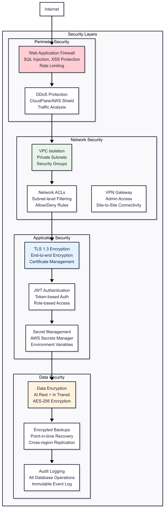

### 6.2 Security Checklist

| Category | Security Measure | Implementation |
|----------|------------------|----------------|
| **Authentication** | Multi-factor Authentication | AWS IAM + TOTP |
| **Authorization** | Role-based Access Control | Kubernetes RBAC |
| **Network** | VPC with Private Subnets | Terraform IaC |
| **Data** | Encryption at Rest | RDS/EBS encryption |
| **Transit** | TLS 1.3 Everywhere | ALB + cert-manager |
| **Secrets** | Centralized Secret Management | AWS Secrets Manager |
| **Monitoring** | Security Event Logging | CloudTrail + GuardDuty |
| **Compliance** | Data Retention Policies | Automated cleanup jobs |

## 7. Disaster Recovery & Business Continuity

### 7.1 Backup Strategy

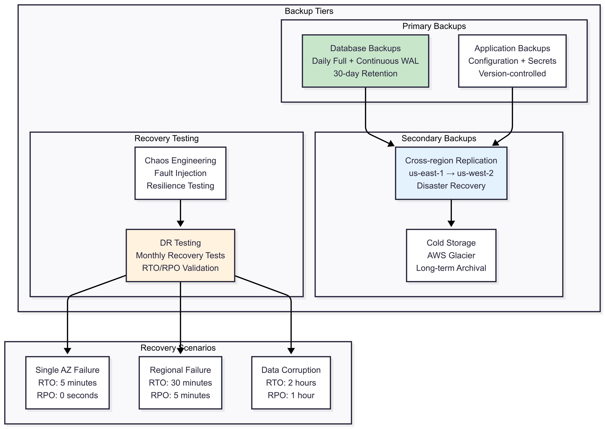

### 7.2 High Availability Configuration

| Component | HA Strategy | Failover Time | Data Loss |
|-----------|-------------|---------------|-----------|
| **Frontend** | Multi-AZ deployment + ALB | < 30 seconds | None |
| **Backend** | Auto-scaling + Health checks | < 1 minute | None |
| **Database** | Multi-AZ RDS + Read replicas | < 60 seconds | < 5 minutes |
| **Cache** | Redis cluster + replication | < 30 seconds | Session data only |
| **Load Balancer** | AWS ALB with multiple AZs | < 10 seconds | None |

## 8. Performance Optimization

### 8.1 Scaling Strategies

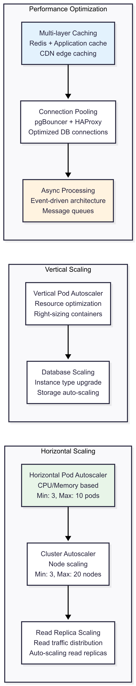

### 8.2 Performance Metrics

| Metric | Target | Alert Threshold | Action |
|--------|--------|-----------------|--------|
| **Response Time** | < 200ms (95th percentile) | > 500ms | Scale up |
| **Event Processing** | < 100ms per event | > 300ms | Optimize queries |
| **Database CPU** | < 70% average | > 85% | Scale up instance |
| **Memory Usage** | < 80% of limit | > 90% | Increase limits |
| **Error Rate** | < 0.1% | > 1% | Alert team |

## 9. Cost Optimization

### 9.1 Resource Right-sizing

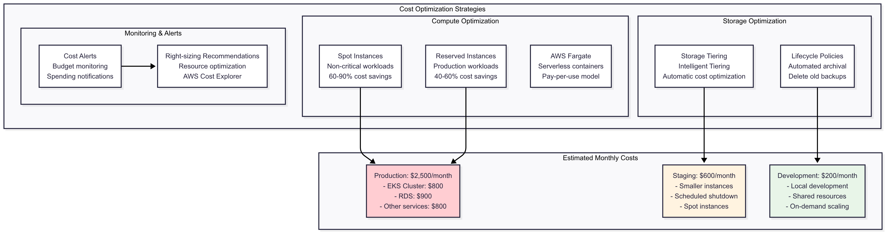

## 10. Compliance & Governance

### 10.1 Compliance Requirements

| Standard | Requirement | Implementation |
|----------|-------------|----------------|
| **GDPR** | Data Privacy & Right to be Forgotten | Event tombstoning, Data anonymization |
| **SOX** | Financial Data Integrity | Immutable audit trail, Access controls |
| **HIPAA** | Healthcare Data Protection | Encryption, Access logging |
| **ISO 27001** | Information Security | Security policies, Risk assessment |

### 10.2 Governance Framework

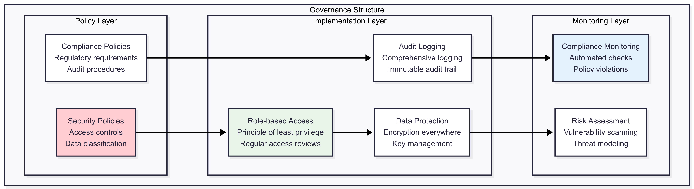

## 11. Migration Strategy

### 11.1 Migration Phases

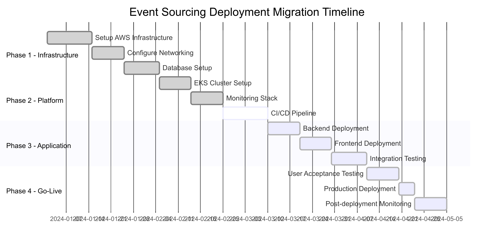

### 11.2 Rollback Strategy

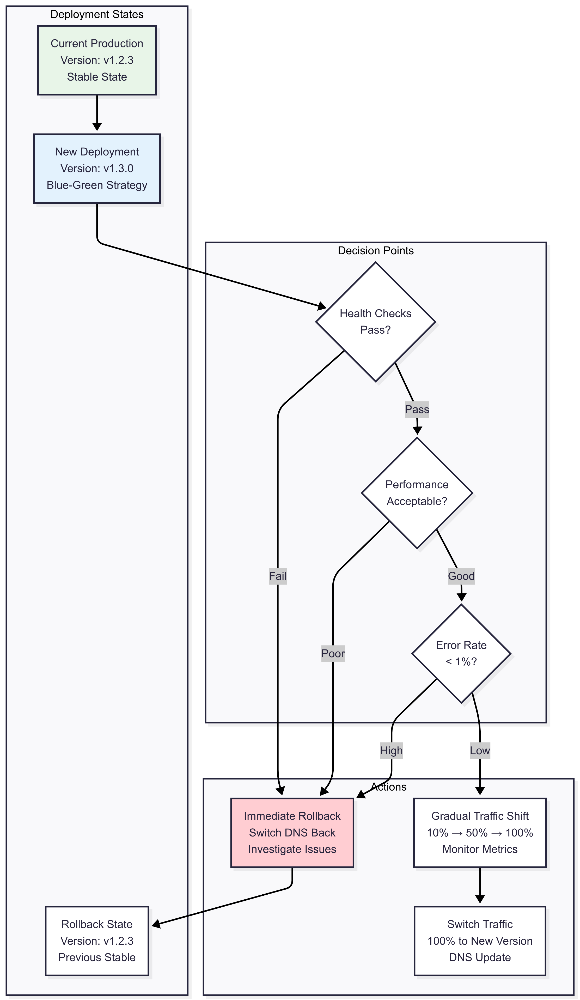

## 12. Conclusion & Recommendations

### 12.1 Deployment Best Practices

1. **Infrastructure as Code**: Tất cả infrastructure được định nghĩa trong code
2. **Immutable Infrastructure**: Không modify infrastructure đang chạy
3. **Blue-Green Deployment**: Zero-downtime deployments
4. **Monitoring First**: Setup monitoring trước khi deploy
5. **Security by Design**: Security được tích hợp từ đầu
6. **Disaster Recovery**: Có kế hoạch và test thường xuyên
7. **Cost Optimization**: Monitor và optimize costs liên tục

### 12.2 Success Metrics

| Metric | Target | Current | Status |
|--------|--------|---------|--------|
| **Deployment Frequency** | Daily | Weekly | 🟨 Improving |
| **Lead Time** | < 2 hours | 4 hours | 🟨 Improving |
| **MTTR** | < 15 minutes | 30 minutes | 🟨 Improving |
| **Change Failure Rate** | < 15% | 20% | 🟨 Improving |
| **Availability** | 99.9% | 99.5% | 🟨 Improving |

### 12.3 Future Enhancements

1. **Multi-Region Deployment**: Expand to multiple AWS regions
2. **Advanced Monitoring**: Implement distributed tracing
3. **Chaos Engineering**: Regular fault injection testing
4. **ML/AI Integration**: Predictive scaling and anomaly detection
5. **Edge Computing**: Deploy closer to users with edge locations
6. **Service Mesh**: Implement Istio for advanced traffic management

Deployment View này cung cấp roadmap đầy đủ cho việc triển khai hệ thống Event Sourcing Order Management từ development đến production, đảm bảo scalability, reliability, và security ở mọi tầng của kiến trúc.
