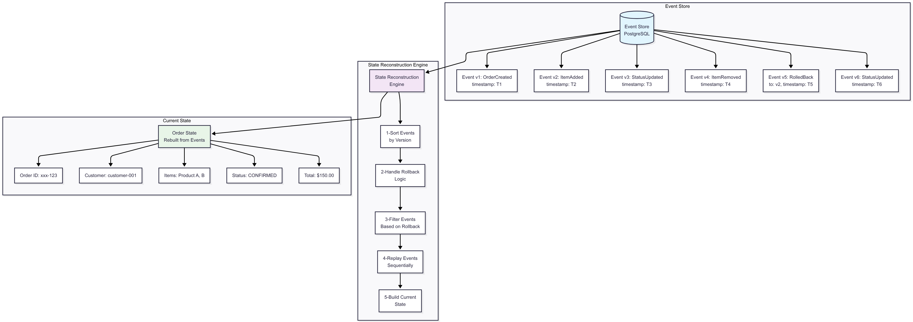
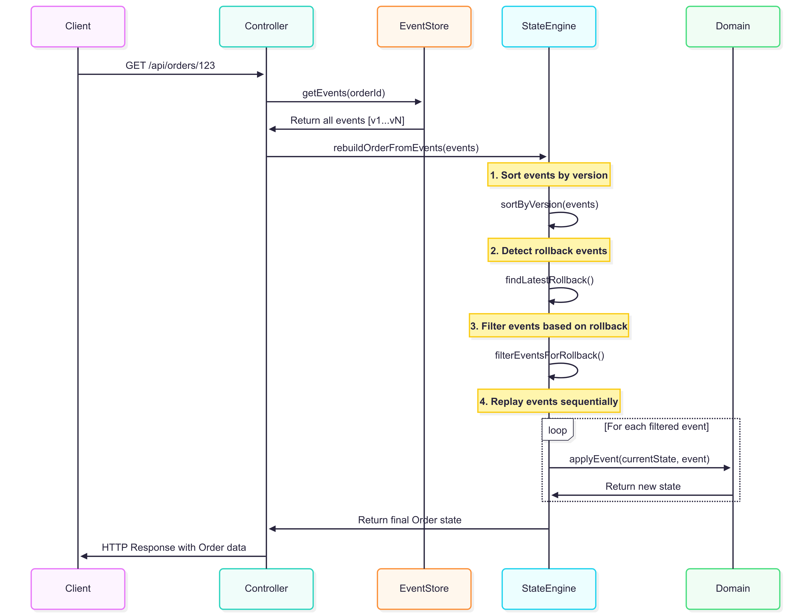
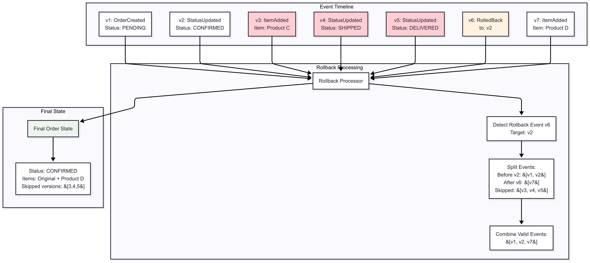
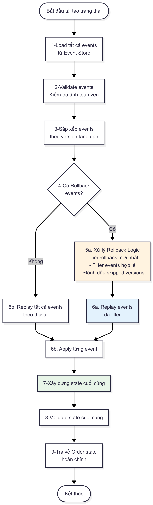
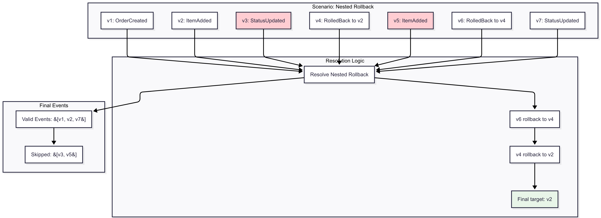
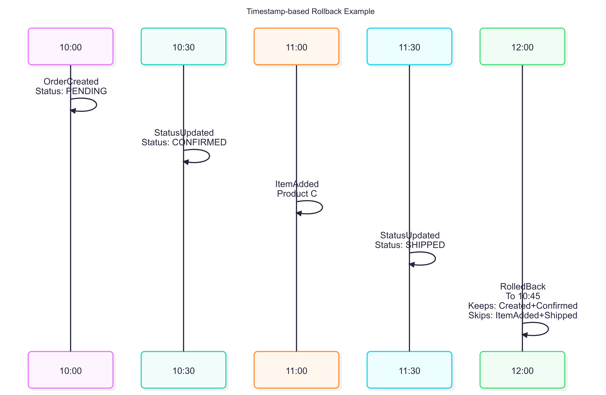
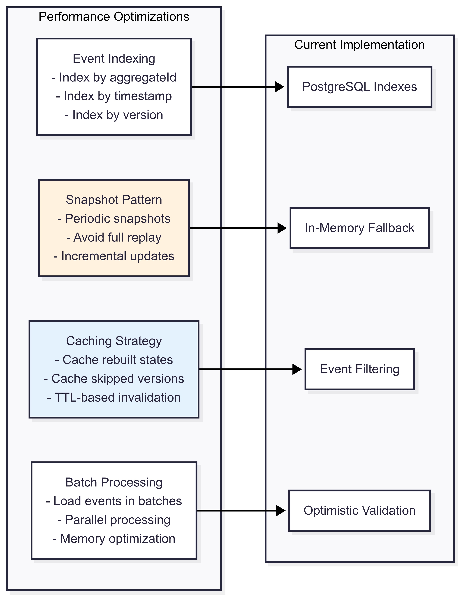
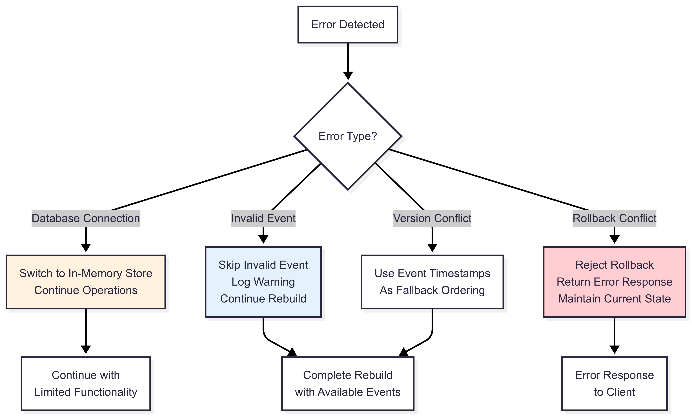

# Cơ Chế Tái Tạo Trạng Thái Hệ Thống từ Sự Kiện - Event Sourcing Order Management

## Tổng Quan

Event Sourcing là một pattern kiến trúc trong đó tất cả các thay đổi trạng thái của hệ thống được lưu trữ dưới dạng một chuỗi các sự kiện (events) bất biến. Thay vì lưu trữ trạng thái hiện tại, hệ thống lưu trữ tất cả các sự kiện đã xảy ra và tái tạo trạng thái bằng cách phát lại (replay) các sự kiện này.

## 1. Sơ Đồ Tổng Quan Cơ Chế Tái Tạo Trạng Thái



## 2. Luồng Dữ Liệu Chi Tiết từ Sự Kiện đến Trạng Thái Cuối Cùng

### 2.1 Sơ Đồ Luồng Dữ Liệu Chính



### 2.2 Cơ Chế Xử Lý Rollback



## 3. Các Loại Sự Kiện trong Hệ Thống

### 3.1 Event Types và Cấu Trúc

```typescript
// Base Event Structure
interface BaseEvent {
  type: string;
  aggregateId: string;
  version: number;
  timestamp: Date;
  data: any;
}

// Các loại sự kiện trong hệ thống
1. OrderCreatedEvent - Tạo order mới
2. OrderStatusUpdatedEvent - Cập nhật trạng thái
3. OrderItemAddedEvent - Thêm sản phẩm
4. OrderItemRemovedEvent - Xóa sản phẩm
5. OrderRolledBackEvent - Rollback về trạng thái trước
```

### 3.2 Ví Dụ Chuỗi Events

```json
[
  {
    "version": 1,
    "type": "OrderCreated",
    "aggregateId": "order-123",
    "timestamp": "2024-01-01T10:00:00Z",
    "data": {
      "customerId": "customer-001",
      "items": [{"productId": "A", "price": 100, "quantity": 1}],
      "status": "PENDING",
      "totalAmount": 100
    }
  },
  {
    "version": 2,
    "type": "OrderStatusUpdated",
    "aggregateId": "order-123",
    "timestamp": "2024-01-01T10:30:00Z",
    "data": {
      "oldStatus": "PENDING",
      "newStatus": "CONFIRMED"
    }
  },
  {
    "version": 3,
    "type": "OrderItemAdded",
    "aggregateId": "order-123",
    "timestamp": "2024-01-01T11:00:00Z",
    "data": {
      "item": {"productId": "B", "price": 50, "quantity": 1}
    }
  },
  {
    "version": 4,
    "type": "OrderRolledBack",
    "aggregateId": "order-123",
    "timestamp": "2024-01-01T12:00:00Z",
    "data": {
      "rollbackType": "version",
      "rollbackValue": 2,
      "eventsUndone": 1,
      "rollbackPoint": "Version 2"
    }
  }
]
```

## 4. Công Cụ và Công Nghệ Sử Dụng

### 4.1 Công Cụ Phát Triển

| Công Cụ | Mục Đích | Ghi Chú |
|----------|----------|---------|
| **PostgreSQL** | Event Store chính | Lưu trữ events với JSONB |
| **TypeScript** | Ngôn ngữ phát triển | Type safety cho events |
| **Node.js/Express** | Backend framework | API endpoints |
| **React/Next.js** | Frontend | UI để tương tác |
| **pgAdmin** | Database management | Quản lý PostgreSQL |
| **Git** | Version control | Quản lý source code |
| **VS Code** | IDE | Development environment |
| **Docker** | Containerization | Deploy và testing |

### 4.2 Công Cụ Monitoring và Debug

| Công Cụ | Mục Đích | Endpoint/Lệnh |
|----------|----------|---------------|
| **Health Check** | Kiểm tra trạng thái hệ thống | `GET /health` |
| **Event Inspector** | Xem tất cả events | `GET /api/debug/events` |
| **Order Events** | Events của order cụ thể | `GET /api/debug/orders/:id/events` |
| **Database Stats** | Thống kê database | `GET /api/debug/stats` |
| **Skipped Versions** | Phân tích rollback | `GET /api/debug/orders/:id/skipped-versions` |

## 5. Các Bước Thực Hiện Tái Tạo Trạng Thái

### 5.1 Quy Trình Tái Tạo Cơ Bản



### 5.2 Chi Tiết Implementation Code

```typescript
// Quy trình tái tạo trạng thái trong OrderController
private rebuildOrderFromEvents(events: BaseEvent[]): Order | null {
  // Bước 1: Kiểm tra đầu vào
  if (events.length === 0) return null;

  // Bước 2: Sắp xếp events theo version
  const sortedEvents = [...events].sort((a, b) => a.version - b.version);

  // Bước 3: Tìm rollback events
  const rollbackEvents = sortedEvents.filter(e => e.type === 'OrderRolledBack');
  const latestRollback = rollbackEvents.length > 0
    ? rollbackEvents.reduce((latest, current) =>
        current.version > latest.version ? current : latest)
    : null;

  // Bước 4: Xác định events cần process
  let eventsToProcess = sortedEvents;

  if (latestRollback) {
    const rollbackData = latestRollback.data;
    const nonRollbackEvents = sortedEvents.filter(e => e.type !== 'OrderRolledBack');

    if (rollbackData.rollbackType === 'version') {
      // Rollback theo version
      const finalVersion = this.resolveNestedRollbackVersion(
        sortedEvents, 
        rollbackData.rollbackValue
      );
      
      const eventsBeforeRollback = nonRollbackEvents.filter(
        e => e.version <= finalVersion
      );
      const eventsAfterRollback = nonRollbackEvents.filter(
        e => e.version > latestRollback.version
      );
      
      eventsToProcess = [...eventsBeforeRollback, ...eventsAfterRollback]
        .sort((a, b) => a.version - b.version);
        
    } else if (rollbackData.rollbackType === 'timestamp') {
      // Rollback theo timestamp
      const rollbackDate = new Date(rollbackData.rollbackValue);
      
      const eventsBeforeRollback = nonRollbackEvents.filter(
        e => new Date(e.timestamp) <= rollbackDate
      );
      const eventsAfterRollback = nonRollbackEvents.filter(
        e => e.version > latestRollback.version
      );
      
      eventsToProcess = [...eventsBeforeRollback, ...eventsAfterRollback]
        .sort((a, b) => a.version - b.version);
    }
  }

  // Bước 5: Replay events để build state
  let order: Order | null = null;

  for (const event of eventsToProcess) {
    switch (event.type) {
      case 'OrderCreated':
        order = new Order(
          event.data.customerId,
          event.data.items,
          event.data.status,
          event.data.orderId
        );
        break;

      case 'OrderStatusUpdated':
        if (order) {
          order = order.updateStatus(event.data.newStatus);
        }
        break;

      case 'OrderItemAdded':
        if (order) {
          order = order.addItem(event.data.item);
        }
        break;

      case 'OrderItemRemoved':
        if (order) {
          order = order.removeItem(event.data.productId);
        }
        break;

      case 'OrderRolledBack':
        // Rollback events đã được xử lý ở trên
        break;

      default:
        console.warn(`Unknown event type: ${event.type}`);
        break;
    }
  }

  return order;
}
```

## 6. Các Tình Huống Phức Tạp

### 6.1 Nested Rollback (Rollback Lồng Nhau)



### 6.2 Timestamp-based Rollback



## 7. Performance và Optimization

### 7.1 Các Kỹ Thuật Tối Ưu



### 7.2 Metrics và Monitoring

| Metric | Mô Tả | Threshold |
|--------|-------|-----------|
| **Event Count** | Tổng số events trong system | Monitor growth rate |
| **Rebuild Time** | Thời gian tái tạo state | < 100ms cho <1000 events |
| **Rollback Frequency** | Tần suất rollback operations | Monitor patterns |
| **Skipped Versions** | Số versions bị skip | Alert nếu > 10% |
| **Database Performance** | Query response time | < 50ms average |

## 8. Error Handling và Edge Cases

### 8.1 Các Tình Huống Lỗi

```typescript
// Validation Logic trong Rollback
async rollbackOrder(orderId: string, toVersion?: number, toTimestamp?: string) {
  try {
    // 1. Validate input parameters
    if (!toVersion && !toTimestamp) {
      throw new Error('Either toVersion or toTimestamp must be provided');
    }

    if (toVersion && toTimestamp) {
      throw new Error('Only one of toVersion or toTimestamp should be provided');
    }

    // 2. Load và validate events
    const allEvents = await this.eventStore.getEvents(orderId);
    if (allEvents.length === 0) {
      throw new Error('Order not found');
    }

    // 3. Check skipped versions
    if (toVersion) {
      const skippedVersions = this.getSkippedVersions(allEvents);
      if (skippedVersions.includes(toVersion)) {
        throw new Error(
          `Cannot rollback to version ${toVersion} because it was skipped by a previous rollback. Skipped versions: ${skippedVersions.join(', ')}`
        );
      }
    }

    // 4. Validate rollback target exists
    const validEvents = allEvents.filter(e => 
      toVersion ? e.version <= toVersion : 
      new Date(e.timestamp) <= new Date(toTimestamp!)
    );

    if (validEvents.length === 0) {
      throw new Error('No events found for the specified rollback point');
    }

    // 5. Proceed with rollback...
    
  } catch (error) {
    console.error('Rollback failed:', error);
    throw error;
  }
}
```

### 8.2 Fallback Strategies



## 9. Testing Strategy

### 9.1 Unit Tests

```typescript
// Ví dụ Unit Test cho State Reconstruction
describe('State Reconstruction Tests', () => {
  it('should rebuild order from simple events', async () => {
    const events = [
      createOrderEvent({ customerId: 'cust-1', items: [item1] }),
      statusUpdateEvent({ newStatus: 'CONFIRMED' }),
      itemAddEvent({ item: item2 })
    ];

    const order = rebuildOrderFromEvents(events);
    
    expect(order.status).toBe('CONFIRMED');
    expect(order.items).toHaveLength(2);
    expect(order.totalAmount).toBe(150);
  });

  it('should handle rollback correctly', async () => {
    const events = [
      createOrderEvent({ customerId: 'cust-1', items: [item1] }), // v1
      itemAddEvent({ item: item2 }), // v2
      statusUpdateEvent({ newStatus: 'CONFIRMED' }), // v3
      rollbackEvent({ toVersion: 2 }) // v4
    ];

    const order = rebuildOrderFromEvents(events);
    
    expect(order.items).toHaveLength(2); // Keeps v1 + v2
    expect(order.status).toBe('PENDING'); // v3 was skipped
  });

  it('should prevent rollback to skipped version', async () => {
    const events = [
      createOrderEvent({ customerId: 'cust-1', items: [item1] }), // v1
      itemAddEvent({ item: item2 }), // v2
      statusUpdateEvent({ newStatus: 'CONFIRMED' }), // v3
      rollbackEvent({ toVersion: 1 }), // v4 - skips v2, v3
      statusUpdateEvent({ newStatus: 'SHIPPED' }) // v5
    ];

    // Attempt to rollback to skipped version should fail
    expect(() => {
      validateRollbackTarget(events, 2); // v2 is skipped
    }).toThrow('Cannot rollback to version 2');
  });
});
```

### 9.2 Integration Tests

```typescript
// Integration Test với Database
describe('Event Store Integration', () => {
  beforeEach(async () => {
    await setupTestDatabase();
  });

  it('should persist and retrieve events correctly', async () => {
    const orderId = 'test-order-1';
    
    // Create events
    await eventStore.saveEvent(createOrderEvent({ orderId }));
    await eventStore.saveEvent(statusUpdateEvent({ orderId }));
    
    // Retrieve and rebuild
    const events = await eventStore.getEvents(orderId);
    const order = rebuildOrderFromEvents(events);
    
    expect(order).toBeDefined();
    expect(order.id).toBe(orderId);
  });

  it('should handle concurrent updates with version control', async () => {
    const orderId = 'test-order-concurrent';
    
    // Simulate concurrent updates
    const promises = [
      eventStore.saveEvent(itemAddEvent({ orderId, expectedVersion: 1 })),
      eventStore.saveEvent(statusUpdateEvent({ orderId, expectedVersion: 1 }))
    ];
    
    // One should succeed, one should fail with version conflict
    const results = await Promise.allSettled(promises);
    const successes = results.filter(r => r.status === 'fulfilled');
    const failures = results.filter(r => r.status === 'rejected');
    
    expect(successes).toHaveLength(1);
    expect(failures).toHaveLength(1);
  });
});
```

## 10. Kết Luận

### 10.1 Ưu Điểm của Event Sourcing

1. **Audit Trail Hoàn Chỉnh**: Mọi thay đổi đều được ghi lại
2. **Time Travel**: Có thể xem trạng thái tại bất kỳ thời điểm nào
3. **Debugging Tốt**: Dễ dàng trace lỗi và phân tích
4. **Scalability**: Có thể scale read và write riêng biệt
5. **Data Recovery**: Có thể tái tạo từ events nếu mất dữ liệu

### 10.2 Thách Thức

1. **Complexity**: Cần hiểu rõ về event ordering và replay
2. **Performance**: Replay nhiều events có thể chậm
3. **Storage**: Events tăng trưởng liên tục
4. **Rollback Logic**: Xử lý rollback phức tạp

### 10.3 Best Practices

1. **Event Design**: Events phải immutable và self-contained
2. **Version Control**: Sử dụng version để handle concurrency
3. **Validation**: Validate events trước khi persist
4. **Monitoring**: Monitor performance và data integrity
5. **Backup Strategy**: Regular backup event store
6. **Documentation**: Document event schemas và business rules

### 10.4 Future Enhancements

1. **Snapshots**: Implement snapshot pattern để tối ưu performance
2. **Read Models**: Tạo materialized views cho các query phức tạp
3. **Event Migration**: Schema evolution và event versioning
4. **Distributed Events**: Event streaming cho microservices
5. **Advanced Analytics**: Event-based analytics và reporting

Hệ thống Event Sourcing Order Management này cung cấp một foundation vững chắc cho việc xây dựng các ứng dụng có yêu cầu cao về audit trail, debugging, và khả năng rollback. Với cơ chế tái tạo trạng thái mạnh mẽ, hệ thống có thể đảm bảo tính nhất quán dữ liệu và cung cấp khả năng "time travel" độc đáo trong thế giới phần mềm.
