# Event Sourcing Order Management - Góc Nhìn Triển khai (Deployment View)

## 🎯 Tổng quan Góc nhìn Triển khai

**Góc nhìn Triển khai** trả lời các câu hỏi quan trọng:
- 🏗️ **Hệ thống sẽ được triển khai ở đâu?**
- 🖥️ **Những node/hạ tầng vật lý hoặc logic nào tồn tại?**
- 📦 **Mỗi node sẽ chạy những thành phần (artifact) nào?**
- 🔗 **Các node giao tiếp với nhau bằng gì?**
- 🔒 **Cách tổ chức mạng & bảo mật**
- 🛠️ **Công cụ/hạ tầng được dùng để triển khai**
- 🚀 **Chiến lược triển khai & vận hành**

---

## 🏗️ Hạ tầng Triển khai Tổng quan

### Deployment Architecture Overview


---

## 🌍 Chiến lược Triển khai Môi trường

### 1. Development Environment (Local)
```
🖥️ Developer Machine (localhost)
├── Frontend: localhost:3000 (Next.js dev server)
├── Backend: localhost:3001 (Express.js nodemon)
└── Database: localhost:5432 (PostgreSQL local)
```

### 2. Staging Environment (Docker Compose)
```
🐳 Docker Host (staging server)
├── docker-compose.staging.yml
├── Frontend Containers (2 replicas)
├── Backend Containers (2 replicas)
├── PostgreSQL Container
├── Redis Container
└── Nginx Container
```

### 3. Production Environment (Kubernetes)
```
☸️ Kubernetes Cluster (cloud-managed)
├── Frontend Pods (3+ replicas)
├── Backend Pods (3+ replicas)
├── PostgreSQL StatefulSet (master/replica)
├── Redis Deployment
├── Nginx Ingress Controller
└── Monitoring Stack (Prometheus/Grafana)
```

### 4. Cloud-native Environment (Future)
```
☁️ AWS/Azure/GCP
├── Frontend: CloudFront + S3/CDN
├── Backend: ECS/AKS/GKE
├── Database: RDS/Cloud SQL
├── Event Streaming: EventBridge/Event Hubs
└── Monitoring: CloudWatch/Azure Monitor
```

---

## 🖥️ Node Architecture & Deployment Mapping

### Node 1: Load Balancer & API Gateway
```yaml
Node Type: Virtual Machine / Container
Deployment Target: Nginx Container / AWS ALB
Responsibilities:
  - HTTP/HTTPS termination
  - SSL certificate management
  - Request routing & load balancing
  - Rate limiting & DDoS protection
  - API versioning support

Specifications:
  CPU: 2 cores
  Memory: 4GB RAM
  Storage: 20GB SSD
  Network: 1Gbps
  
Artifacts Running:
  - nginx:alpine container
  - SSL certificates
  - nginx.conf configuration
  - upstream server definitions
```

### Node 2: Frontend Application Servers
```yaml
Node Type: Container / Kubernetes Pod
Deployment Target: Docker Swarm / Kubernetes
Replicas: 2-5 instances (auto-scaling)
Responsibilities:
  - Serve Next.js application
  - Server-side rendering (SSR)
  - Static asset serving
  - Client-side routing

Specifications:
  CPU: 1 core per container
  Memory: 2GB RAM per container
  Storage: 10GB for application code
  Network: Internal cluster networking
  
Artifacts Running:
  - Node.js 18+ runtime
  - Next.js application bundle
  - Static assets & images
  - Environment configuration
  
Docker Configuration:
  FROM node:18-alpine
  WORKDIR /app
  COPY package*.json ./
  RUN npm ci --only=production
  COPY . .
  RUN npm run build
  EXPOSE 3000
  CMD ["npm", "start"]
```

### Node 3: Backend API Servers
```yaml
Node Type: Container / Kubernetes Pod
Deployment Target: Docker Swarm / Kubernetes
Replicas: 2-5 instances (auto-scaling)
Responsibilities:
  - Process HTTP REST API requests
  - Command & Query handling
  - Business logic execution
  - Event generation & publishing

Specifications:
  CPU: 2 cores per container
  Memory: 4GB RAM per container
  Storage: 10GB for application code
  Network: Internal cluster networking
  
Artifacts Running:
  - Node.js 18+ runtime
  - Express.js application
  - TypeScript compiled code
  - npm dependencies
  - Configuration files
  
Docker Configuration:
  FROM node:18-alpine
  WORKDIR /app
  COPY package*.json ./
  RUN npm ci --only=production
  COPY dist/ ./dist/
  EXPOSE 3001
  CMD ["node", "dist/index.js"]
  
Environment Variables:
  - DB_HOST=postgres-service
  - DB_PORT=5432
  - DB_NAME=order_management
  - DB_USER=app_user
  - DB_PASSWORD=<secret>
  - REDIS_URL=redis://redis-service:6379
  - NODE_ENV=production
```

### Node 4: Event Store (PostgreSQL Primary)
```yaml
Node Type: StatefulSet / Dedicated VM
Deployment Target: Kubernetes StatefulSet / AWS RDS
Responsibilities:
  - Store events immutably
  - Handle write operations
  - Maintain ACID properties
  - Stream replication to replicas

Specifications:
  CPU: 4 cores
  Memory: 16GB RAM
  Storage: 500GB SSD (persistent volume)
  Network: High-speed internal network
  
Artifacts Running:
  - PostgreSQL 15+ database engine
  - Custom database schema
  - Database functions & procedures
  - Backup & maintenance scripts
  
Database Configuration:
  max_connections = 200
  shared_buffers = 4GB
  effective_cache_size = 12GB
  work_mem = 256MB
  maintenance_work_mem = 2GB
  wal_level = replica
  max_replication_slots = 5
  
Storage Configuration:
  Data Directory: /var/lib/postgresql/data
  Backup Directory: /backups
  WAL Archive: /wal-archive
  Volume Type: Persistent SSD
```

### Node 5: Read Replicas (PostgreSQL Secondary)
```yaml
Node Type: StatefulSet / Managed Service
Deployment Target: Kubernetes / AWS RDS Read Replica
Replicas: 2 instances
Responsibilities:
  - Handle read-only queries
  - Reduce load on primary database
  - Provide query performance optimization
  - Support analytics workloads

Specifications:
  CPU: 2 cores each
  Memory: 8GB RAM each
  Storage: 500GB SSD (synchronized)
  Network: High-speed internal network
  
Artifacts Running:
  - PostgreSQL 15+ (read-only mode)
  - Streaming replication setup
  - Read-only user configurations
  - Query optimization settings
```

### Node 6: Cache Layer (Redis)
```yaml
Node Type: Container / Managed Service
Deployment Target: Kubernetes Deployment / AWS ElastiCache
Responsibilities:
  - Cache frequently accessed data
  - Store session information
  - Cache projection data
  - Provide fast key-value storage

Specifications:
  CPU: 1 core
  Memory: 8GB RAM
  Storage: 50GB (persistent if needed)
  Network: High-speed internal network
  
Artifacts Running:
  - Redis 7+ server
  - Redis configuration
  - Persistence settings (RDB/AOF)
  - Memory optimization settings
  
Redis Configuration:
  maxmemory 6gb
  maxmemory-policy allkeys-lru
  save 900 1
  save 300 10
  save 60 10000
  appendonly yes
```

### Node 7: Monitoring & Observability
```yaml
Node Type: Container Stack / Managed Service
Deployment Target: Kubernetes / AWS CloudWatch
Responsibilities:
  - System metrics collection
  - Application performance monitoring
  - Log aggregation & analysis
  - Alerting & notification

Specifications:
  CPU: 2 cores
  Memory: 8GB RAM
  Storage: 200GB for metrics/logs
  Network: Access to all application nodes
  
Artifacts Running:
  - Prometheus server
  - Grafana dashboard
  - Elasticsearch (logs)
  - Kibana (log visualization)
  - Alertmanager
  
Services:
  - prometheus:9090
  - grafana:3000
  - elasticsearch:9200
  - kibana:5601
  - alertmanager:9093
```

---

## 🔗 Network Communication & Protocols

### Internal Communication Patterns

```mermaid
graph LR
    subgraph "External Traffic"
        USER[Users/Clients]
        ADMIN[Admin Dashboard]
    end
    
    subgraph "Edge Layer"
        LB[Load Balancer<br/>HTTPS/443]
        CDN[CDN<br/>Static Assets]
    end
    
    subgraph "Application Layer"
        FE[Frontend<br/>HTTP/3000]
        BE[Backend API<br/>HTTP/3001]
    end
    
    subgraph "Data Layer"
        PG[PostgreSQL<br/>TCP/5432]
        RD[Redis<br/>TCP/6379]
    end
    
    subgraph "Infrastructure"
        MON[Monitoring<br/>HTTP/9090]
        LOG[Logging<br/>HTTP/5601]
    end
    
    USER -->|HTTPS/443| LB
    ADMIN -->|HTTPS/443| LB
    USER -->|HTTP/80→443| CDN
    
    LB -->|HTTP/3000| FE
    LB -->|HTTP/3001| BE
    CDN -->|HTTP/3000| FE
    
    FE -->|HTTP/3001| BE
    BE -->|TCP/5432| PG
    BE -->|TCP/6379| RD
    
    BE -->|HTTP/9090| MON
    FE -->|HTTP/9090| MON
    PG -->|HTTP/9090| MON
    
    BE -->|Syslog/514| LOG
    FE -->|Syslog/514| LOG
    PG -->|Syslog/514| LOG
```



### Communication Protocols Detail

#### 1. Client-to-System Communication
```yaml
Protocol: HTTPS/TLS 1.3
Port: 443 (external), 80 (redirect)
Authentication: JWT tokens (future)
Rate Limiting: 1000 requests/minute per IP
Security Headers:
  - Strict-Transport-Security
  - Content-Security-Policy
  - X-Frame-Options: DENY
  - X-Content-Type-Options: nosniff
```

#### 2. Frontend-to-Backend Communication
```yaml
Protocol: HTTP/1.1 (internal cluster)
Port: 3001
Content-Type: application/json
Authentication: Internal service mesh (future)
Retry Policy: 3 attempts with exponential backoff
Timeout: 30 seconds
Keep-Alive: Enabled
```

#### 3. Backend-to-Database Communication
```yaml
Protocol: PostgreSQL Wire Protocol (TCP)
Port: 5432
Connection Pooling: 
  - Min Connections: 5
  - Max Connections: 20
  - Idle Timeout: 30 seconds
SSL: Required (sslmode=require)
Transaction Isolation: Read Committed
Prepared Statements: Enabled
```

#### 4. Backend-to-Cache Communication
```yaml
Protocol: Redis Protocol (RESP3)
Port: 6379
Connection Pooling:
  - Max Connections: 10
  - Idle Timeout: 60 seconds
Serialization: JSON
TTL Strategy: Configurable per cache type
Persistence: AOF + RDB snapshots
```

#### 5. Monitoring Communication
```yaml
Metrics Collection:
  - Protocol: HTTP/1.1
  - Port: 9090 (Prometheus)
  - Scrape Interval: 30 seconds
  - Retention: 30 days

Log Collection:
  - Protocol: Syslog/UDP
  - Port: 514
  - Format: JSON structured logging
  - Retention: 90 days
```

---

## 🔒 Network Security & Organization

### Network Topology


### Security Configuration

#### 1. Firewall Rules (iptables/Security Groups)
```bash
# DMZ Zone - Load Balancer
Allow: 0.0.0.0/0:443 → 10.0.1.0/24:443 (HTTPS)
Allow: 0.0.0.0/0:80 → 10.0.1.0/24:80 (HTTP redirect)
Deny: All other inbound traffic

# Application Zone - Frontend
Allow: 10.0.1.0/24:* → 10.0.2.0/24:3000 (from LB)
Allow: 10.0.2.0/24:* → 10.0.3.0/24:3001 (to Backend)
Deny: Direct internet access

# Application Zone - Backend  
Allow: 10.0.1.0/24:* → 10.0.3.0/24:3001 (from LB)
Allow: 10.0.2.0/24:* → 10.0.3.0/24:3001 (from Frontend)
Allow: 10.0.3.0/24:* → 10.0.4.0/24:5432 (to Database)
Allow: 10.0.3.0/24:* → 10.0.4.0/24:6379 (to Redis)
Deny: Direct internet access

# Data Zone - Database & Cache
Allow: 10.0.3.0/24:* → 10.0.4.0/24:5432 (from Backend)
Allow: 10.0.3.0/24:* → 10.0.4.0/24:6379 (from Backend)
Allow: 10.0.5.0/24:* → 10.0.4.0/24:* (from Management)
Deny: All other access

# Management Zone
Allow: Admin IPs → 10.0.5.0/24:22 (SSH)
Allow: 10.0.5.0/24:* → 10.0.0.0/16:* (internal management)
```

#### 2. TLS/SSL Configuration
```yaml
TLS Version: 1.3 (minimum 1.2)
Cipher Suites:
  - TLS_AES_256_GCM_SHA384
  - TLS_CHACHA20_POLY1305_SHA256
  - TLS_AES_128_GCM_SHA256

Certificate Management:
  Provider: Let's Encrypt / AWS Certificate Manager
  Auto-renewal: Enabled
  HSTS: max-age=31536000; includeSubDomains
  
Internal TLS:
  Service Mesh: Istio/Linkerd (future)
  mTLS: Enabled between services
  Certificate Rotation: 90 days
```

#### 3. Authentication & Authorization
```yaml
Current Implementation:
  - No authentication (demo system)
  - IP-based access control
  - Internal service communication (trusted network)

Future Implementation:
  Authentication:
    - JWT tokens with RS256 signing
    - OAuth 2.0 / OpenID Connect
    - Multi-factor authentication (MFA)
    
  Authorization:
    - Role-based access control (RBAC)
    - API key management
    - Rate limiting per user/role
    
  Service-to-Service:
    - Service mesh with mTLS
    - API gateway authentication
    - Zero-trust network principles
```

#### 4. Docker Network Security
```yaml
Development Environment:
  Network: event-sourcing-network (bridge)
  Isolation: Container-level isolation
  DNS: Internal Docker DNS
  
Production Environment:
  Network: Kubernetes cluster networking
  CNI: Calico/Flannel with network policies
  Service Mesh: Istio (planned)
  
Network Policies:
  - Default deny all
  - Explicit allow rules for required communication
  - Namespace isolation
  - Pod-to-pod encryption
```

---

## 🛠️ Deployment Tools & Infrastructure

### Container Orchestration

#### Docker Compose (Development/Staging)
```yaml
# docker-compose.production.yml
version: '3.8'

services:
  nginx:
    image: nginx:alpine
    ports:
      - "80:80"
      - "443:443"
    volumes:
      - ./nginx.conf:/etc/nginx/nginx.conf
      - ./ssl-certs:/etc/ssl/certs
    depends_on:
      - frontend
      - backend
    restart: unless-stopped
    
  frontend:
    build: ./frontend
    ports:
      - "3000"
    environment:
      - NODE_ENV=production
      - NEXT_PUBLIC_API_URL=https://api.yourdomain.com
    depends_on:
      - backend
    deploy:
      replicas: 2
      restart_policy:
        condition: on-failure
        delay: 5s
        max_attempts: 3
    
  backend:
    build: ./Order-management
    ports:
      - "3001"
    environment:
      - NODE_ENV=production
      - DB_HOST=postgres
      - DB_PORT=5432
      - DB_NAME=order_management
      - DB_USER=app_user
      - DB_PASSWORD_FILE=/run/secrets/db_password
      - REDIS_URL=redis://redis:6379
    depends_on:
      - postgres
      - redis
    secrets:
      - db_password
    deploy:
      replicas: 2
      restart_policy:
        condition: on-failure
        delay: 5s
        max_attempts: 3
    healthcheck:
      test: ["CMD", "curl", "-f", "http://localhost:3001/health"]
      interval: 30s
      timeout: 10s
      retries: 3
      
  postgres:
    image: postgres:15-alpine
    environment:
      - POSTGRES_DB=order_management
      - POSTGRES_USER=app_user
      - POSTGRES_PASSWORD_FILE=/run/secrets/db_password
    volumes:
      - postgres_data:/var/lib/postgresql/data
      - ./Order-management/database/schema.sql:/docker-entrypoint-initdb.d/01-schema.sql
    ports:
      - "5432"
    secrets:
      - db_password
    deploy:
      restart_policy:
        condition: on-failure
        delay: 5s
        max_attempts: 3
        
  redis:
    image: redis:7-alpine
    ports:
      - "6379"
    volumes:
      - redis_data:/data
    command: redis-server --appendonly yes --maxmemory 2gb --maxmemory-policy allkeys-lru
    deploy:
      restart_policy:
        condition: on-failure
        delay: 5s
        max_attempts: 3

volumes:
  postgres_data:
    driver: local
  redis_data:
    driver: local
    
secrets:
  db_password:
    file: ./secrets/db_password.txt

networks:
  default:
    driver: bridge
    ipam:
      config:
        - subnet: 172.20.0.0/16
```

#### Kubernetes (Production)
```yaml
# kubernetes/namespace.yaml
apiVersion: v1
kind: Namespace
metadata:
  name: event-sourcing
  labels:
    name: event-sourcing

---
# kubernetes/frontend-deployment.yaml
apiVersion: apps/v1
kind: Deployment
metadata:
  name: frontend
  namespace: event-sourcing
spec:
  replicas: 3
  selector:
    matchLabels:
      app: frontend
  template:
    metadata:
      labels:
        app: frontend
    spec:
      containers:
      - name: frontend
        image: event-sourcing/frontend:latest
        ports:
        - containerPort: 3000
        env:
        - name: NODE_ENV
          value: "production"
        - name: NEXT_PUBLIC_API_URL
          value: "https://api.yourdomain.com"
        resources:
          requests:
            cpu: 100m
            memory: 256Mi
          limits:
            cpu: 500m
            memory: 512Mi
        livenessProbe:
          httpGet:
            path: /health
            port: 3000
          initialDelaySeconds: 30
          periodSeconds: 10
        readinessProbe:
          httpGet:
            path: /ready
            port: 3000
          initialDelaySeconds: 5
          periodSeconds: 5

---
# kubernetes/backend-deployment.yaml
apiVersion: apps/v1
kind: Deployment
metadata:
  name: backend
  namespace: event-sourcing
spec:
  replicas: 3
  selector:
    matchLabels:
      app: backend
  template:
    metadata:
      labels:
        app: backend
    spec:
      containers:
      - name: backend
        image: event-sourcing/backend:latest
        ports:
        - containerPort: 3001
        env:
        - name: NODE_ENV
          value: "production"
        - name: DB_HOST
          value: "postgres-service"
        - name: DB_PORT
          value: "5432"
        - name: DB_NAME
          value: "order_management"
        - name: DB_USER
          valueFrom:
            secretKeyRef:
              name: postgres-secret
              key: username
        - name: DB_PASSWORD
          valueFrom:
            secretKeyRef:
              name: postgres-secret
              key: password
        - name: REDIS_URL
          value: "redis://redis-service:6379"
        resources:
          requests:
            cpu: 200m
            memory: 512Mi
          limits:
            cpu: 1
            memory: 1Gi
        livenessProbe:
          httpGet:
            path: /health
            port: 3001
          initialDelaySeconds: 30
          periodSeconds: 10
        readinessProbe:
          httpGet:
            path: /ready
            port: 3001
          initialDelaySeconds: 5
          periodSeconds: 5

---
# kubernetes/postgres-statefulset.yaml
apiVersion: apps/v1
kind: StatefulSet
metadata:
  name: postgres
  namespace: event-sourcing
spec:
  serviceName: postgres-service
  replicas: 1
  selector:
    matchLabels:
      app: postgres
  template:
    metadata:
      labels:
        app: postgres
    spec:
      containers:
      - name: postgres
        image: postgres:15
        ports:
        - containerPort: 5432
        env:
        - name: POSTGRES_DB
          value: "order_management"
        - name: POSTGRES_USER
          valueFrom:
            secretKeyRef:
              name: postgres-secret
              key: username
        - name: POSTGRES_PASSWORD
          valueFrom:
            secretKeyRef:
              name: postgres-secret
              key: password
        - name: PGDATA
          value: /var/lib/postgresql/data/pgdata
        volumeMounts:
        - name: postgres-storage
          mountPath: /var/lib/postgresql/data
        - name: init-scripts
          mountPath: /docker-entrypoint-initdb.d
        resources:
          requests:
            cpu: 500m
            memory: 1Gi
          limits:
            cpu: 2
            memory: 4Gi
      volumes:
      - name: init-scripts
        configMap:
          name: postgres-init-scripts
  volumeClaimTemplates:
  - metadata:
      name: postgres-storage
    spec:
      accessModes: ["ReadWriteOnce"]
      resources:
        requests:
          storage: 100Gi
      storageClassName: fast-ssd

---
# kubernetes/ingress.yaml
apiVersion: networking.k8s.io/v1
kind: Ingress
metadata:
  name: event-sourcing-ingress
  namespace: event-sourcing
  annotations:
    kubernetes.io/ingress.class: "nginx"
    cert-manager.io/cluster-issuer: "letsencrypt-prod"
    nginx.ingress.kubernetes.io/rate-limit: "1000"
    nginx.ingress.kubernetes.io/ssl-redirect: "true"
spec:
  tls:
  - hosts:
    - yourdomain.com
    - api.yourdomain.com
    secretName: event-sourcing-tls
  rules:
  - host: yourdomain.com
    http:
      paths:
      - path: /
        pathType: Prefix
        backend:
          service:
            name: frontend-service
            port:
              number: 3000
  - host: api.yourdomain.com
    http:
      paths:
      - path: /
        pathType: Prefix
        backend:
          service:
            name: backend-service
            port:
              number: 3001
```

---

## 🚀 CI/CD Pipeline & Deployment Strategy

### CI/CD Architecture


### GitHub Actions Workflow
```yaml
# .github/workflows/ci-cd.yml
name: CI/CD Pipeline

on:
  push:
    branches: [ main, develop ]
  pull_request:
    branches: [ main ]

env:
  REGISTRY: ghcr.io
  IMAGE_NAME: event-sourcing-demo

jobs:
  test:
    runs-on: ubuntu-latest
    steps:
    - uses: actions/checkout@v3
    
    - name: Setup Node.js
      uses: actions/setup-node@v3
      with:
        node-version: '18'
        cache: 'npm'
        
    - name: Install dependencies - Backend
      run: |
        cd Order-management
        npm ci
        
    - name: Install dependencies - Frontend
      run: |
        cd frontend
        npm ci
        
    - name: Run tests - Backend
      run: |
        cd Order-management
        npm test
        
    - name: Run tests - Frontend
      run: |
        cd frontend
        npm test
        
    - name: Run linting
      run: |
        cd Order-management && npm run lint
        cd ../frontend && npm run lint
        
    - name: Security audit
      run: |
        cd Order-management && npm audit --audit-level high
        cd ../frontend && npm audit --audit-level high

  build:
    needs: test
    runs-on: ubuntu-latest
    if: github.ref == 'refs/heads/main'
    
    steps:
    - uses: actions/checkout@v3
    
    - name: Set up Docker Buildx
      uses: docker/setup-buildx-action@v2
      
    - name: Log in to Container Registry
      uses: docker/login-action@v2
      with:
        registry: ${{ env.REGISTRY }}
        username: ${{ github.actor }}
        password: ${{ secrets.GITHUB_TOKEN }}
        
    - name: Build and push Backend image
      uses: docker/build-push-action@v3
      with:
        context: ./Order-management
        push: true
        tags: |
          ${{ env.REGISTRY }}/${{ github.repository }}/backend:latest
          ${{ env.REGISTRY }}/${{ github.repository }}/backend:${{ github.sha }}
        cache-from: type=gha
        cache-to: type=gha,mode=max
        
    - name: Build and push Frontend image
      uses: docker/build-push-action@v3
      with:
        context: ./frontend
        push: true
        tags: |
          ${{ env.REGISTRY }}/${{ github.repository }}/frontend:latest
          ${{ env.REGISTRY }}/${{ github.repository }}/frontend:${{ github.sha }}
        cache-from: type=gha
        cache-to: type=gha,mode=max

  deploy-staging:
    needs: build
    runs-on: ubuntu-latest
    environment: staging
    
    steps:
    - uses: actions/checkout@v3
    
    - name: Deploy to staging
      run: |
        # Update image tags in staging manifests
        sed -i "s/:latest/:${{ github.sha }}/g" kubernetes/staging/*.yaml
        
        # Apply manifests to staging cluster
        kubectl apply -f kubernetes/staging/ --kubeconfig=${{ secrets.STAGING_KUBECONFIG }}
        
        # Wait for deployment
        kubectl rollout status deployment/backend deployment/frontend -n event-sourcing-staging --kubeconfig=${{ secrets.STAGING_KUBECONFIG }}

  deploy-production:
    needs: [build, deploy-staging]
    runs-on: ubuntu-latest
    environment: production
    if: github.ref == 'refs/heads/main'
    
    steps:
    - uses: actions/checkout@v3
    
    - name: Deploy to production
      run: |
        # Update image tags in production manifests
        sed -i "s/:latest/:${{ github.sha }}/g" kubernetes/production/*.yaml
        
        # Apply manifests to production cluster
        kubectl apply -f kubernetes/production/ --kubeconfig=${{ secrets.PRODUCTION_KUBECONFIG }}
        
        # Wait for deployment with rolling update
        kubectl rollout status deployment/backend deployment/frontend -n event-sourcing --kubeconfig=${{ secrets.PRODUCTION_KUBECONFIG }}
        
    - name: Run health checks
      run: |
        # Wait for services to be ready
        sleep 30
        
        # Health check API
        curl -f https://api.yourdomain.com/health || exit 1
        
        # Health check Frontend
        curl -f https://yourdomain.com/ || exit 1
        
    - name: Notify deployment
      uses: 8398a7/action-slack@v3
      with:
        status: success
        text: "✅ Event Sourcing Demo deployed to production successfully!"
      env:
        SLACK_WEBHOOK_URL: ${{ secrets.SLACK_WEBHOOK }}
```

### Deployment Strategies

#### 1. Blue-Green Deployment
```yaml
# Blue-Green deployment strategy
apiVersion: argoproj.io/v1alpha1
kind: Rollout
metadata:
  name: backend-rollout
spec:
  replicas: 3
  strategy:
    blueGreen:
      activeService: backend-active
      previewService: backend-preview
      autoPromotionEnabled: false
      prePromotionAnalysis:
        templates:
        - templateName: success-rate
        args:
        - name: service-name
          value: backend-preview
      promotionPolicy:
        timeoutSeconds: 300
  selector:
    matchLabels:
      app: backend
  template:
    metadata:
      labels:
        app: backend
    spec:
      containers:
      - name: backend
        image: event-sourcing/backend:latest
```

#### 2. Canary Deployment
```yaml
# Canary deployment for gradual rollout
apiVersion: argoproj.io/v1alpha1
kind: Rollout
metadata:
  name: frontend-rollout
spec:
  replicas: 5
  strategy:
    canary:
      steps:
      - setWeight: 20
      - pause: {duration: 10m}
      - setWeight: 40
      - pause: {duration: 10m}
      - setWeight: 60
      - pause: {duration: 10m}
      - setWeight: 80
      - pause: {duration: 10m}
      canaryService: frontend-canary
      stableService: frontend-stable
```

---

## 📊 Monitoring & Observability

### Monitoring Stack Architecture


### Monitoring Configuration

#### Prometheus Configuration
```yaml
# prometheus.yml
global:
  scrape_interval: 15s
  evaluation_interval: 15s

rule_files:
  - "alert_rules.yml"

alerting:
  alertmanagers:
    - static_configs:
        - targets:
          - alertmanager:9093

scrape_configs:
  - job_name: 'backend'
    static_configs:
      - targets: ['backend:3001']
    metrics_path: /metrics
    scrape_interval: 30s
    
  - job_name: 'frontend'
    static_configs:
      - targets: ['frontend:3000']
    metrics_path: /metrics
    scrape_interval: 30s
    
  - job_name: 'postgres'
    static_configs:
      - targets: ['postgres-exporter:9187']
    scrape_interval: 30s
    
  - job_name: 'redis'
    static_configs:
      - targets: ['redis-exporter:9121']
    scrape_interval: 30s
    
  - job_name: 'node'
    static_configs:
      - targets: ['node-exporter:9100']
    scrape_interval: 30s
```

#### Alert Rules
```yaml
# alert_rules.yml
groups:
- name: event-sourcing-alerts
  rules:
  - alert: HighErrorRate
    expr: rate(http_requests_total{status=~"5.."}[5m]) > 0.1
    for: 5m
    labels:
      severity: critical
    annotations:
      summary: "High error rate detected"
      description: "Error rate is {{ $value }} requests per second"
      
  - alert: DatabaseConnectionsHigh
    expr: pg_stat_database_numbackends > 80
    for: 2m
    labels:
      severity: warning
    annotations:
      summary: "High database connections"
      description: "Database connections: {{ $value }}"
      
  - alert: MemoryUsageHigh
    expr: (node_memory_MemTotal_bytes - node_memory_MemAvailable_bytes) / node_memory_MemTotal_bytes > 0.9
    for: 5m
    labels:
      severity: critical
    annotations:
      summary: "High memory usage"
      description: "Memory usage is {{ $value | humanizePercentage }}"
      
  - alert: EventStoreLatency
    expr: histogram_quantile(0.95, rate(event_store_operation_duration_seconds_bucket[5m])) > 1
    for: 3m
    labels:
      severity: warning
    annotations:
      summary: "Event store high latency"
      description: "95th percentile latency: {{ $value }}s"
```

#### Grafana Dashboards
```json
{
  "dashboard": {
    "title": "Event Sourcing System Overview",
    "panels": [
      {
        "title": "Request Rate",
        "type": "graph",
        "targets": [
          {
            "expr": "rate(http_requests_total[5m])",
            "legendFormat": "{{method}} {{status}}"
          }
        ]
      },
      {
        "title": "Event Store Operations",
        "type": "graph",
        "targets": [
          {
            "expr": "rate(event_store_operations_total[5m])",
            "legendFormat": "{{operation}}"
          }
        ]
      },
      {
        "title": "Database Performance",
        "type": "graph",
        "targets": [
          {
            "expr": "rate(pg_stat_database_tup_inserted[5m])",
            "legendFormat": "Inserts/sec"
          },
          {
            "expr": "rate(pg_stat_database_tup_fetched[5m])",
            "legendFormat": "Fetches/sec"
          }
        ]
      }
    ]
  }
}
```

---

## 🔄 Backup & Disaster Recovery

### Backup Strategy

#### 1. Database Backup
```bash
#!/bin/bash
# automated-backup.sh

# PostgreSQL backup script
BACKUP_DIR="/backups/postgresql"
DATE=$(date +%Y%m%d_%H%M%S)
DB_NAME="order_management"

# Full database backup
pg_dump -h postgres -U app_user -d $DB_NAME | gzip > "$BACKUP_DIR/full_backup_$DATE.sql.gz"

# WAL archiving for point-in-time recovery
rsync -av /var/lib/postgresql/data/pg_wal/ "$BACKUP_DIR/wal_archive/"

# Cleanup old backups (keep 30 days)
find $BACKUP_DIR -name "*.sql.gz" -mtime +30 -delete

# Upload to cloud storage
aws s3 sync $BACKUP_DIR s3://event-sourcing-backups/postgresql/
```

#### 2. Configuration Backup
```bash
#!/bin/bash
# config-backup.sh

# Kubernetes configurations
kubectl get all -n event-sourcing -o yaml > /backups/k8s/manifests_$(date +%Y%m%d).yaml

# Application configurations
tar -czf /backups/configs/app_configs_$(date +%Y%m%d).tar.gz \
  /etc/nginx/ \
  /app/configs/ \
  ~/.kube/

# Upload to cloud storage
aws s3 sync /backups/ s3://event-sourcing-backups/configs/
```

### Disaster Recovery Plan

#### RTO/RPO Targets
```yaml
Recovery Objectives:
  RTO (Recovery Time Objective): 1 hour
  RPO (Recovery Point Objective): 15 minutes
  
Backup Schedule:
  Full Database Backup: Daily at 02:00 UTC
  Incremental WAL Backup: Every 15 minutes
  Configuration Backup: Daily at 03:00 UTC
  
Testing Schedule:
  Backup Restore Test: Monthly
  Full DR Test: Quarterly
  Failover Test: Semi-annually
```

#### Recovery Procedures
```bash
# 1. Database Recovery
# Restore from full backup
gunzip -c /backups/postgresql/full_backup_20250818_020000.sql.gz | psql -h postgres -U app_user -d order_management

# Apply WAL files for point-in-time recovery
pg_wal_replay -D /var/lib/postgresql/data -t "2025-08-18 14:30:00"

# 2. Application Recovery
# Redeploy applications
kubectl apply -f /backups/k8s/manifests_20250818.yaml

# Scale up services
kubectl scale deployment backend --replicas=3 -n event-sourcing
kubectl scale deployment frontend --replicas=3 -n event-sourcing

# 3. Verification
# Health checks
curl -f https://api.yourdomain.com/health
curl -f https://yourdomain.com/

# Data integrity check
psql -h postgres -U app_user -d order_management -c "SELECT COUNT(*) FROM events;"
```

---

## 🎯 Deployment Checklist & Best Practices

### Pre-deployment Checklist
```markdown
## Security
- [ ] SSL certificates configured and valid
- [ ] Firewall rules implemented and tested
- [ ] Secrets management configured (no hardcoded passwords)
- [ ] Container image vulnerability scanning passed
- [ ] Network segmentation implemented
- [ ] Access controls and RBAC configured

## Performance
- [ ] Resource limits and requests defined
- [ ] Horizontal Pod Autoscaler configured
- [ ] Database connection pooling optimized
- [ ] Caching strategy implemented
- [ ] CDN configured for static assets

## Reliability
- [ ] Health checks and readiness probes configured
- [ ] Graceful shutdown handling implemented
- [ ] Circuit breakers configured for external dependencies
- [ ] Retry policies with exponential backoff
- [ ] Database migration strategy tested

## Monitoring
- [ ] Prometheus metrics exposed
- [ ] Grafana dashboards imported
- [ ] Alert rules configured and tested
- [ ] Log aggregation pipeline working
- [ ] SLA/SLO targets defined

## Backup & Recovery
- [ ] Automated backup scripts tested
- [ ] Disaster recovery plan documented
- [ ] Backup restoration tested
- [ ] RTO/RPO targets validated
```

### Operational Best Practices
```yaml
Configuration Management:
  - Use environment-specific configurations
  - Implement configuration drift detection
  - Version control all deployment manifests
  - Automate configuration validation

Security Operations:
  - Regular security scanning
  - Automated certificate renewal
  - Security patch management
  - Access audit and review

Performance Optimization:
  - Regular performance testing
  - Database query optimization
  - Container resource tuning
  - Network latency monitoring

Capacity Planning:
  - Monitor resource utilization trends
  - Plan for peak load scenarios
  - Implement auto-scaling policies
  - Regular capacity reviews
```

---

Góc nhìn Triển khai này cung cấp **comprehensive blueprint** cho việc deploy và vận hành hệ thống Event Sourcing trong production environment, bao gồm **detailed configurations**, **security considerations**, **monitoring setup**, và **operational procedures** để đảm bảo system reliability và performance.
