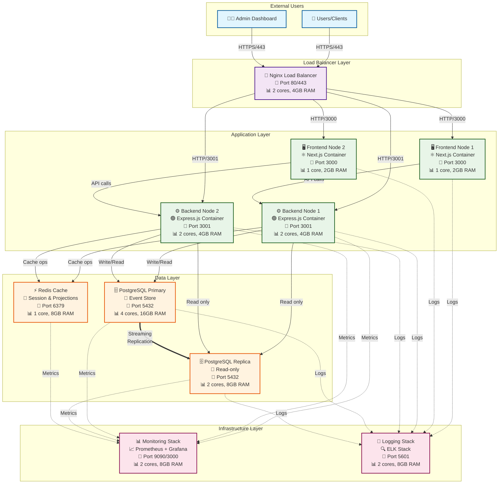
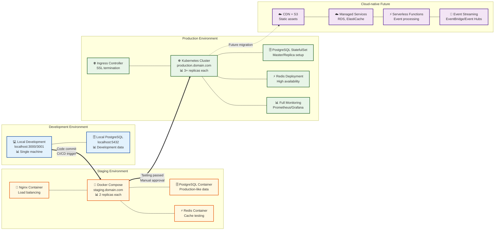
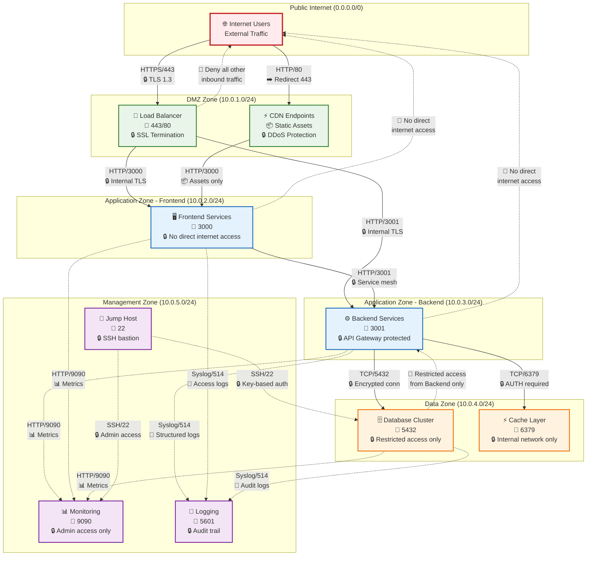
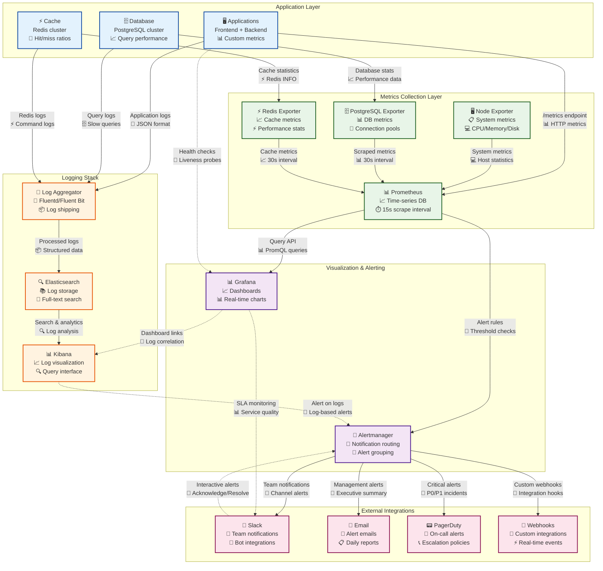
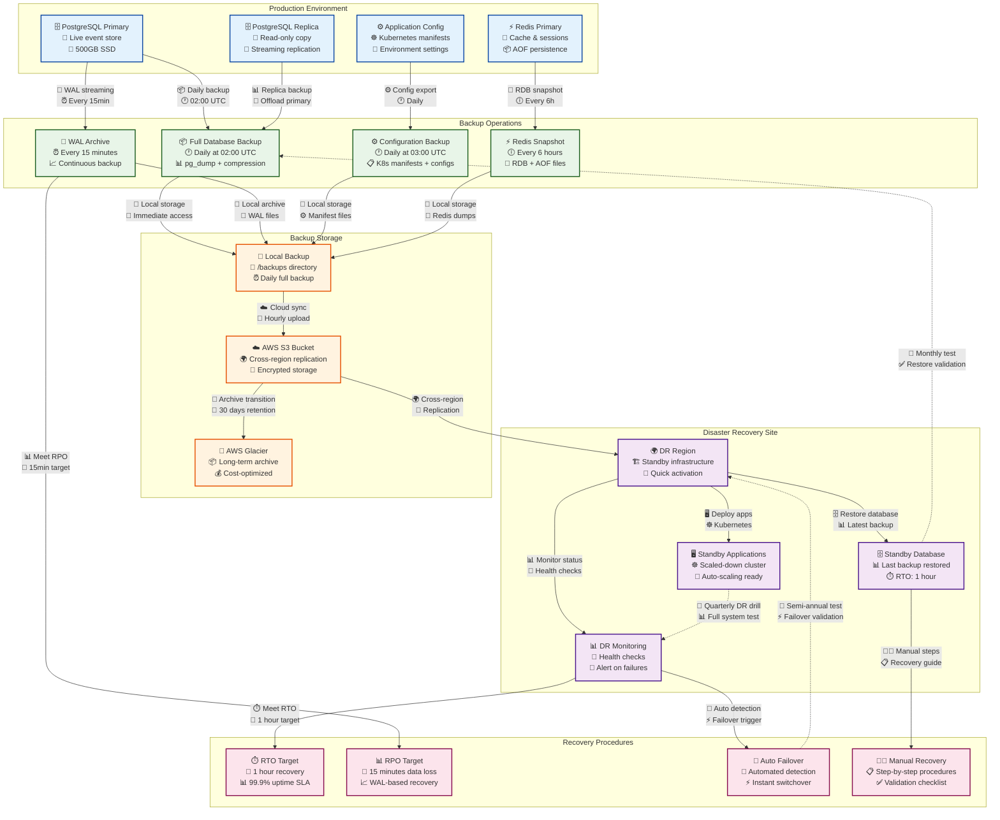

```mermaid
graph LR
    subgraph "Source Control"
        GIT[📚 GitHub Repository<br/>🔀 Main/Develop branches<br/>📝 Pull requests]
    end
    
    subgraph "CI Pipeline"
        BUILD[🔨 Build & Test<br/>⚡ Node.js 18<br/>🧪 Unit/Integration tests]
        SCAN[🛡️ Security Scan<br/>🔍 Vulnerability check<br/>📋 Code quality]
        IMG[📦 Build Images<br/>🐳 Docker build<br/>🏷️ Tag & version]
    end
    
    subgraph "Artifact Storage"
        REG[📁 Container Registry<br/>🐳 GitHub Container Registry<br/>🏷️ ghcr.io/repo/image:tag]
    end
    
    subgraph "CD Pipeline"
        DEV[🚀 Deploy to Dev<br/>💻 Local/Docker Compose<br/>⚡ Instant deployment]
        STAGE[🧪 Deploy to Staging<br/>🐳 Docker Swarm<br/>✅ Smoke tests]
        APPROVAL[✋ Manual Approval<br/>👨‍💼 Product owner review<br/>📋 Release checklist]
        PROD[🌟 Deploy to Production<br/>☸️ Kubernetes cluster<br/>🔄 Rolling update]
    end
    
    subgraph "Infrastructure"
        K8S[☸️ Kubernetes Cluster<br/>🏷️ Namespaces: dev/staging/prod<br/>⚖️ Auto-scaling enabled]
        MON[📊 Monitoring<br/>📈 Prometheus/Grafana<br/>🚨 Alerting rules]
    end
    
    subgraph "Notifications"
        SLACK[💬 Slack Notifications<br/>✅ Success alerts<br/>❌ Failure alerts]
        EMAIL[📧 Email Alerts<br/>👨‍💼 Stakeholder updates<br/>📊 Weekly reports]
    end
    
    %% CI Flow
    GIT -->|Webhook trigger<br/>🔔 Push/PR events| BUILD
    BUILD -->|Tests passed<br/>✅ Quality gates| SCAN
    SCAN -->|Security cleared<br/>🛡️ No vulnerabilities| IMG
    IMG -->|Image pushed<br/>📦 Artifact created| REG
    
    %% CD Flow
    REG -->|Auto deploy<br/>⚡ Development| DEV
    DEV -->|Deploy on merge<br/>🔀 Main branch| STAGE
    STAGE -->|Manual gate<br/>✋ Human approval| APPROVAL
    APPROVAL -->|Approved<br/>✅ Go live| PROD
    
    %% Infrastructure
    PROD -->|Deployment<br/>☸️ Rolling update| K8S
    K8S -->|Health checks<br/>💓 Readiness probes| MON
    
    %% Feedback loops
    MON -.->|Metrics<br/>📊 Performance data| SLACK
    STAGE -.->|Test results<br/>🧪 Validation report| EMAIL
    PROD -.->|Deployment status<br/>🚀 Go-live notification| SLACK
    
    %% Error flows
    BUILD -.->|Build failed<br/>❌ Test failures| SLACK
    SCAN -.->|Security issues<br/>🚨 Vulnerabilities found| EMAIL
    PROD -.->|Deployment failed<br/>💥 Rollback triggered| SLACK
    
    %% Styling
    classDef sourceClass fill:#e3f2fd,stroke:#0d47a1,stroke-width:2px
    classDef ciClass fill:#e8f5e8,stroke:#1b5e20,stroke-width:2px
    classDef artifactClass fill:#fff3e0,stroke:#e65100,stroke-width:2px
    classDef cdClass fill:#f3e5f5,stroke:#4a148c,stroke-width:2px
    classDef infraClass fill:#fce4ec,stroke:#880e4f,stroke-width:2px
    classDef notifClass fill:#e0f2f1,stroke:#00695c,stroke-width:2px
    
    class GIT sourceClass
    class BUILD,SCAN,IMG ciClass
    class REG artifactClass
    class DEV,STAGE,APPROVAL,PROD cdClass
    class K8S,MON infraClass
    class SLACK,EMAIL notifClass
```

```mermaid
graph TB
    subgraph "Development Strategy"
        DEV_COMPOSE[🐳 Docker Compose<br/>📁 docker-compose.dev.yml<br/>🔧 Hot reload enabled]
        DEV_VOLUMES[📁 Volume Mounts<br/>🔄 Source code sync<br/>⚡ Instant updates]
    end
    
    subgraph "Staging Strategy"
        STAGE_SWARM[🐝 Docker Swarm<br/>📦 Multi-container orchestration<br/>⚖️ Load balancing]
        STAGE_SECRETS[🔐 Docker Secrets<br/>🗝️ Password management<br/>🔒 Encrypted storage]
    end
    
    subgraph "Production Strategy - Blue/Green"
        PROD_BLUE[🔵 Blue Environment<br/>☸️ Current production<br/>👥 Active traffic]
        PROD_GREEN[🟢 Green Environment<br/>☸️ New deployment<br/>🧪 Testing phase]
        PROD_SWITCH[🔄 Traffic Switch<br/>⚡ Instant cutover<br/>🔙 Quick rollback]
    end
    
    subgraph "Production Strategy - Canary"
        CANARY_OLD[📦 Stable Version<br/>👥 80% traffic<br/>✅ Proven stable]
        CANARY_NEW[🆕 New Version<br/>👥 20% traffic<br/>📊 Performance monitoring]
        CANARY_CONTROL[🎛️ Traffic Control<br/>📊 Gradual rollout<br/>🚨 Auto rollback]
    end
    
    subgraph "Kubernetes Infrastructure"
        K8S_MASTER[☸️ Master Nodes<br/>🎛️ Control plane<br/>📋 API server]
        K8S_WORKER[💪 Worker Nodes<br/>🏃‍♂️ Pod execution<br/>📦 Container runtime]
        K8S_INGRESS[🌐 Ingress Controller<br/>🔄 Load balancing<br/>🔒 SSL termination]
        K8S_STORAGE[💾 Persistent Storage<br/>📁 StatefulSets<br/>🔄 Volume management]
    end
    
    subgraph "Auto-scaling & Health"
        HPA[📈 Horizontal Pod Autoscaler<br/>⚖️ CPU/Memory based<br/>🔄 Dynamic scaling]
        VPA[📊 Vertical Pod Autoscaler<br/>📈 Resource optimization<br/>💡 Right-sizing]
        HEALTH[💓 Health Checks<br/>🩺 Liveness probes<br/>✅ Readiness probes]
        CIRCUIT[🔌 Circuit Breakers<br/>🛡️ Failure isolation<br/>🔄 Auto recovery]
    end
    
    %% Development flow
    DEV_COMPOSE <--> DEV_VOLUMES
    
    %% Staging flow
    STAGE_SWARM --> STAGE_SECRETS
    
    %% Blue/Green flow
    PROD_BLUE <-->|🔄 Switch traffic| PROD_SWITCH
    PROD_GREEN <-->|🔄 Switch traffic| PROD_SWITCH
    PROD_SWITCH -.->|🔙 Rollback if needed| PROD_BLUE
    
    %% Canary flow
    CANARY_OLD <-->|📊 Traffic split| CANARY_CONTROL
    CANARY_NEW <-->|📊 Traffic split| CANARY_CONTROL
    CANARY_CONTROL -.->|🚨 Issues detected| CANARY_OLD
    
    %% Kubernetes architecture
    K8S_MASTER -->|🎛️ Orchestration| K8S_WORKER
    K8S_WORKER -->|🌐 Service mesh| K8S_INGRESS
    K8S_WORKER -->|💾 Data persistence| K8S_STORAGE
    
    %% Auto-scaling integration
    K8S_WORKER <-->|📈 Scale pods| HPA
    K8S_WORKER <-->|📊 Optimize resources| VPA
    K8S_WORKER <-->|💓 Monitor health| HEALTH
    K8S_WORKER <-->|🛡️ Handle failures| CIRCUIT
    
    %% Strategy progression
    DEV_COMPOSE ==>|🚀 Promote| STAGE_SWARM
    STAGE_SWARM ==>|✅ Validated| PROD_BLUE
    STAGE_SWARM ==>|✅ Validated| CANARY_OLD
    
    %% Infrastructure dependencies
    PROD_BLUE -.->|☸️ Runs on| K8S_WORKER
    PROD_GREEN -.->|☸️ Runs on| K8S_WORKER
    CANARY_OLD -.->|☸️ Runs on| K8S_WORKER
    CANARY_NEW -.->|☸️ Runs on| K8S_WORKER
    
    %% Styling
    classDef devClass fill:#e3f2fd,stroke:#0d47a1,stroke-width:2px
    classDef stageClass fill:#fff8e1,stroke:#e65100,stroke-width:2px
    classDef blueGreenClass fill:#e8f5e8,stroke:#1b5e20,stroke-width:2px
    classDef canaryClass fill:#f3e5f5,stroke:#4a148c,stroke-width:2px
    classDef k8sClass fill:#fce4ec,stroke:#880e4f,stroke-width:2px
    classDef autoClass fill:#e0f2f1,stroke:#00695c,stroke-width:2px
    
    class DEV_COMPOSE,DEV_VOLUMES devClass
    class STAGE_SWARM,STAGE_SECRETS stageClass
    class PROD_BLUE,PROD_GREEN,PROD_SWITCH blueGreenClass
    class CANARY_OLD,CANARY_NEW,CANARY_CONTROL canaryClass
    class K8S_MASTER,K8S_WORKER,K8S_INGRESS,K8S_STORAGE k8sClass
    class HPA,VPA,HEALTH,CIRCUIT autoClass
```

```mermaid
graph TB
    subgraph "Resource Specifications"
        LOAD_BALANCER[🔄 Load Balancer<br/>📊 2 cores, 4GB RAM<br/>📡 1Gbps network<br/>💾 20GB SSD]
        FRONTEND[🖥️ Frontend Pods<br/>📊 1 core, 2GB RAM each<br/>🔢 2-5 replicas<br/>📦 10GB storage]
        BACKEND[⚙️ Backend Pods<br/>📊 2 cores, 4GB RAM each<br/>🔢 2-5 replicas<br/>📦 10GB storage]
        DATABASE[🗄️ Database Primary<br/>📊 4 cores, 16GB RAM<br/>💾 500GB SSD<br/>🔌 High-speed network]
        REPLICA[🗄️ Database Replica<br/>📊 2 cores, 8GB RAM each<br/>🔢 2 instances<br/>💾 500GB SSD sync]
        REDIS_CACHE[⚡ Redis Cache<br/>📊 1 core, 8GB RAM<br/>💾 50GB persistence<br/>🔄 Memory optimization]
        MONITORING[📊 Monitoring Stack<br/>📊 2 cores, 8GB RAM<br/>💾 200GB metrics/logs<br/>🔗 Full cluster access]
    end
    
    subgraph "Auto-scaling Policies"
        HPA_FRONTEND[📈 Frontend HPA<br/>🎯 Target: 70% CPU<br/>📊 Min: 2, Max: 10<br/>⏱️ Scale up: 30s]
        HPA_BACKEND[📈 Backend HPA<br/>🎯 Target: 80% CPU<br/>📊 Min: 2, Max: 8<br/>⏱️ Scale up: 30s]
        VPA_POLICIES[📊 VPA Recommendations<br/>💡 Resource right-sizing<br/>📈 Historical analysis<br/>🔄 Auto-adjustment]
        CLUSTER_AUTO[☸️ Cluster Autoscaler<br/>🏗️ Node pool scaling<br/>📊 Resource requests<br/>💰 Cost optimization]
    end
    
    subgraph "Performance Thresholds"
        CPU_THRESHOLDS[💻 CPU Thresholds<br/>🟢 Normal: <70%<br/>🟡 Warning: 70-85%<br/>🔴 Critical: >85%]
        MEMORY_THRESHOLDS[🧠 Memory Thresholds<br/>🟢 Normal: <80%<br/>🟡 Warning: 80-90%<br/>🔴 Critical: >90%]
        NETWORK_THRESHOLDS[📡 Network Thresholds<br/>🟢 Normal: <500Mbps<br/>🟡 Warning: 500-800Mbps<br/>🔴 Critical: >800Mbps]
        DISK_THRESHOLDS[💾 Disk Thresholds<br/>🟢 Normal: <75%<br/>🟡 Warning: 75-90%<br/>🔴 Critical: >90%]
    end
    
    subgraph "Scaling Triggers"
        TRAFFIC_SPIKE[📈 Traffic Spike<br/>🚀 Sudden load increase<br/>⚡ Auto-scale trigger<br/>📊 Response time SLA]
        RESOURCE_PRESSURE[💥 Resource Pressure<br/>📊 High CPU/Memory<br/>🔄 Scale-out trigger<br/>⚖️ Load distribution]
        SCHEDULED_SCALE[⏰ Scheduled Scaling<br/>📅 Predictable patterns<br/>🏢 Business hours<br/>📊 Proactive scaling]
        COST_OPTIMIZATION[💰 Cost Optimization<br/>📉 Low usage periods<br/>🔽 Scale-down trigger<br/>💡 Resource efficiency]
    end
    
    subgraph "Scaling Actions"
        SCALE_OUT[📈 Scale Out<br/>➕ Add more pods<br/>⚖️ Distribute load<br/>⏱️ Horizontal scaling]
        SCALE_UP[📊 Scale Up<br/>⬆️ Increase resources<br/>💪 More CPU/RAM<br/>⏱️ Vertical scaling]
        SCALE_DOWN[📉 Scale Down<br/>➖ Remove pods<br/>💰 Reduce costs<br/>⏱️ Graceful shutdown]
        SCALE_IN[📊 Scale In<br/>⬇️ Decrease resources<br/>💡 Right-sizing<br/>⏱️ Resource optimization]
    end
    
    %% Resource allocation flows
    LOAD_BALANCER -.->|🔄 Routes traffic| FRONTEND
    LOAD_BALANCER -.->|🔄 Routes traffic| BACKEND
    FRONTEND -.->|📞 API calls| BACKEND
    BACKEND -.->|📊 Read/Write| DATABASE
    BACKEND -.->|📖 Read queries| REPLICA
    BACKEND -.->|⚡ Cache ops| REDIS_CACHE
    MONITORING -.->|📊 Observes all| DATABASE
    
    %% Auto-scaling relationships
    FRONTEND <-->|📈 Scales based on| HPA_FRONTEND
    BACKEND <-->|📈 Scales based on| HPA_BACKEND
    FRONTEND <-->|💡 Optimizes| VPA_POLICIES
    BACKEND <-->|💡 Optimizes| VPA_POLICIES
    CLUSTER_AUTO -.->|🏗️ Provisions nodes| FRONTEND
    CLUSTER_AUTO -.->|🏗️ Provisions nodes| BACKEND
    
    %% Threshold monitoring
    FRONTEND -.->|📊 CPU monitoring| CPU_THRESHOLDS
    BACKEND -.->|🧠 Memory monitoring| MEMORY_THRESHOLDS
    DATABASE -.->|📡 Network monitoring| NETWORK_THRESHOLDS
    REPLICA -.->|💾 Disk monitoring| DISK_THRESHOLDS
    
    %% Scaling triggers
    TRAFFIC_SPIKE -->|🚀 Triggers| SCALE_OUT
    RESOURCE_PRESSURE -->|💥 Triggers| SCALE_UP
    SCHEDULED_SCALE -->|⏰ Triggers| SCALE_OUT
    COST_OPTIMIZATION -->|💰 Triggers| SCALE_DOWN
    
    %% Scaling actions
    HPA_FRONTEND -->|📈 Executes| SCALE_OUT
    HPA_BACKEND -->|📈 Executes| SCALE_OUT
    VPA_POLICIES -->|📊 Executes| SCALE_UP
    VPA_POLICIES -->|📊 Executes| SCALE_IN
    
    %% Feedback loops
    SCALE_OUT -.->|📊 Monitors impact| CPU_THRESHOLDS
    SCALE_UP -.->|📊 Monitors impact| MEMORY_THRESHOLDS
    SCALE_DOWN -.->|📊 Validates safety| TRAFFIC_SPIKE
    SCALE_IN -.->|📊 Validates safety| RESOURCE_PRESSURE
    
    %% Styling
    classDef resourceClass fill:#e3f2fd,stroke:#0d47a1,stroke-width:2px
    classDef scalingClass fill:#e8f5e8,stroke:#1b5e20,stroke-width:2px
    classDef thresholdClass fill:#fff3e0,stroke:#e65100,stroke-width:2px
    classDef triggerClass fill:#f3e5f5,stroke:#4a148c,stroke-width:2px
    classDef actionClass fill:#fce4ec,stroke:#880e4f,stroke-width:2px
    
    class LOAD_BALANCER,FRONTEND,BACKEND,DATABASE,REPLICA,REDIS_CACHE,MONITORING resourceClass
    class HPA_FRONTEND,HPA_BACKEND,VPA_POLICIES,CLUSTER_AUTO scalingClass
    class CPU_THRESHOLDS,MEMORY_THRESHOLDS,NETWORK_THRESHOLDS,DISK_THRESHOLDS thresholdClass
    class TRAFFIC_SPIKE,RESOURCE_PRESSURE,SCHEDULED_SCALE,COST_OPTIMIZATION triggerClass
    class SCALE_OUT,SCALE_UP,SCALE_DOWN,SCALE_IN actionClass
```

# Event Sourcing Order Management - Deployment View Mermaid Diagrams

## 📋 Tổng quan Script Mermaid cho Deployment View

File này chứa các script Mermaid để vẽ diagram cho **Deployment View** của hệ thống Event Sourcing Order Management. Các diagram bao gồm kiến trúc triển khai, network topology, CI/CD pipeline, monitoring stack và các chiến lược deployment.

---

## 🏗️ 1. Overall Deployment Architecture

### Script Mermaid


### Mô tả sử dụng:
- **Mục đích**: Hiển thị tổng quan kiến trúc triển khai với tất cả các node và kết nối
- **Thành phần chính**: Load balancer, application layer, data layer, infrastructure layer
- **Thông tin hiển thị**: Ports, resource specifications, connection types
- **Sử dụng**: Architecture overview, system documentation, stakeholder presentations

---

## 🌍 2. Multi-Environment Deployment Strategy

### Script Mermaid


### Mô tả sử dụng:
- **Mục đích**: Hiển thị chiến lược triển khai qua các môi trường
- **Thành phần**: Development, Staging, Production, Cloud-native future
- **Flow**: Code progression từ development đến production
- **Sử dụng**: DevOps planning, environment strategy, team alignment

---

## 🔗 3. Network Communication & Security Topology

### Script Mermaid


### Mô tả sử dụng:
- **Mục đích**: Hiển thị network topology và security boundaries
- **Thành phần**: Network zones, firewall rules, communication protocols
- **Security**: Access controls, encryption, network segmentation
- **Sử dụng**: Security planning, network design, compliance documentation

---

## 🚀 4. CI/CD Pipeline Architecture

### Script Mermaid


### Mô tả sử dụng:
- **Mục đích**: Hiển thị end-to-end CI/CD pipeline workflow
- **Thành phần**: Source control, CI stages, CD environments, infrastructure
- **Flow**: Code to production deployment process
- **Sử dụng**: DevOps documentation, process training, pipeline optimization

---

## 📊 5. Monitoring & Observability Stack

### Script Mermaid


### Mô tả sử dụng:
- **Mục đích**: Hiển thị complete observability stack architecture
- **Thành phần**: Metrics, logs, visualization, alerting, notifications
- **Data flow**: Collection → Processing → Visualization → Alerting
- **Sử dụng**: Monitoring strategy, incident response, performance optimization

---

## 🔄 6. Container Orchestration & Deployment Strategies

### Script Mermaid


### Mô tả sử dụng:
- **Mục đích**: Hiển thị container orchestration và deployment strategies
- **Thành phần**: Development, staging, production strategies, Kubernetes infrastructure
- **Strategies**: Blue/Green, Canary deployments, auto-scaling
- **Sử dụng**: Deployment planning, risk mitigation, infrastructure design

---

## 🔄 7. Backup & Disaster Recovery Architecture

### Script Mermaid


### Mô tả sử dụng:
- **Mục đích**: Hiển thị comprehensive backup và disaster recovery strategy
- **Thành phần**: Production systems, backup operations, storage layers, DR site
- **Recovery**: RTO/RPO targets, automated and manual procedures
- **Sử dụng**: Business continuity planning, compliance documentation, DR testing

---

## 🎯 8. Resource Allocation & Scaling Architecture

### Script Mermaid


### Mô tả sử dụng:
- **Mục đích**: Hiển thị resource allocation và auto-scaling architecture
- **Thành phần**: Resource specs, scaling policies, thresholds, triggers, actions
- **Scaling**: Horizontal và vertical scaling strategies
- **Sử dụng**: Capacity planning, cost optimization, performance tuning

---

## 📋 Hướng dẫn sử dụng Mermaid Scripts

### Cách sử dụng các script:

1. **Copy script** từ các section trên
2. **Paste vào Mermaid editor**:
   - [Mermaid Live Editor](https://mermaid.live)
   - GitHub/GitLab (markdown files)
   - VS Code với Mermaid extension
   - Confluence, Notion, hay các tools khác hỗ trợ Mermaid

3. **Customize theo needs**:
   - Thay đổi colors trong `classDef` statements
   - Điều chỉnh labels và descriptions
   - Thêm/bớt components theo architecture requirements
   - Modify connections và data flows

### Customization Examples:

#### Thay đổi màu sắc:
```mermaid
classDef myCustomClass fill:#your-color,stroke:#border-color,stroke-width:2px
class NODE1,NODE2 myCustomClass
```

#### Thêm styling cho connections:
```mermaid
A -->|Label text| B
A -.->|Dotted line| C
A ==>|Thick line| D
```

#### Tạo subgraphs mới:
```mermaid
subgraph "Your Custom Group"
    COMPONENT[Your Component<br/>Description<br/>Specs]
end
```

### Best Practices:

1. **Consistent naming**: Sử dụng naming convention nhất quán
2. **Clear labels**: Labels ngắn gọn nhưng đầy đủ thông tin
3. **Logical grouping**: Group related components trong subgraphs
4. **Color coding**: Sử dụng colors để phân biệt các loại components
5. **Documentation**: Include mô tả và context cho mỗi diagram

### Integration với documentation:

- **Architecture docs**: Embed trong technical specifications
- **Presentations**: Export as images cho slides
- **Training materials**: Visual aids cho team onboarding
- **Compliance**: Document infrastructure cho audits
- **Planning**: Visualize proposed changes và improvements

---

**Total Scripts**: 8 comprehensive Mermaid diagrams covering all aspects của Deployment View architecture, từ overall infrastructure đến detailed scaling policies và disaster recovery procedures.
