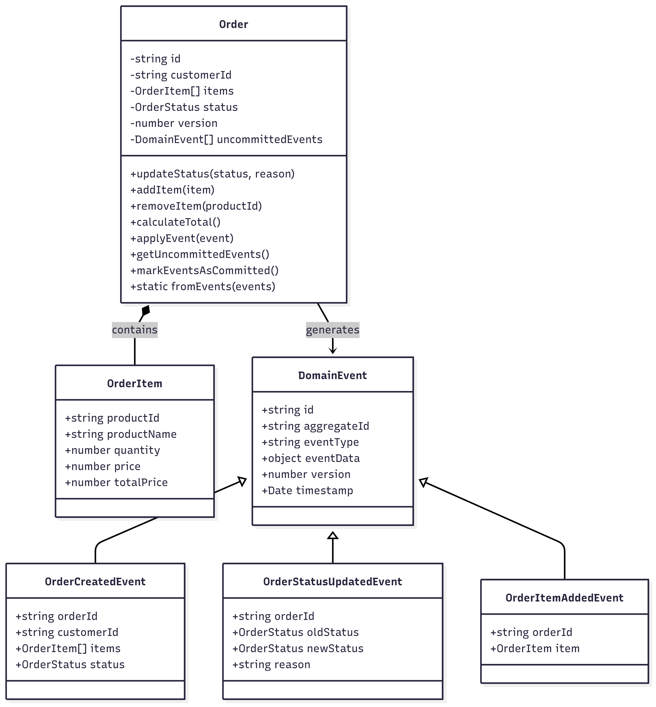

# Event Sourcing Order Management - Góc Nhìn Logic (Logical View)

## 🎯 Tổng quan Góc nhìn Logic

**Góc nhìn Logic** trả lời câu hỏi: *"Hệ thống có những thành phần gì, trách nhiệm ra sao, và quan hệ logic giữa chúng thế nào?"*

Hệ thống Event Sourcing Order Management được tổ chức theo kiến trúc **CQRS + Event Sourcing** với các thành phần logic chính được phân tách rõ ràng về trách nhiệm và tương tác theo các pattern đã được chứng minh trong domain-driven design.

---

## 📊 Sơ đồ Logic Tổng quan

```
┌─────────────────────────────────────────────────────────────────────────────────────┐
│                           EVENT SOURCING LOGICAL ARCHITECTURE                        │
├─────────────────────────────────────────────────────────────────────────────────────┤
│                                                                                     │
│  ┌─────────────┐    Commands     ┌─────────────────┐    Events    ┌─────────────┐   │
│  │   Client    │ ─────────────→  │   Command Side  │ ──────────→  │ Event Store │   │
│  │ Application │                 │   (Write Path)  │              │             │   │
│  └─────────────┘                 └─────────────────┘              └─────────────┘   │
│         │                                                                  │         │
│         │                                                                  │         │
│         │ Queries                                                          │ Events  │
│         │                                                                  │         │
│         ↓                                                                  ↓         │
│  ┌─────────────┐                 ┌─────────────────┐              ┌─────────────┐   │
│  │    Query    │ ←─────────────  │   Query Side    │ ←────────────│ Event Bus   │   │
│  │  Response   │     Results     │  (Read Path)    │   Subscribe  │ (Internal)  │   │
│  └─────────────┘                 └─────────────────┘              └─────────────┘   │
│                                                                                     │
└─────────────────────────────────────────────────────────────────────────────────────┘
```

---

## 🧩 Các Thành phần Logic Chính

### 1. 📝 Commands - Yêu cầu Ghi nhận Hành động

**Định nghĩa**: Commands đại diện cho các ý định thay đổi state của hệ thống. Chúng là các yêu cầu imperative mô tả *"điều gì cần được thực hiện"*.

**Trách nhiệm**:
- Encapsulate user intentions và business operations
- Validate input data trước khi processing
- Trigger business logic execution
- Initiate state transitions trong domain

**Commands trong hệ thống**:
```typescript
// Các Command Types chính
interface CreateOrderCommand {
  type: 'CreateOrder';
  orderId: string;
  customerId: string;
  items: OrderItem[];
}

interface UpdateOrderStatusCommand {
  type: 'UpdateOrderStatus';
  orderId: string;
  status: OrderStatus;
  reason?: string;
}

interface AddOrderItemCommand {
  type: 'AddOrderItem';
  orderId: string;
  item: OrderItem;
}

interface RemoveOrderItemCommand {
  type: 'RemoveOrderItem';
  orderId: string;
  productId: string;
}

interface RollbackOrderCommand {
  type: 'RollbackOrder';
  orderId: string;
  targetVersion?: number;
  targetTimestamp?: Date;
}
```

**Characteristics**:
- **Imperative**: Sử dụng động từ (Create, Update, Add, Remove)
- **Intent-based**: Mô tả business intention rõ ràng
- **Validation-ready**: Chứa đủ data để validate business rules
- **Traceable**: Có unique identifiers cho audit trail

---

### 2. 🏛️ Aggregates - Thực thể Trung tâm Quản lý State

**Định nghĩa**: Aggregates là các business entities tập trung quản lý state và business rules. Chúng đảm bảo consistency boundaries và encapsulate domain logic.

**Trách nhiệm**:
- Enforce business rules và invariants
- Maintain consistency boundaries
- Generate domain events from state changes
- Provide entry points cho all business operations

**Order Aggregate Implementation**:
```typescript
class Order {
  private id: string;
  private customerId: string;
  private items: OrderItem[];
  private status: OrderStatus;
  private version: number;
  private uncommittedEvents: DomainEvent[];

  // Business Methods
  public updateStatus(newStatus: OrderStatus, reason?: string): void {
    // Business rule validation
    if (!this.canTransitionTo(newStatus)) {
      throw new Error(`Cannot transition from ${this.status} to ${newStatus}`);
    }
    
    // Generate event
    const event = new OrderStatusUpdatedEvent({
      orderId: this.id,
      oldStatus: this.status,
      newStatus: newStatus,
      reason: reason,
      timestamp: new Date()
    });
    
    // Apply state change
    this.applyEvent(event);
  }

  public addItem(item: OrderItem): void {
    // Business validation
    this.validateItemAddition(item);
    
    // Generate và apply event
    const event = new OrderItemAddedEvent({
      orderId: this.id,
      item: item,
      timestamp: new Date()
    });
    
    this.applyEvent(event);
  }

  // Event sourcing methods
  public static fromEvents(events: DomainEvent[]): Order {
    const order = new Order();
    events.forEach(event => order.applyEvent(event));
    return order;
  }

  public getUncommittedEvents(): DomainEvent[] {
    return [...this.uncommittedEvents];
  }

  public markEventsAsCommitted(): void {
    this.uncommittedEvents = [];
  }
}
```

**Aggregate Characteristics**:
- **Consistency Boundary**: Đảm bảo business rules trong boundary
- **Event Generator**: Tạo events từ business operations
- **State Reconstructor**: Rebuild state từ historical events
- **Version Controlled**: Track version cho concurrency control

---

### 3. 🗄️ Event Store - Lưu trữ Sự kiện Bất biến

**Định nghĩa**: Event Store là persistent storage cho tất cả domain events. Nó đóng vai trò như "source of truth" cho toàn bộ system state.

**Trách nhiệm**:
- Store events immutably với complete ordering
- Provide event retrieval by aggregate ID
- Support temporal queries (point-in-time reconstruction)
- Ensure ACID properties cho event transactions
- Maintain event versioning và concurrency control

**Event Store Interface**:
```typescript
interface EventStore {
  // Core operations
  saveEvents(aggregateId: string, expectedVersion: number, events: DomainEvent[]): Promise<void>;
  getEvents(aggregateId: string, fromVersion?: number): Promise<DomainEvent[]>;
  getAllEvents(offset?: number, limit?: number): Promise<DomainEvent[]>;
  
  // Temporal operations
  getEventsUpToTimestamp(aggregateId: string, timestamp: Date): Promise<DomainEvent[]>;
  getEventsUpToVersion(aggregateId: string, version: number): Promise<DomainEvent[]>;
  
  // Stream operations
  getEventStream(fromPosition?: number): AsyncIterableIterator<DomainEvent>;
  subscribeToEvents(eventType?: string): EventSubscription;
}
```

**PostgreSQL Implementation**:
```sql
-- Events table schema
CREATE TABLE events (
    id UUID PRIMARY KEY DEFAULT uuid_generate_v4(),
    aggregate_id VARCHAR(255) NOT NULL,
    aggregate_type VARCHAR(100) NOT NULL DEFAULT 'Order',
    event_type VARCHAR(100) NOT NULL,
    event_data JSONB NOT NULL,
    version INTEGER NOT NULL,
    timestamp TIMESTAMP WITH TIME ZONE DEFAULT CURRENT_TIMESTAMP,
    
    -- Consistency constraints
    UNIQUE(aggregate_id, version),
    CHECK (version > 0)
);

-- Performance indexes
CREATE INDEX idx_events_aggregate_id ON events(aggregate_id);
CREATE INDEX idx_events_event_type ON events(event_type);
CREATE INDEX idx_events_timestamp ON events(timestamp);
CREATE INDEX idx_events_version ON events(aggregate_id, version);
```

**Event Store Characteristics**:
- **Immutable**: Events không bao giờ được update hoặc delete
- **Append-only**: Chỉ thêm events mới, không modify existing
- **Ordered**: Events có strict ordering by version/timestamp
- **Atomic**: Batch event storage trong single transaction

---

### 4. 📊 Projections / Read Models - Dữ liệu Phục vụ Truy vấn

**Định nghĩa**: Projections là materialized views được xây dựng từ event stream để tối ưu hóa read operations và support specific query patterns.

**Trách nhiệm**:
- Transform events thành optimized read models
- Support efficient querying và reporting
- Maintain eventual consistency với event store
- Handle projection rebuilding khi cần thiết

**Current Implementation (In-Memory)**:
```typescript
class OrderProjection {
  private orders: Map<string, OrderReadModel> = new Map();
  
  public handleEvent(event: DomainEvent): void {
    switch (event.eventType) {
      case 'OrderCreated':
        this.handleOrderCreated(event as OrderCreatedEvent);
        break;
      case 'OrderStatusUpdated':
        this.handleOrderStatusUpdated(event as OrderStatusUpdatedEvent);
        break;
      case 'OrderItemAdded':
        this.handleOrderItemAdded(event as OrderItemAddedEvent);
        break;
      // ... other events
    }
  }
  
  public getOrder(orderId: string): OrderReadModel | undefined {
    return this.orders.get(orderId);
  }
  
  public getAllOrders(): OrderReadModel[] {
    return Array.from(this.orders.values());
  }
  
  public getOrdersByStatus(status: OrderStatus): OrderReadModel[] {
    return Array.from(this.orders.values())
      .filter(order => order.status === status);
  }
  
  // Rebuild projection từ events
  public rebuild(events: DomainEvent[]): void {
    this.orders.clear();
    events.forEach(event => this.handleEvent(event));
  }
}

interface OrderReadModel {
  id: string;
  customerId: string;
  items: OrderItem[];
  status: OrderStatus;
  totalAmount: number;
  createdAt: Date;
  updatedAt: Date;
  version: number;
}
```

**Future Projections (Planned)**:
- **Database Projections**: Materialized views trong PostgreSQL
- **Search Projections**: Elasticsearch indexes
- **Analytics Projections**: Time-series data cho dashboards
- **Reporting Projections**: Pre-aggregated data cho reports

---

### 5. 🔍 Queries - Yêu cầu Đọc Dữ liệu

**Định nghĩa**: Queries đại diện cho các read operations trên system. Chúng được xử lý bởi read side và không thay đổi system state.

**Trách nhiệm**:
- Retrieve data từ projections
- Support various query patterns
- Provide optimized read performance
- Handle pagination và filtering

**Query Types trong hệ thống**:
```typescript
// Query interfaces
interface GetOrderQuery {
  type: 'GetOrder';
  orderId: string;
}

interface GetAllOrdersQuery {
  type: 'GetAllOrders';
  page?: number;
  limit?: number;
  status?: OrderStatus;
}

interface GetOrderEventsQuery {
  type: 'GetOrderEvents';
  orderId: string;
  fromVersion?: number;
  toVersion?: number;
}

interface GetOrderHistoryQuery {
  type: 'GetOrderHistory';
  orderId: string;
  fromDate?: Date;
  toDate?: Date;
}

// Query handlers
class OrderQueryHandler {
  constructor(
    private projection: OrderProjection,
    private eventStore: EventStore
  ) {}
  
  public async handle(query: Query): Promise<QueryResult> {
    switch (query.type) {
      case 'GetOrder':
        return this.handleGetOrder(query as GetOrderQuery);
      case 'GetAllOrders':
        return this.handleGetAllOrders(query as GetAllOrdersQuery);
      case 'GetOrderEvents':
        return this.handleGetOrderEvents(query as GetOrderEventsQuery);
      default:
        throw new Error(`Unsupported query type: ${query.type}`);
    }
  }
}
```

---

### 6. 🚌 Event Bus - Truyền Sự kiện (Internal)

**Định nghĩa**: Event Bus cung cấp mechanism để distribute events trong hệ thống và coordinate giữa various components.

**Trách nhiệm**:
- Distribute events tới interested subscribers
- Decouple event producers từ consumers
- Support asynchronous event processing
- Enable eventual consistency across projections

**Current Implementation (In-Process)**:
```typescript
class InternalEventBus {
  private subscribers: Map<string, EventHandler[]> = new Map();
  
  public subscribe(eventType: string, handler: EventHandler): void {
    if (!this.subscribers.has(eventType)) {
      this.subscribers.set(eventType, []);
    }
    this.subscribers.get(eventType)!.push(handler);
  }
  
  public async publish(event: DomainEvent): Promise<void> {
    const handlers = this.subscribers.get(event.eventType) || [];
    
    // Process tất cả handlers in parallel
    await Promise.all(
      handlers.map(handler => handler.handle(event))
    );
  }
  
  public async publishMany(events: DomainEvent[]): Promise<void> {
    for (const event of events) {
      await this.publish(event);
    }
  }
}

interface EventHandler {
  handle(event: DomainEvent): Promise<void>;
}
```

**Future Event Bus (External - Planned)**:
- **Apache Kafka**: For distributed event streaming
- **RabbitMQ**: For reliable message delivery
- **Azure Service Bus**: For cloud-native messaging
- **Redis Streams**: For lightweight event streaming

---

### 7. 👂 Consumers - Dịch vụ Lắng nghe Sự kiện

**Định nghĩa**: Consumers là các services lắng nghe events để perform side effects, update projections, hoặc trigger additional processing.

**Trách nhiệm**:
- Listen to event streams continuously
- Update projections khi có events mới
- Trigger business processes
- Send notifications hoặc external integrations
- Maintain event processing positions

**Current Consumers**:
```typescript
// Projection Updater Consumer
class ProjectionUpdaterConsumer implements EventHandler {
  constructor(private projection: OrderProjection) {}
  
  public async handle(event: DomainEvent): Promise<void> {
    try {
      this.projection.handleEvent(event);
      console.log(`Projection updated for event: ${event.eventType}`);
    } catch (error) {
      console.error('Failed to update projection:', error);
      // Implement retry logic hoặc dead letter queue
    }
  }
}

// Audit Logger Consumer
class AuditLoggerConsumer implements EventHandler {
  public async handle(event: DomainEvent): Promise<void> {
    const auditEntry = {
      eventId: event.id,
      eventType: event.eventType,
      aggregateId: event.aggregateId,
      timestamp: event.timestamp,
      data: event.eventData
    };
    
    console.log('AUDIT:', JSON.stringify(auditEntry, null, 2));
    // Future: Write to audit database hoặc external system
  }
}

// Notification Consumer (Future)
class NotificationConsumer implements EventHandler {
  public async handle(event: DomainEvent): Promise<void> {
    switch (event.eventType) {
      case 'OrderCreated':
        await this.sendOrderCreatedNotification(event);
        break;
      case 'OrderStatusUpdated':
        await this.sendStatusUpdateNotification(event);
        break;
    }
  }
}
```

**Future Consumers (Planned)**:
- **Email Notification Service**: Send order updates qua email
- **SMS Notification Service**: Critical updates qua SMS
- **Analytics Consumer**: Feed data vào analytics platform
- **Integration Consumer**: Sync với external systems
- **Backup Consumer**: Replicate events tới backup storage

---

## 🔄 Mối Quan hệ Logic giữa các Thành phần

### Command Flow (Write Path)
```
1. Client Request
   ↓
2. Command Creation & Validation
   ↓
3. Command Handler Processing
   ↓
4. Aggregate Business Logic
   ↓
5. Event Generation
   ↓
6. Event Store Persistence
   ↓
7. Event Bus Distribution
   ↓
8. Consumer Processing (Async)
```

### Query Flow (Read Path)
```
1. Client Query
   ↓
2. Query Handler Processing
   ↓
3. Projection Data Retrieval
   ↓
4. Result Formatting
   ↓
5. Response to Client
```

### Event Processing Flow
```
Event Store → Event Bus → Multiple Consumers (Parallel)
                       ├→ Projection Updater
                       ├→ Audit Logger
                       ├→ Notification Service
                       └→ External Integrations
```

---

## 📐 Design Patterns và Principles

### 1. **Command Query Responsibility Segregation (CQRS)**
- **Write Side**: Commands → Aggregates → Events → Event Store
- **Read Side**: Queries → Projections → Optimized Data
- **Benefits**: Independent scaling, optimized data models, clear separation

### 2. **Event Sourcing Pattern**
- **State Reconstruction**: Rebuild aggregate state từ events
- **Temporal Queries**: Query state tại any point in time
- **Audit Trail**: Complete history của all changes

### 3. **Domain-Driven Design (DDD)**
- **Aggregates**: Consistency boundaries cho business logic
- **Domain Events**: Communicate state changes
- **Ubiquitous Language**: Consistent terminology across system

### 4. **Eventual Consistency**
- **Immediate Consistency**: Trong aggregate boundaries
- **Eventual Consistency**: Across projections và external systems
- **Compensating Actions**: Handle failed operations

---

## 🎯 Lợi ích của Thiết kế Logic

### 1. **Separation of Concerns**
- Commands xử lý write operations
- Queries xử lý read operations
- Events capture state changes
- Projections optimize read performance

### 2. **Scalability**
- Independent scaling của read/write sides
- Multiple specialized projections
- Asynchronous event processing
- Horizontal scaling capabilities

### 3. **Auditability & Compliance**
- Complete audit trail trong Event Store
- Immutable event history
- Point-in-time state reconstruction
- Regulatory compliance support

### 4. **Flexibility & Evolution**
- Easy to add new projections
- Support cho new query patterns
- Event schema evolution
- Business rule changes tracking

### 5. **Resilience**
- Event Store là single source of truth
- Projection rebuild capabilities
- Fault tolerance through retry mechanisms
- Graceful degradation options

---

## 🔮 Future Evolution

### Near-term Enhancements
- **Persistent Projections**: Database-backed read models
- **Event Versioning**: Handle schema evolution
- **Snapshots**: Performance optimization
- **External Event Bus**: Kafka/RabbitMQ integration

### Long-term Vision
- **Microservices Architecture**: Split aggregates into services
- **Event Streaming Platform**: Real-time event processing
- **Machine Learning Integration**: Predictive analytics
- **Multi-tenant Support**: Shared infrastructure

---

Góc nhìn Logic này cung cấp foundation mạnh mẽ cho Event Sourcing system với clear separation of concerns, excellent scalability characteristics, và complete auditability. Thiết kế cho phép system evolve theo business requirements trong khi maintaining consistency và performance.
