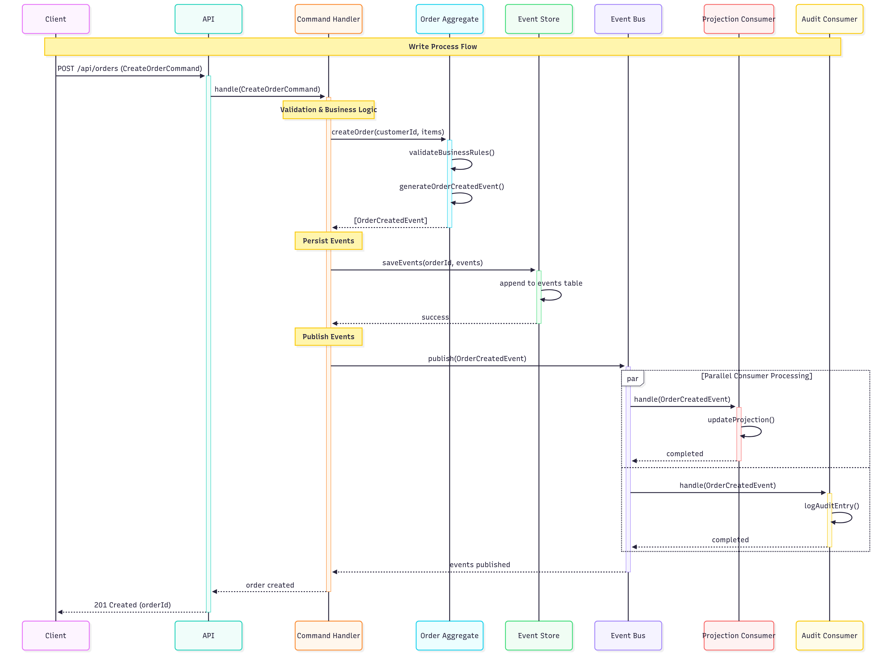
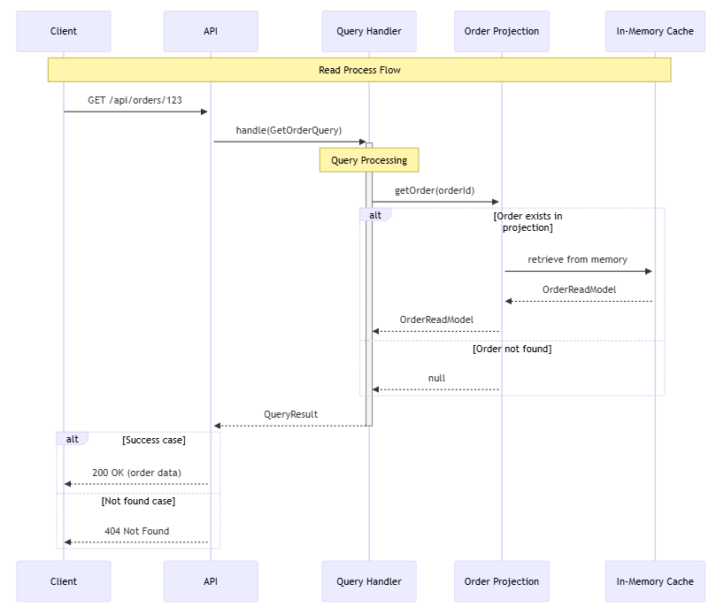
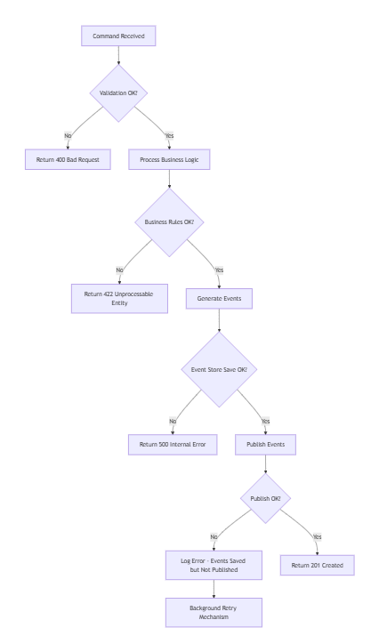

# Event Sourcing Order Management - Góc Nhìn Process (Process View)

## 🎯 Tổng quan Góc nhìn Process

**Góc nhìn Process** trả lời câu hỏi: *"Khi chạy thực tế, luồng dữ liệu và xử lý diễn ra như thế nào theo thời gian?"*

Hệ thống Event Sourcing Order Management hoạt động theo mô hình **CQRS + Event Sourcing** với hai luồng xử lý song song và độc lập:
- **Write Process**: Xử lý Commands và tạo Events
- **Read Process**: Xử lý Queries từ Projections

---

## 🔄 Luồng Xử lý Tổng quan


---

## 📝 Write Process - Luồng Ghi Dữ liệu

### Sequence Diagram - Command Processing


### 🔄 Chi tiết từng bước Write Process

#### Step 1: Client Request Processing
```typescript
// Client gửi HTTP request
POST /api/orders
{
  "customerId": "customer-123",
  "items": [
    {"productId": "prod-1", "quantity": 2, "price": 29.99}
  ]
}

// API Layer - routes.ts
app.post('/api/orders', async (req, res) => {
  try {
    const command = new CreateOrderCommand({
      orderId: uuidv4(),
      customerId: req.body.customerId,
      items: req.body.items
    });
    
    const result = await commandHandler.handle(command);
    res.status(201).json(result);
  } catch (error) {
    res.status(400).json({ error: error.message });
  }
});
```

#### Step 2: Command Handler Processing
```typescript
// Command Handler - handlers.ts
class CreateOrderHandler implements CommandHandler<CreateOrderCommand> {
  async handle(command: CreateOrderCommand): Promise<string> {
    // 1. Validate command
    this.validateCommand(command);
    
    // 2. Load aggregate (new order)
    const order = Order.create(command.orderId, command.customerId);
    
    // 3. Execute business logic
    command.items.forEach(item => order.addItem(item));
    
    // 4. Get uncommitted events
    const events = order.getUncommittedEvents();
    
    // 5. Save events to store
    await this.eventStore.saveEvents(
      command.orderId, 
      0, // expected version for new aggregate
      events
    );
    
    // 6. Publish events
    for (const event of events) {
      await this.eventBus.publish(event);
    }
    
    // 7. Mark events as committed
    order.markEventsAsCommitted();
    
    return command.orderId;
  }
}
```

#### Step 3: Aggregate Business Logic
```typescript
// Order Aggregate - Order.ts
class Order {
  static create(orderId: string, customerId: string): Order {
    const order = new Order();
    
    // Generate creation event
    const event = new OrderCreatedEvent({
      orderId,
      customerId,
      items: [],
      status: OrderStatus.PENDING,
      timestamp: new Date()
    });
    
    // Apply event to update state
    order.applyEvent(event);
    return order;
  }
  
  addItem(item: OrderItem): void {
    // Business rule validation
    if (this.status !== OrderStatus.PENDING) {
      throw new Error('Cannot add items to non-pending order');
    }
    
    // Generate event
    const event = new OrderItemAddedEvent({
      orderId: this.id,
      item: item,
      timestamp: new Date()
    });
    
    this.applyEvent(event);
  }
  
  private applyEvent(event: DomainEvent): void {
    // Update internal state based on event
    switch (event.eventType) {
      case 'OrderCreated':
        this.applyOrderCreated(event as OrderCreatedEvent);
        break;
      case 'OrderItemAdded':
        this.applyOrderItemAdded(event as OrderItemAddedEvent);
        break;
    }
    
    // Track uncommitted events
    this.uncommittedEvents.push(event);
    this.version++;
  }
}
```

#### Step 4: Event Store Persistence
```typescript
// PostgreSQL Event Store - postgres-event-store.ts
class PostgresEventStore implements EventStore {
  async saveEvents(
    aggregateId: string, 
    expectedVersion: number, 
    events: DomainEvent[]
  ): Promise<void> {
    const client = await this.pool.connect();
    
    try {
      await client.query('BEGIN');
      
      // Optimistic concurrency check
      const currentVersion = await this.getCurrentVersion(aggregateId, client);
      if (currentVersion !== expectedVersion) {
        throw new Error('Concurrency conflict detected');
      }
      
      // Insert events
      for (const event of events) {
        await client.query(`
          INSERT INTO events (aggregate_id, event_type, event_data, version, timestamp)
          VALUES ($1, $2, $3, $4, $5)
        `, [
          aggregateId,
          event.eventType,
          JSON.stringify(event.eventData),
          event.version,
          event.timestamp
        ]);
      }
      
      await client.query('COMMIT');
    } catch (error) {
      await client.query('ROLLBACK');
      throw error;
    } finally {
      client.release();
    }
  }
}
```

#### Step 5: Event Bus Distribution
```typescript
// Internal Event Bus - event-bus.ts
class InternalEventBus {
  async publish(event: DomainEvent): Promise<void> {
    const handlers = this.getHandlersForEvent(event.eventType);
    
    // Process all handlers in parallel
    const promises = handlers.map(handler => 
      this.safeHandleEvent(handler, event)
    );
    
    await Promise.all(promises);
  }
  
  private async safeHandleEvent(
    handler: EventHandler, 
    event: DomainEvent
  ): Promise<void> {
    try {
      await handler.handle(event);
      console.log(`Event ${event.eventType} processed by ${handler.constructor.name}`);
    } catch (error) {
      console.error(`Error processing event ${event.eventType}:`, error);
      // Future: Implement retry logic hoặc dead letter queue
    }
  }
}
```

#### Step 6: Consumer Processing (Parallel)
```typescript
// Projection Updater Consumer
class ProjectionUpdaterConsumer implements EventHandler {
  async handle(event: DomainEvent): Promise<void> {
    switch (event.eventType) {
      case 'OrderCreated':
        await this.handleOrderCreated(event as OrderCreatedEvent);
        break;
      case 'OrderItemAdded':
        await this.handleOrderItemAdded(event as OrderItemAddedEvent);
        break;
    }
  }
  
  private async handleOrderCreated(event: OrderCreatedEvent): Promise<void> {
    const readModel: OrderReadModel = {
      id: event.eventData.orderId,
      customerId: event.eventData.customerId,
      items: event.eventData.items,
      status: event.eventData.status,
      totalAmount: this.calculateTotal(event.eventData.items),
      createdAt: event.timestamp,
      updatedAt: event.timestamp,
      version: event.version
    };
    
    this.projection.setOrder(readModel);
  }
}

// Audit Logger Consumer
class AuditLoggerConsumer implements EventHandler {
  async handle(event: DomainEvent): Promise<void> {
    const auditEntry = {
      eventId: event.id,
      aggregateId: event.aggregateId,
      eventType: event.eventType,
      timestamp: event.timestamp,
      data: event.eventData,
      correlationId: this.extractCorrelationId(event)
    };
    
    // Log to console (future: persist to audit database)
    console.log('AUDIT TRAIL:', JSON.stringify(auditEntry, null, 2));
  }
}
```

---

## 🔍 Read Process - Luồng Truy vấn

### Sequence Diagram - Query Processing


### 🔍 Chi tiết từng bước Read Process

#### Step 1: Query Request Processing
```typescript
// Client gửi HTTP request
GET /api/orders/order-123

// API Layer - routes.ts
app.get('/api/orders/:id', async (req, res) => {
  try {
    const query = new GetOrderQuery({
      orderId: req.params.id
    });
    
    const result = await queryHandler.handle(query);
    
    if (result) {
      res.json(result);
    } else {
      res.status(404).json({ error: 'Order not found' });
    }
  } catch (error) {
    res.status(500).json({ error: error.message });
  }
});
```

#### Step 2: Query Handler Processing
```typescript
// Query Handler
class GetOrderQueryHandler implements QueryHandler<GetOrderQuery> {
  constructor(private projection: OrderProjection) {}
  
  async handle(query: GetOrderQuery): Promise<OrderReadModel | null> {
    // Simple delegation to projection
    return this.projection.getOrder(query.orderId);
  }
}

// Complex query example
class GetOrdersByStatusQueryHandler implements QueryHandler<GetOrdersByStatusQuery> {
  async handle(query: GetOrdersByStatusQuery): Promise<PagedResult<OrderReadModel>> {
    const orders = this.projection.getOrdersByStatus(query.status);
    
    // Apply pagination
    const startIndex = (query.page - 1) * query.limit;
    const endIndex = startIndex + query.limit;
    const pagedOrders = orders.slice(startIndex, endIndex);
    
    return {
      data: pagedOrders,
      total: orders.length,
      page: query.page,
      limit: query.limit,
      totalPages: Math.ceil(orders.length / query.limit)
    };
  }
}
```

#### Step 3: Projection Data Retrieval
```typescript
// Order Projection - In-memory implementation
class OrderProjection {
  private orders: Map<string, OrderReadModel> = new Map();
  
  getOrder(orderId: string): OrderReadModel | null {
    return this.orders.get(orderId) || null;
  }
  
  getAllOrders(): OrderReadModel[] {
    return Array.from(this.orders.values());
  }
  
  getOrdersByStatus(status: OrderStatus): OrderReadModel[] {
    return Array.from(this.orders.values())
      .filter(order => order.status === status);
  }
  
  getOrdersByCustomer(customerId: string): OrderReadModel[] {
    return Array.from(this.orders.values())
      .filter(order => order.customerId === customerId);
  }
  
  // Analytical queries
  getOrderStatistics(): OrderStatistics {
    const orders = Array.from(this.orders.values());
    
    return {
      totalOrders: orders.length,
      totalRevenue: orders.reduce((sum, order) => sum + order.totalAmount, 0),
      averageOrderValue: orders.length > 0 
        ? orders.reduce((sum, order) => sum + order.totalAmount, 0) / orders.length 
        : 0,
      ordersByStatus: this.groupOrdersByStatus(orders)
    };
  }
}
```

---

## ⚡ Real-time Event Processing Flow

### Event Processing Timeline

```mermaid
gantt
    title Event Processing Timeline
    dateFormat X
    axisFormat %s
    
    section Write Process
    Receive Command    :0, 100
    Validate & Process :100, 200
    Generate Events    :200, 250
    Save to Store      :250, 350
    Publish Events     :350, 400
    
    section Read Process
    Update Projection  :350, 450
    Process Audit      :350, 400
    Send Notifications :400, 500
    
    section Query Process
    Query Available    :450, 1000
```



### Concurrent Event Processing

```typescript
// Demonstrating parallel consumer processing
class EventProcessor {
  async processEventBatch(events: DomainEvent[]): Promise<void> {
    const startTime = Date.now();
    
    // Process events in parallel across multiple consumers
    const processingPromises = events.map(async (event) => {
      const eventProcessingPromises = [
        this.projectionUpdater.handle(event),
        this.auditLogger.handle(event),
        this.notificationService.handle(event),
        this.analyticsCollector.handle(event)
      ];
      
      // Wait for all consumers to process this event
      await Promise.all(eventProcessingPromises);
      
      console.log(`Event ${event.eventType} processed by all consumers`);
    });
    
    await Promise.all(processingPromises);
    
    const endTime = Date.now();
    console.log(`Processed ${events.length} events in ${endTime - startTime}ms`);
  }
}
```

---

## 🔄 Complete User Journey Examples

### Example 1: Create Order Journey

```typescript
// Timeline: T0 -> T5 (5 seconds)
async function demonstrateCreateOrderJourney() {
  console.log('T0: User initiates order creation');
  
  // T0-T1: Command processing (200ms)
  const startTime = Date.now();
  const orderId = await createOrder({
    customerId: 'customer-123',
    items: [
      { productId: 'product-1', quantity: 2, price: 29.99 }
    ]
  });
  console.log(`T1: Order ${orderId} created (${Date.now() - startTime}ms)`);
  
  // T1-T2: Event processing (100ms)
  await new Promise(resolve => setTimeout(resolve, 100));
  console.log('T2: Events processed, projections updated');
  
  // T2-T3: Query available (immediate)
  const order = await getOrder(orderId);
  console.log(`T3: Order queryable - Status: ${order?.status}`);
  
  // T3-T4: Update order status (150ms)
  await updateOrderStatus(orderId, OrderStatus.CONFIRMED);
  console.log('T4: Order status updated to CONFIRMED');
  
  // T4-T5: Final state query
  const finalOrder = await getOrder(orderId);
  console.log(`T5: Final order state - Status: ${finalOrder?.status}`);
}
```

### Example 2: Complex Business Process

```typescript
// Multi-step business process with rollback
async function demonstrateComplexBusinessProcess() {
  const orderId = await createOrder({
    customerId: 'customer-456',
    items: [{ productId: 'product-2', quantity: 1, price: 99.99 }]
  });
  
  console.log('Step 1: Order created');
  
  // Add additional items
  await addOrderItem(orderId, { productId: 'product-3', quantity: 2, price: 15.50 });
  console.log('Step 2: Additional item added');
  
  // Update status
  await updateOrderStatus(orderId, OrderStatus.CONFIRMED);
  console.log('Step 3: Order confirmed');
  
  // Business rule violation - simulate error
  try {
    await addOrderItem(orderId, { productId: 'invalid-product', quantity: 1, price: -10 });
  } catch (error) {
    console.log('Step 4: Error occurred, rolling back...');
    
    // Rollback to step 2
    await rollbackOrder(orderId, { targetVersion: 2 });
    console.log('Step 5: Order rolled back to version 2');
  }
  
  // Query final state
  const finalOrder = await getOrder(orderId);
  console.log(`Final state: ${finalOrder?.items.length} items, status: ${finalOrder?.status}`);
}
```

---

## 📊 Performance Characteristics

### Write Process Performance
```typescript
interface WriteProcessMetrics {
  commandValidation: '5-10ms';
  businessLogicExecution: '10-20ms';
  eventGeneration: '1-2ms';
  eventStorePersistence: '50-100ms';
  eventBusPublishing: '5-10ms';
  totalWriteTime: '71-142ms';
}
```

### Read Process Performance
```typescript
interface ReadProcessMetrics {
  queryValidation: '1-2ms';
  projectionAccess: '1-5ms';
  dataFormatting: '1-2ms';
  totalReadTime: '3-9ms';
}
```

### Consumer Processing Performance
```typescript
interface ConsumerMetrics {
  projectionUpdate: '5-15ms';
  auditLogging: '2-5ms';
  notificationSending: '100-500ms'; // External dependency
  parallelProcessing: 'true'; // Non-blocking
}
```

---

## 🔧 Error Handling & Recovery Flows

### Command Processing Error Flow


### Event Processing Error Handling
```typescript
class ResilientEventHandler implements EventHandler {
  private readonly maxRetries = 3;
  private readonly retryDelay = 1000; // 1 second
  
  async handle(event: DomainEvent): Promise<void> {
    for (let attempt = 1; attempt <= this.maxRetries; attempt++) {
      try {
        await this.processEvent(event);
        return; // Success
      } catch (error) {
        console.error(`Attempt ${attempt}/${this.maxRetries} failed for event ${event.id}:`, error);
        
        if (attempt === this.maxRetries) {
          // Send to dead letter queue
          await this.sendToDeadLetterQueue(event, error);
          throw error;
        }
        
        // Wait before retry
        await this.delay(this.retryDelay * attempt);
      }
    }
  }
  
  private async sendToDeadLetterQueue(event: DomainEvent, error: Error): Promise<void> {
    const deadLetterEntry = {
      event,
      error: error.message,
      timestamp: new Date(),
      retryCount: this.maxRetries
    };
    
    // Future: Send to external queue (SQS, RabbitMQ, etc.)
    console.error('DEAD LETTER QUEUE:', JSON.stringify(deadLetterEntry, null, 2));
  }
}
```

---

## 🎯 Process Optimization Strategies

### 1. **Batching Strategy**
```typescript
class BatchedEventProcessor {
  private eventBatch: DomainEvent[] = [];
  private readonly batchSize = 10;
  private readonly batchTimeout = 1000; // 1 second
  
  async addEvent(event: DomainEvent): Promise<void> {
    this.eventBatch.push(event);
    
    if (this.eventBatch.length >= this.batchSize) {
      await this.processBatch();
    }
  }
  
  private async processBatch(): Promise<void> {
    if (this.eventBatch.length === 0) return;
    
    const batch = [...this.eventBatch];
    this.eventBatch = [];
    
    // Process batch in parallel
    await Promise.all(
      batch.map(event => this.processEvent(event))
    );
  }
}
```

### 2. **Caching Strategy**
```typescript
class CachedProjection {
  private cache = new Map<string, OrderReadModel>();
  private readonly cacheTimeout = 300000; // 5 minutes
  
  async getOrder(orderId: string): Promise<OrderReadModel | null> {
    // Check cache first
    const cached = this.cache.get(orderId);
    if (cached && this.isCacheValid(cached)) {
      return cached;
    }
    
    // Load from projection
    const order = await this.loadFromProjection(orderId);
    if (order) {
      this.cache.set(orderId, order);
    }
    
    return order;
  }
}
```

### 3. **Connection Pooling**
```typescript
class OptimizedEventStore {
  private pool = new Pool({
    host: process.env.DB_HOST,
    port: 5432,
    database: 'order_management',
    max: 20, // Maximum connections
    min: 5,  // Minimum connections
    idleTimeoutMillis: 30000,
    connectionTimeoutMillis: 2000
  });
  
  async saveEvents(aggregateId: string, expectedVersion: number, events: DomainEvent[]): Promise<void> {
    const client = await this.pool.connect();
    try {
      // Use prepared statements for better performance
      await this.executeBatchInsert(client, events);
    } finally {
      client.release(); // Return to pool
    }
  }
}
```

---

## 🎮 Demo Scenarios

### Scenario 1: High-Frequency Order Creation
```typescript
async function demonstrateHighFrequencyOrders() {
  const orderPromises = [];
  
  // Create 100 orders concurrently
  for (let i = 0; i < 100; i++) {
    orderPromises.push(createOrder({
      customerId: `customer-${i}`,
      items: [
        { productId: 'product-1', quantity: Math.floor(Math.random() * 5) + 1, price: 29.99 }
      ]
    }));
  }
  
  const startTime = Date.now();
  const orderIds = await Promise.all(orderPromises);
  const endTime = Date.now();
  
  console.log(`Created ${orderIds.length} orders in ${endTime - startTime}ms`);
  console.log(`Average: ${(endTime - startTime) / orderIds.length}ms per order`);
}
```

### Scenario 2: Event Replay & Projection Rebuild
```typescript
async function demonstrateEventReplay() {
  console.log('Starting projection rebuild...');
  
  // Clear current projection
  projection.clear();
  
  // Reload all events
  const allEvents = await eventStore.getAllEvents();
  console.log(`Replaying ${allEvents.length} events...`);
  
  const startTime = Date.now();
  
  // Rebuild projection from events
  for (const event of allEvents) {
    await projectionUpdater.handle(event);
  }
  
  const endTime = Date.now();
  console.log(`Projection rebuilt in ${endTime - startTime}ms`);
  
  // Verify projection state
  const allOrders = projection.getAllOrders();
  console.log(`Projection contains ${allOrders.length} orders`);
}
```

---

Góc nhìn Process này cung cấp **comprehensive understanding** về cách hệ thống Event Sourcing hoạt động trong thực tế, với **detailed flows**, **performance characteristics**, **error handling**, và **optimization strategies**. Document này giúp developers và architects hiểu rõ về runtime behavior và có thể optimize system performance effectively.
