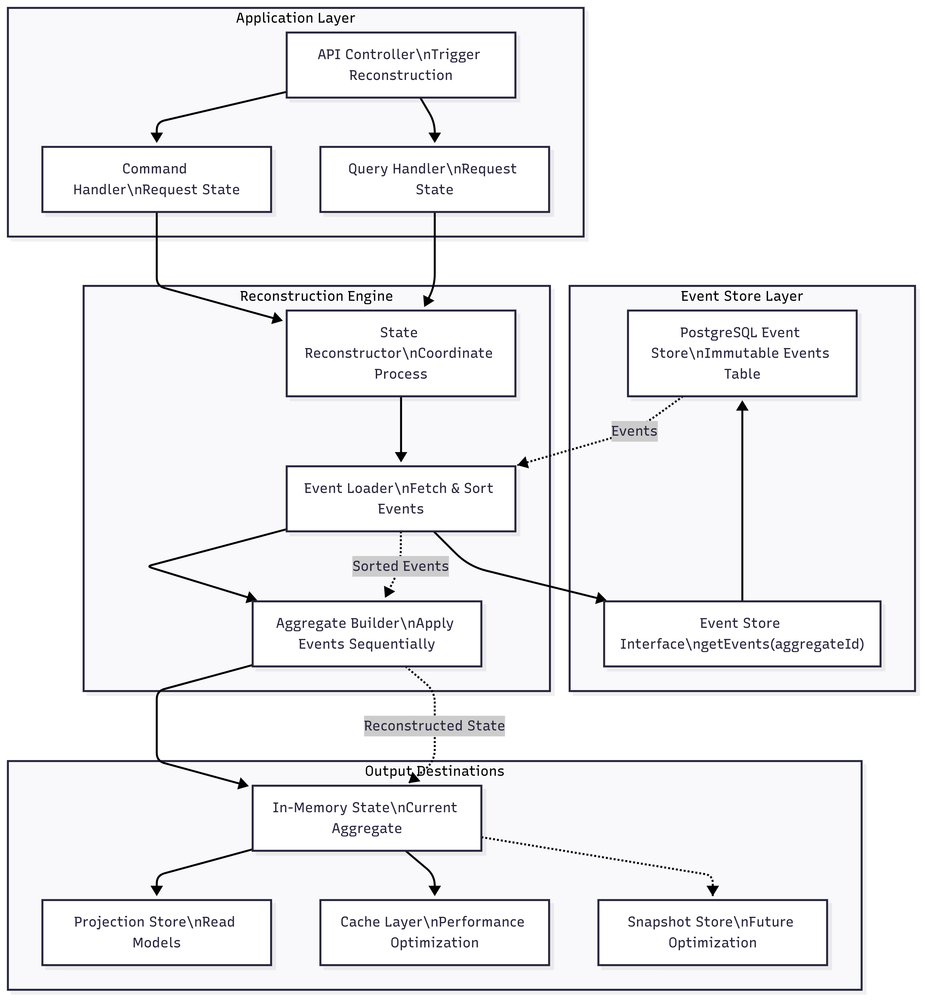
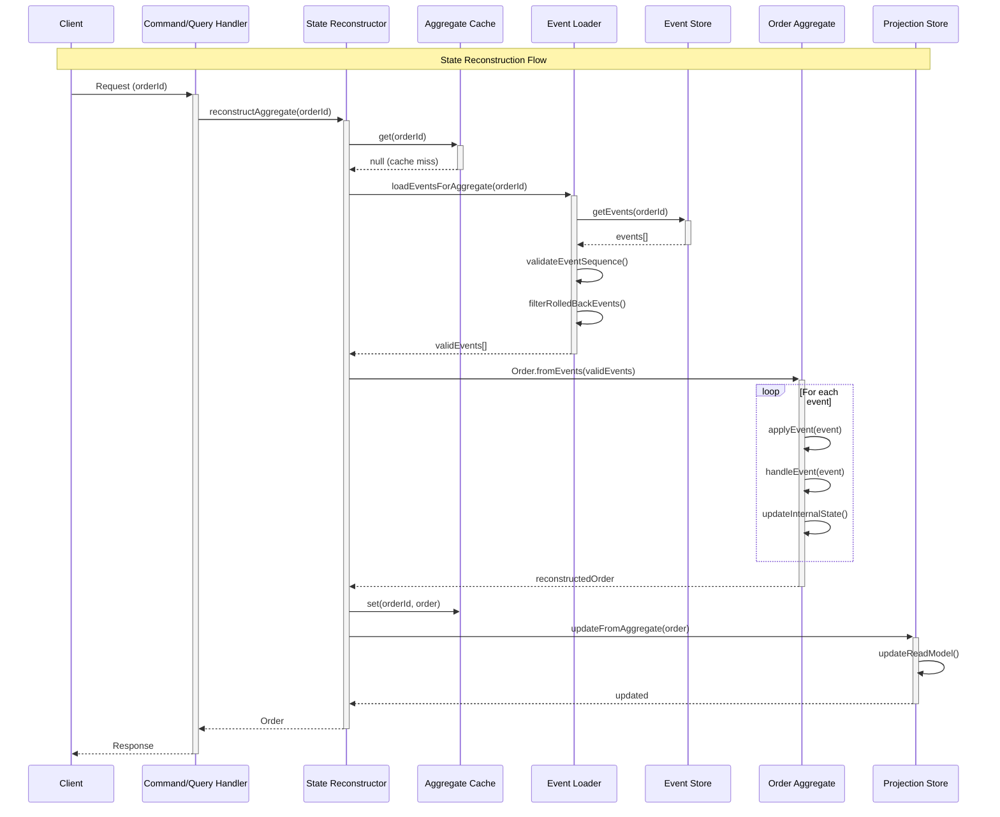
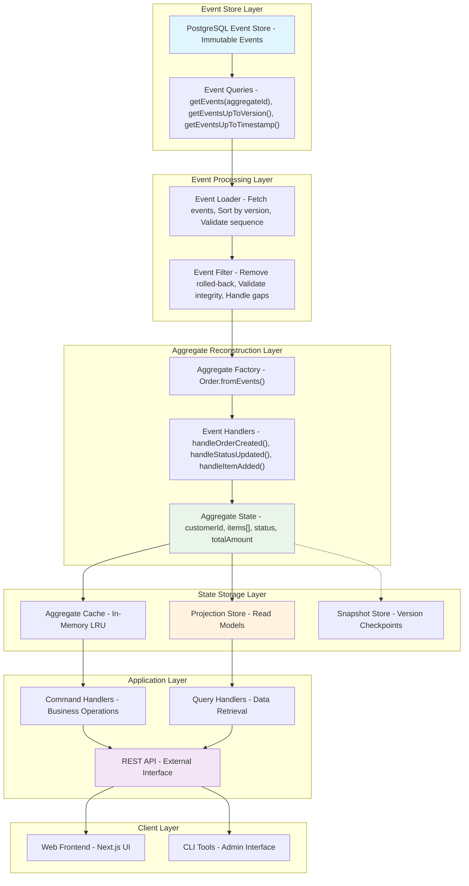
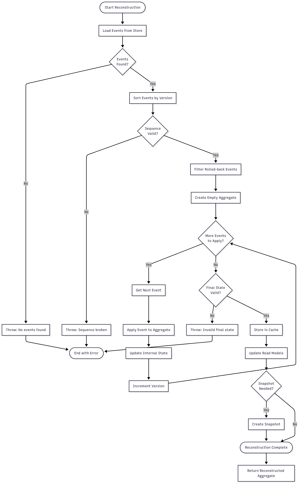

# Event Sourcing - Cơ chế Tái tạo Trạng thái từ Sự kiện

## 🎯 Tổng quan Cơ chế State Reconstruction

**State Reconstruction** là cơ chế core của Event Sourcing, cho phép tái tạo lại trạng thái của bất kỳ aggregate nào tại bất kỳ thời điểm nào bằng cách replay các events đã được lưu trữ. Đây là foundation cho audit trail, time travel, và debugging capabilities.

### Câu hỏi cốt lõi được trả lời:
- 📊 **Sự kiện lấy từ đâu?** → Event Store (PostgreSQL)
- 🔄 **Cách đọc & tổ chức sự kiện?** → Theo aggregate ID, ordered by version
- 🏛️ **Ai áp dụng sự kiện?** → Aggregate với hàm `applyEvent()`
- 💾 **State lưu ở đâu?** → In-memory, Projections, Snapshots (future)
- 🛠️ **Công cụ nào dùng?** → TypeScript, PostgreSQL, Custom Event Store
- 📋 **Các bước triển khai?** → Load → Sort → Apply → Reconstruct

---

## 🏗️ Architecture Overview - State Reconstruction Flow


---

## 📊 1. Sự kiện Lấy từ Đâu? - Event Store Source

### PostgreSQL Event Store Schema
```sql
-- Events table - Source of truth
CREATE TABLE events (
    id UUID PRIMARY KEY DEFAULT uuid_generate_v4(),
    aggregate_id VARCHAR(255) NOT NULL,           -- Aggregate identifier
    aggregate_type VARCHAR(100) NOT NULL DEFAULT 'Order',
    event_type VARCHAR(100) NOT NULL,             -- Event type name
    event_data JSONB NOT NULL,                    -- Event payload
    version INTEGER NOT NULL,                     -- Event version (sequence)
    timestamp TIMESTAMP WITH TIME ZONE DEFAULT CURRENT_TIMESTAMP,
    metadata JSONB DEFAULT '{}',                  -- Additional metadata
    
    -- Constraints for data integrity
    UNIQUE(aggregate_id, version),
    CHECK (version > 0)
);

-- Indexes for efficient event retrieval
CREATE INDEX idx_events_aggregate_id ON events(aggregate_id);
CREATE INDEX idx_events_aggregate_type ON events(aggregate_type);
CREATE INDEX idx_events_version ON events(aggregate_id, version);
CREATE INDEX idx_events_timestamp ON events(timestamp);
CREATE INDEX idx_events_event_type ON events(event_type);
```

### Event Store Interface Implementation
```typescript
// Event Store Interface - Abstract contract
interface EventStore {
  // Core reconstruction methods
  getEvents(aggregateId: string, fromVersion?: number): Promise<DomainEvent[]>;
  getEventsUpToVersion(aggregateId: string, toVersion: number): Promise<DomainEvent[]>;
  getEventsUpToTimestamp(aggregateId: string, timestamp: Date): Promise<DomainEvent[]>;
  
  // Additional retrieval methods
  getAllEvents(offset?: number, limit?: number): Promise<DomainEvent[]>;
  getEventsByType(eventType: string): Promise<DomainEvent[]>;
  getAggregateVersion(aggregateId: string): Promise<number>;
}

// PostgreSQL Event Store Implementation
class PostgresEventStore implements EventStore {
  constructor(private pool: Pool) {}
  
  async getEvents(aggregateId: string, fromVersion: number = 1): Promise<DomainEvent[]> {
    const query = `
      SELECT id, aggregate_id, event_type, event_data, version, timestamp, metadata
      FROM events 
      WHERE aggregate_id = $1 AND version >= $2
      ORDER BY version ASC
    `;
    
    const result = await this.pool.query(query, [aggregateId, fromVersion]);
    
    return result.rows.map(row => this.mapRowToEvent(row));
  }
  
  async getEventsUpToVersion(aggregateId: string, toVersion: number): Promise<DomainEvent[]> {
    const query = `
      SELECT id, aggregate_id, event_type, event_data, version, timestamp, metadata
      FROM events 
      WHERE aggregate_id = $1 AND version <= $2
      ORDER BY version ASC
    `;
    
    const result = await this.pool.query(query, [aggregateId, toVersion]);
    
    return result.rows.map(row => this.mapRowToEvent(row));
  }
  
  async getEventsUpToTimestamp(aggregateId: string, timestamp: Date): Promise<DomainEvent[]> {
    const query = `
      SELECT id, aggregate_id, event_type, event_data, version, timestamp, metadata
      FROM events 
      WHERE aggregate_id = $1 AND timestamp <= $2
      ORDER BY version ASC
    `;
    
    const result = await this.pool.query(query, [aggregateId, timestamp]);
    
    return result.rows.map(row => this.mapRowToEvent(row));
  }
  
  private mapRowToEvent(row: any): DomainEvent {
    return {
      id: row.id,
      aggregateId: row.aggregate_id,
      eventType: row.event_type,
      eventData: row.event_data,
      version: row.version,
      timestamp: row.timestamp,
      metadata: row.metadata || {}
    };
  }
}
```

---

## 🔄 2. Cách Đọc & Tổ chức Sự kiện - Event Organization

### Event Loading Strategies

#### Strategy 1: Load All Events (Current Implementation)
```typescript
// Complete event history loading
class AllEventsLoader {
  constructor(private eventStore: EventStore) {}
  
  async loadEventsForAggregate(aggregateId: string): Promise<DomainEvent[]> {
    console.log(`Loading all events for aggregate: ${aggregateId}`);
    
    const startTime = Date.now();
    const events = await this.eventStore.getEvents(aggregateId);
    const loadTime = Date.now() - startTime;
    
    console.log(`Loaded ${events.length} events in ${loadTime}ms`);
    
    // Validate event sequence
    this.validateEventSequence(events);
    
    return events;
  }
  
  private validateEventSequence(events: DomainEvent[]): void {
    for (let i = 0; i < events.length; i++) {
      const expectedVersion = i + 1;
      if (events[i].version !== expectedVersion) {
        throw new Error(
          `Event sequence broken. Expected version ${expectedVersion}, got ${events[i].version}`
        );
      }
    }
  }
}
```

#### Strategy 2: Snapshot-based Loading (Future Implementation)
```typescript
// Snapshot + incremental events loading
class SnapshotBasedLoader {
  constructor(
    private eventStore: EventStore,
    private snapshotStore: SnapshotStore
  ) {}
  
  async loadEventsForAggregate(aggregateId: string): Promise<{
    snapshot: AggregateSnapshot | null;
    events: DomainEvent[];
  }> {
    // Try to load latest snapshot
    const snapshot = await this.snapshotStore.getLatestSnapshot(aggregateId);
    
    if (snapshot) {
      // Load events after snapshot
      const events = await this.eventStore.getEvents(aggregateId, snapshot.version + 1);
      
      console.log(`Loaded snapshot at version ${snapshot.version} + ${events.length} incremental events`);
      
      return { snapshot, events };
    } else {
      // No snapshot, load all events
      const events = await this.eventStore.getEvents(aggregateId);
      
      console.log(`No snapshot found, loaded ${events.length} events from beginning`);
      
      return { snapshot: null, events };
    }
  }
}
```

#### Strategy 3: Time-based Loading
```typescript
// Point-in-time reconstruction
class TimeBasedLoader {
  constructor(private eventStore: EventStore) {}
  
  async loadEventsUpToTimestamp(
    aggregateId: string, 
    timestamp: Date
  ): Promise<DomainEvent[]> {
    console.log(`Loading events for ${aggregateId} up to ${timestamp.toISOString()}`);
    
    const events = await this.eventStore.getEventsUpToTimestamp(aggregateId, timestamp);
    
    console.log(`Loaded ${events.length} events for point-in-time reconstruction`);
    
    return events;
  }
  
  async loadEventsInTimeRange(
    aggregateId: string,
    fromTime: Date,
    toTime: Date
  ): Promise<DomainEvent[]> {
    const allEvents = await this.eventStore.getEvents(aggregateId);
    
    return allEvents.filter(event => 
      event.timestamp >= fromTime && event.timestamp <= toTime
    );
  }
}
```

### Event Sorting & Validation
```typescript
class EventProcessor {
  static sortEvents(events: DomainEvent[]): DomainEvent[] {
    return events.sort((a, b) => {
      // Primary sort by version
      if (a.version !== b.version) {
        return a.version - b.version;
      }
      
      // Secondary sort by timestamp (for same version - should not happen)
      return a.timestamp.getTime() - b.timestamp.getTime();
    });
  }
  
  static validateEventIntegrity(events: DomainEvent[]): void {
    if (events.length === 0) return;
    
    // Check for version gaps
    for (let i = 1; i < events.length; i++) {
      const currentVersion = events[i].version;
      const previousVersion = events[i - 1].version;
      
      if (currentVersion !== previousVersion + 1) {
        throw new Error(
          `Version gap detected between ${previousVersion} and ${currentVersion}`
        );
      }
    }
    
    // Check for duplicate versions
    const versions = events.map(e => e.version);
    const uniqueVersions = new Set(versions);
    
    if (versions.length !== uniqueVersions.size) {
      throw new Error('Duplicate event versions detected');
    }
  }
  
  static filterRolledBackEvents(events: DomainEvent[]): DomainEvent[] {
    const rolledBackVersions = new Set<number>();
    
    // Collect rolled back versions
    events.forEach(event => {
      if (event.eventType === 'OrderRolledBack') {
        const rollbackData = event.eventData as any;
        if (rollbackData.targetVersion) {
          // Mark all events after target version as rolled back
          for (let v = rollbackData.targetVersion + 1; v < event.version; v++) {
            rolledBackVersions.add(v);
          }
        }
      }
    });
    
    // Filter out rolled back events
    return events.filter(event => !rolledBackVersions.has(event.version));
  }
}
```

---

## 🏛️ 3. Ai Áp dụng Sự kiện? - Aggregate Event Application

### Aggregate Base Class với State Reconstruction
```typescript
// Base aggregate class with event sourcing capabilities
abstract class AggregateRoot {
  protected id: string;
  protected version: number = 0;
  private uncommittedEvents: DomainEvent[] = [];
  
  constructor(id?: string) {
    this.id = id || uuidv4();
  }
  
  // Static factory method for reconstruction
  static fromEvents<T extends AggregateRoot>(
    this: new (id?: string) => T,
    events: DomainEvent[]
  ): T {
    if (events.length === 0) {
      throw new Error('Cannot reconstruct aggregate from empty event list');
    }
    
    // Create new instance
    const aggregate = new this(events[0].aggregateId);
    
    // Apply all events to reconstruct state
    events.forEach(event => {
      aggregate.applyEvent(event, false); // false = don't track as uncommitted
    });
    
    console.log(`Reconstructed aggregate ${aggregate.id} to version ${aggregate.version}`);
    
    return aggregate;
  }
  
  // Apply event to aggregate state
  protected applyEvent(event: DomainEvent, isNew: boolean = true): void {
    // Delegate to specific event handler
    this.handleEvent(event);
    
    // Update version
    this.version = event.version;
    
    // Track new events
    if (isNew) {
      this.uncommittedEvents.push(event);
    }
  }
  
  // Abstract method for event handling
  protected abstract handleEvent(event: DomainEvent): void;
  
  // Get events for persistence
  public getUncommittedEvents(): DomainEvent[] {
    return [...this.uncommittedEvents];
  }
  
  // Mark events as committed
  public markEventsAsCommitted(): void {
    this.uncommittedEvents = [];
  }
  
  // Get current state info
  public getAggregateInfo(): AggregateInfo {
    return {
      id: this.id,
      version: this.version,
      uncommittedEventCount: this.uncommittedEvents.length
    };
  }
}

interface AggregateInfo {
  id: string;
  version: number;
  uncommittedEventCount: number;
}
```

### Order Aggregate Implementation
```typescript
// Order aggregate with comprehensive event handling
class Order extends AggregateRoot {
  private customerId: string = '';
  private items: OrderItem[] = [];
  private status: OrderStatus = OrderStatus.PENDING;
  private totalAmount: number = 0;
  private createdAt: Date = new Date();
  private updatedAt: Date = new Date();
  
  // Static factory for creating new orders
  static create(orderId: string, customerId: string): Order {
    const order = new Order(orderId);
    
    const event = new OrderCreatedEvent({
      orderId,
      customerId,
      items: [],
      status: OrderStatus.PENDING,
      timestamp: new Date(),
      version: 1
    });
    
    order.applyEvent(event);
    return order;
  }
  
  // Event handler dispatcher
  protected handleEvent(event: DomainEvent): void {
    switch (event.eventType) {
      case 'OrderCreated':
        this.handleOrderCreated(event as OrderCreatedEvent);
        break;
      case 'OrderStatusUpdated':
        this.handleOrderStatusUpdated(event as OrderStatusUpdatedEvent);
        break;
      case 'OrderItemAdded':
        this.handleOrderItemAdded(event as OrderItemAddedEvent);
        break;
      case 'OrderItemRemoved':
        this.handleOrderItemRemoved(event as OrderItemRemovedEvent);
        break;
      case 'OrderRolledBack':
        this.handleOrderRolledBack(event as OrderRolledBackEvent);
        break;
      default:
        console.warn(`Unknown event type: ${event.eventType}`);
    }
  }
  
  // Individual event handlers
  private handleOrderCreated(event: OrderCreatedEvent): void {
    this.customerId = event.eventData.customerId;
    this.items = [...event.eventData.items];
    this.status = event.eventData.status;
    this.createdAt = event.timestamp;
    this.updatedAt = event.timestamp;
    this.recalculateTotal();
    
    console.log(`Order created: ${this.id} for customer ${this.customerId}`);
  }
  
  private handleOrderStatusUpdated(event: OrderStatusUpdatedEvent): void {
    const oldStatus = this.status;
    this.status = event.eventData.newStatus;
    this.updatedAt = event.timestamp;
    
    console.log(`Order ${this.id} status changed: ${oldStatus} → ${this.status}`);
  }
  
  private handleOrderItemAdded(event: OrderItemAddedEvent): void {
    const newItem = event.eventData.item;
    
    // Check if item already exists
    const existingItemIndex = this.items.findIndex(item => 
      item.productId === newItem.productId
    );
    
    if (existingItemIndex >= 0) {
      // Update existing item quantity
      this.items[existingItemIndex].quantity += newItem.quantity;
    } else {
      // Add new item
      this.items.push({...newItem});
    }
    
    this.updatedAt = event.timestamp;
    this.recalculateTotal();
    
    console.log(`Item added to order ${this.id}: ${newItem.productId} x${newItem.quantity}`);
  }
  
  private handleOrderItemRemoved(event: OrderItemRemovedEvent): void {
    const productId = event.eventData.productId;
    
    this.items = this.items.filter(item => item.productId !== productId);
    this.updatedAt = event.timestamp;
    this.recalculateTotal();
    
    console.log(`Item removed from order ${this.id}: ${productId}`);
  }
  
  private handleOrderRolledBack(event: OrderRolledBackEvent): void {
    // Rollback handling is done at the event filtering level
    // This handler mainly for logging
    console.log(`Order ${this.id} rolled back to version ${event.eventData.targetVersion}`);
  }
  
  // Helper methods
  private recalculateTotal(): void {
    this.totalAmount = this.items.reduce((total, item) => 
      total + (item.price * item.quantity), 0
    );
  }
  
  // Getters for current state
  public getCurrentState(): OrderState {
    return {
      id: this.id,
      customerId: this.customerId,
      items: [...this.items],
      status: this.status,
      totalAmount: this.totalAmount,
      createdAt: this.createdAt,
      updatedAt: this.updatedAt,
      version: this.version
    };
  }
  
  // Business methods (for new operations)
  public updateStatus(newStatus: OrderStatus, reason?: string): void {
    if (!this.canTransitionTo(newStatus)) {
      throw new Error(`Cannot transition from ${this.status} to ${newStatus}`);
    }
    
    const event = new OrderStatusUpdatedEvent({
      orderId: this.id,
      oldStatus: this.status,
      newStatus: newStatus,
      reason: reason,
      timestamp: new Date(),
      version: this.version + 1
    });
    
    this.applyEvent(event);
  }
  
  private canTransitionTo(newStatus: OrderStatus): boolean {
    const validTransitions: Record<OrderStatus, OrderStatus[]> = {
      [OrderStatus.PENDING]: [OrderStatus.CONFIRMED, OrderStatus.CANCELLED],
      [OrderStatus.CONFIRMED]: [OrderStatus.SHIPPED, OrderStatus.CANCELLED],
      [OrderStatus.SHIPPED]: [OrderStatus.DELIVERED],
      [OrderStatus.DELIVERED]: [],
      [OrderStatus.CANCELLED]: []
    };
    
    return validTransitions[this.status].includes(newStatus);
  }
}

interface OrderState {
  id: string;
  customerId: string;
  items: OrderItem[];
  status: OrderStatus;
  totalAmount: number;
  createdAt: Date;
  updatedAt: Date;
  version: number;
}
```

---

## 💾 4. State Lưu ở Đâu? - State Storage Destinations

### In-Memory State Management
```typescript
// In-memory aggregate cache
class AggregateCache {
  private cache: Map<string, {
    aggregate: AggregateRoot;
    lastAccessed: Date;
    version: number;
  }> = new Map();
  
  private readonly maxSize = 1000;
  private readonly ttl = 30 * 60 * 1000; // 30 minutes
  
  set(aggregateId: string, aggregate: AggregateRoot): void {
    // Implement LRU eviction if cache is full
    if (this.cache.size >= this.maxSize) {
      this.evictOldest();
    }
    
    this.cache.set(aggregateId, {
      aggregate: aggregate,
      lastAccessed: new Date(),
      version: aggregate.getAggregateInfo().version
    });
  }
  
  get(aggregateId: string): AggregateRoot | null {
    const entry = this.cache.get(aggregateId);
    
    if (!entry) return null;
    
    // Check TTL
    if (Date.now() - entry.lastAccessed.getTime() > this.ttl) {
      this.cache.delete(aggregateId);
      return null;
    }
    
    // Update last accessed
    entry.lastAccessed = new Date();
    return entry.aggregate;
  }
  
  private evictOldest(): void {
    let oldestKey = '';
    let oldestTime = Date.now();
    
    for (const [key, value] of this.cache.entries()) {
      if (value.lastAccessed.getTime() < oldestTime) {
        oldestTime = value.lastAccessed.getTime();
        oldestKey = key;
      }
    }
    
    if (oldestKey) {
      this.cache.delete(oldestKey);
    }
  }
}
```

### Projection Store (Read Models)
```typescript
// Projection store for optimized read access
class OrderProjectionStore {
  private orders: Map<string, OrderReadModel> = new Map();
  private customerOrders: Map<string, string[]> = new Map();
  private statusOrders: Map<OrderStatus, string[]> = new Map();
  
  updateFromAggregate(order: Order): void {
    const state = order.getCurrentState();
    
    const readModel: OrderReadModel = {
      id: state.id,
      customerId: state.customerId,
      items: state.items,
      status: state.status,
      totalAmount: state.totalAmount,
      itemCount: state.items.length,
      createdAt: state.createdAt,
      updatedAt: state.updatedAt,
      version: state.version
    };
    
    // Update main index
    this.orders.set(state.id, readModel);
    
    // Update customer index
    if (!this.customerOrders.has(state.customerId)) {
      this.customerOrders.set(state.customerId, []);
    }
    if (!this.customerOrders.get(state.customerId)!.includes(state.id)) {
      this.customerOrders.get(state.customerId)!.push(state.id);
    }
    
    // Update status index
    if (!this.statusOrders.has(state.status)) {
      this.statusOrders.set(state.status, []);
    }
    if (!this.statusOrders.get(state.status)!.includes(state.id)) {
      this.statusOrders.get(state.status)!.push(state.id);
    }
  }
  
  getOrder(orderId: string): OrderReadModel | null {
    return this.orders.get(orderId) || null;
  }
  
  getOrdersByCustomer(customerId: string): OrderReadModel[] {
    const orderIds = this.customerOrders.get(customerId) || [];
    return orderIds.map(id => this.orders.get(id)!).filter(Boolean);
  }
  
  getOrdersByStatus(status: OrderStatus): OrderReadModel[] {
    const orderIds = this.statusOrders.get(status) || [];
    return orderIds.map(id => this.orders.get(id)!).filter(Boolean);
  }
}

interface OrderReadModel {
  id: string;
  customerId: string;
  items: OrderItem[];
  status: OrderStatus;
  totalAmount: number;
  itemCount: number;
  createdAt: Date;
  updatedAt: Date;
  version: number;
}
```

### Snapshot Store (Future Implementation)
```typescript
// Snapshot store for performance optimization
interface AggregateSnapshot {
  aggregateId: string;
  aggregateType: string;
  version: number;
  timestamp: Date;
  data: any;
}

class SnapshotStore {
  constructor(private pool: Pool) {}
  
  async saveSnapshot(
    aggregateId: string,
    aggregateType: string,
    version: number,
    data: any
  ): Promise<void> {
    const query = `
      INSERT INTO snapshots (aggregate_id, aggregate_type, version, timestamp, data)
      VALUES ($1, $2, $3, $4, $5)
      ON CONFLICT (aggregate_id) 
      DO UPDATE SET 
        version = EXCLUDED.version,
        timestamp = EXCLUDED.timestamp,
        data = EXCLUDED.data
    `;
    
    await this.pool.query(query, [
      aggregateId,
      aggregateType,
      version,
      new Date(),
      JSON.stringify(data)
    ]);
  }
  
  async getLatestSnapshot(aggregateId: string): Promise<AggregateSnapshot | null> {
    const query = `
      SELECT aggregate_id, aggregate_type, version, timestamp, data
      FROM snapshots
      WHERE aggregate_id = $1
      ORDER BY version DESC
      LIMIT 1
    `;
    
    const result = await this.pool.query(query, [aggregateId]);
    
    if (result.rows.length === 0) return null;
    
    const row = result.rows[0];
    return {
      aggregateId: row.aggregate_id,
      aggregateType: row.aggregate_type,
      version: row.version,
      timestamp: row.timestamp,
      data: JSON.parse(row.data)
    };
  }
}
```

---

## 🛠️ 5. Công cụ Thực hiện - Implementation Tools

### State Reconstructor Service
```typescript
// Main service for state reconstruction
class StateReconstructorService {
  constructor(
    private eventStore: EventStore,
    private aggregateCache: AggregateCache,
    private projectionStore: OrderProjectionStore,
    private snapshotStore?: SnapshotStore
  ) {}
  
  // Reconstruct aggregate to current state
  async reconstructAggregate(aggregateId: string): Promise<Order> {
    console.log(`Starting reconstruction for aggregate: ${aggregateId}`);
    
    // Check cache first
    const cached = this.aggregateCache.get(aggregateId);
    if (cached && cached instanceof Order) {
      console.log(`Aggregate ${aggregateId} found in cache`);
      return cached;
    }
    
    // Load events and reconstruct
    const events = await this.eventStore.getEvents(aggregateId);
    
    if (events.length === 0) {
      throw new Error(`No events found for aggregate: ${aggregateId}`);
    }
    
    // Filter out rolled-back events
    const validEvents = EventProcessor.filterRolledBackEvents(events);
    
    // Reconstruct aggregate
    const order = Order.fromEvents(validEvents);
    
    // Cache the result
    this.aggregateCache.set(aggregateId, order);
    
    // Update projection
    this.projectionStore.updateFromAggregate(order);
    
    console.log(`Aggregate ${aggregateId} reconstructed to version ${order.getAggregateInfo().version}`);
    
    return order;
  }
  
  // Reconstruct to specific version
  async reconstructToVersion(aggregateId: string, version: number): Promise<Order> {
    console.log(`Reconstructing ${aggregateId} to version ${version}`);
    
    const events = await this.eventStore.getEventsUpToVersion(aggregateId, version);
    
    if (events.length === 0) {
      throw new Error(`No events found for aggregate: ${aggregateId}`);
    }
    
    // Filter and reconstruct
    const validEvents = EventProcessor.filterRolledBackEvents(events);
    const order = Order.fromEvents(validEvents);
    
    console.log(`Aggregate ${aggregateId} reconstructed to version ${version}`);
    
    return order;
  }
  
  // Reconstruct to specific timestamp
  async reconstructToTimestamp(aggregateId: string, timestamp: Date): Promise<Order> {
    console.log(`Reconstructing ${aggregateId} to timestamp ${timestamp.toISOString()}`);
    
    const events = await this.eventStore.getEventsUpToTimestamp(aggregateId, timestamp);
    
    if (events.length === 0) {
      throw new Error(`No events found for aggregate: ${aggregateId} before ${timestamp.toISOString()}`);
    }
    
    // Filter and reconstruct
    const validEvents = EventProcessor.filterRolledBackEvents(events);
    const order = Order.fromEvents(validEvents);
    
    console.log(`Aggregate ${aggregateId} reconstructed to timestamp ${timestamp.toISOString()}`);
    
    return order;
  }
  
  // Rebuild all projections
  async rebuildAllProjections(): Promise<void> {
    console.log('Starting projection rebuild...');
    
    const allEvents = await this.eventStore.getAllEvents();
    
    // Group events by aggregate
    const eventsByAggregate = new Map<string, DomainEvent[]>();
    
    allEvents.forEach(event => {
      if (!eventsByAggregate.has(event.aggregateId)) {
        eventsByAggregate.set(event.aggregateId, []);
      }
      eventsByAggregate.get(event.aggregateId)!.push(event);
    });
    
    // Reconstruct each aggregate and update projections
    for (const [aggregateId, events] of eventsByAggregate) {
      try {
        const validEvents = EventProcessor.filterRolledBackEvents(events);
        const order = Order.fromEvents(validEvents);
        this.projectionStore.updateFromAggregate(order);
        
        console.log(`Rebuilt projection for aggregate: ${aggregateId}`);
      } catch (error) {
        console.error(`Failed to rebuild projection for ${aggregateId}:`, error);
      }
    }
    
    console.log('Projection rebuild completed');
  }
}
```

### Command Handler Integration
```typescript
// Command handler using state reconstruction
class OrderCommandHandler {
  constructor(
    private stateReconstructor: StateReconstructorService,
    private eventStore: EventStore
  ) {}
  
  async handle(command: UpdateOrderStatusCommand): Promise<void> {
    // Reconstruct current state
    const order = await this.stateReconstructor.reconstructAggregate(command.orderId);
    
    // Execute business operation
    order.updateStatus(command.status, command.reason);
    
    // Save new events
    const newEvents = order.getUncommittedEvents();
    await this.eventStore.saveEvents(
      command.orderId,
      order.getAggregateInfo().version - newEvents.length,
      newEvents
    );
    
    // Mark events as committed
    order.markEventsAsCommitted();
    
    console.log(`Order ${command.orderId} status updated to ${command.status}`);
  }
}
```

---

## 📋 6. Các Bước Triển khai Cụ thể - Implementation Steps

### Step-by-Step Reconstruction Process



### Implementation Steps Detail

#### Step 1: Initialize Event Store Connection
```typescript
async function initializeEventStore(): Promise<EventStore> {
  const pool = new Pool({
    host: process.env.DB_HOST || 'localhost',
    port: 5432,
    database: 'order_management',
    user: process.env.DB_USER || 'app_user',
    password: process.env.DB_PASSWORD,
    max: 20,
    idleTimeoutMillis: 30000,
    connectionTimeoutMillis: 2000,
  });
  
  // Test connection
  const client = await pool.connect();
  await client.query('SELECT NOW()');
  client.release();
  
  console.log('Event store connection established');
  
  return new PostgresEventStore(pool);
}
```

#### Step 2: Setup Caching and Projection Layers
```typescript
async function initializeStateManagement(): Promise<{
  cache: AggregateCache;
  projectionStore: OrderProjectionStore;
}> {
  const cache = new AggregateCache();
  const projectionStore = new OrderProjectionStore();
  
  console.log('State management layers initialized');
  
  return { cache, projectionStore };
}
```

#### Step 3: Create State Reconstructor Service
```typescript
async function initializeStateReconstructor(
  eventStore: EventStore,
  cache: AggregateCache,
  projectionStore: OrderProjectionStore
): Promise<StateReconstructorService> {
  const reconstructor = new StateReconstructorService(
    eventStore,
    cache,
    projectionStore
  );
  
  console.log('State reconstructor service initialized');
  
  return reconstructor;
}
```

#### Step 4: Implement Reconstruction API Endpoints
```typescript
// API endpoints for state reconstruction
class ReconstructionController {
  constructor(private stateReconstructor: StateReconstructorService) {}
  
  // Get current state
  async getCurrentState(req: Request, res: Response): Promise<void> {
    try {
      const { orderId } = req.params;
      
      const order = await this.stateReconstructor.reconstructAggregate(orderId);
      const state = order.getCurrentState();
      
      res.json({
        success: true,
        data: state,
        reconstructedAt: new Date().toISOString()
      });
    } catch (error) {
      res.status(404).json({
        success: false,
        error: error.message
      });
    }
  }
  
  // Get state at specific version
  async getStateAtVersion(req: Request, res: Response): Promise<void> {
    try {
      const { orderId } = req.params;
      const { version } = req.query;
      
      const order = await this.stateReconstructor.reconstructToVersion(
        orderId,
        parseInt(version as string)
      );
      
      const state = order.getCurrentState();
      
      res.json({
        success: true,
        data: state,
        targetVersion: version,
        reconstructedAt: new Date().toISOString()
      });
    } catch (error) {
      res.status(400).json({
        success: false,
        error: error.message
      });
    }
  }
  
  // Get state at specific timestamp
  async getStateAtTimestamp(req: Request, res: Response): Promise<void> {
    try {
      const { orderId } = req.params;
      const { timestamp } = req.query;
      
      const targetTime = new Date(timestamp as string);
      const order = await this.stateReconstructor.reconstructToTimestamp(
        orderId,
        targetTime
      );
      
      const state = order.getCurrentState();
      
      res.json({
        success: true,
        data: state,
        targetTimestamp: timestamp,
        reconstructedAt: new Date().toISOString()
      });
    } catch (error) {
      res.status(400).json({
        success: false,
        error: error.message
      });
    }
  }
  
  // Rebuild all projections
  async rebuildProjections(req: Request, res: Response): Promise<void> {
    try {
      await this.stateReconstructor.rebuildAllProjections();
      
      res.json({
        success: true,
        message: 'All projections rebuilt successfully',
        rebuiltAt: new Date().toISOString()
      });
    } catch (error) {
      res.status(500).json({
        success: false,
        error: error.message
      });
    }
  }
}
```

#### Step 5: Performance Monitoring
```typescript
// Performance monitoring for state reconstruction
class ReconstructionMetrics {
  private reconstructionTimes: number[] = [];
  private eventCounts: number[] = [];
  private cacheHitRate = 0;
  private totalReconstructions = 0;
  private cacheHits = 0;
  
  recordReconstruction(
    timeTaken: number,
    eventCount: number,
    wasCacheHit: boolean
  ): void {
    this.reconstructionTimes.push(timeTaken);
    this.eventCounts.push(eventCount);
    this.totalReconstructions++;
    
    if (wasCacheHit) {
      this.cacheHits++;
    }
    
    this.cacheHitRate = (this.cacheHits / this.totalReconstructions) * 100;
  }
  
  getStatistics(): ReconstructionStats {
    return {
      averageReconstructionTime: this.average(this.reconstructionTimes),
      medianReconstructionTime: this.median(this.reconstructionTimes),
      averageEventCount: this.average(this.eventCounts),
      cacheHitRate: this.cacheHitRate,
      totalReconstructions: this.totalReconstructions
    };
  }
  
  private average(numbers: number[]): number {
    return numbers.length > 0 ? numbers.reduce((a, b) => a + b, 0) / numbers.length : 0;
  }
  
  private median(numbers: number[]): number {
    if (numbers.length === 0) return 0;
    
    const sorted = [...numbers].sort((a, b) => a - b);
    const mid = Math.floor(sorted.length / 2);
    
    return sorted.length % 2 === 0
      ? (sorted[mid - 1] + sorted[mid]) / 2
      : sorted[mid];
  }
}

interface ReconstructionStats {
  averageReconstructionTime: number;
  medianReconstructionTime: number;
  averageEventCount: number;
  cacheHitRate: number;
  totalReconstructions: number;
}
```

---

## 📊 7. Luồng Dữ liệu Chi tiết - Data Flow Diagram

### Complete Data Flow from Events to State



### Detailed Event-to-State Transformation Flow


### Event Processing Timeline

```mermaid
gantt
    title Event-to-State Reconstruction Timeline
    dateFormat X
    axisFormat %s
    
    section Event Loading
    Fetch Events        :0, 50
    Validate Sequence   :50, 75
    Filter Rollbacks    :75, 100
    
    section State Building
    Create Aggregate    :100, 110
    Apply Event 1       :110, 120
    Apply Event 2       :120, 130
    Apply Event 3       :130, 140
    Apply Event N       :140, 200
    
    section State Storage
    Validate State      :200, 210
    Update Cache        :210, 220
    Update Projections  :220, 250
    Create Snapshot     :250, 300
    
    section Response
    Return Aggregate    :300, 320
```



---

## 🎯 Demo Scenarios & Examples

### Demo 1: Basic State Reconstruction
```typescript
async function demonstrateBasicReconstruction() {
  console.log('=== Demo: Basic State Reconstruction ===');
  
  const orderId = 'order-123';
  
  // Reconstruct current state
  const startTime = Date.now();
  const order = await stateReconstructor.reconstructAggregate(orderId);
  const reconstructionTime = Date.now() - startTime;
  
  const state = order.getCurrentState();
  
  console.log(`Reconstruction completed in ${reconstructionTime}ms`);
  console.log(`Order ID: ${state.id}`);
  console.log(`Customer: ${state.customerId}`);
  console.log(`Status: ${state.status}`);
  console.log(`Items: ${state.items.length}`);
  console.log(`Total: $${state.totalAmount}`);
  console.log(`Version: ${state.version}`);
}
```

### Demo 2: Time Travel Reconstruction
```typescript
async function demonstrateTimeTravelReconstruction() {
  console.log('=== Demo: Time Travel Reconstruction ===');
  
  const orderId = 'order-123';
  const targetTimestamp = new Date('2025-08-18T10:30:00Z');
  
  // Reconstruct state at specific time
  const pastOrder = await stateReconstructor.reconstructToTimestamp(
    orderId,
    targetTimestamp
  );
  
  // Compare with current state
  const currentOrder = await stateReconstructor.reconstructAggregate(orderId);
  
  const pastState = pastOrder.getCurrentState();
  const currentState = currentOrder.getCurrentState();
  
  console.log('=== State Comparison ===');
  console.log(`Past (${targetTimestamp.toISOString()}):`);
  console.log(`  Status: ${pastState.status}`);
  console.log(`  Items: ${pastState.items.length}`);
  console.log(`  Total: $${pastState.totalAmount}`);
  console.log(`  Version: ${pastState.version}`);
  
  console.log(`Current:`);
  console.log(`  Status: ${currentState.status}`);
  console.log(`  Items: ${currentState.items.length}`);
  console.log(`  Total: $${currentState.totalAmount}`);
  console.log(`  Version: ${currentState.version}`);
}
```

### Demo 3: Performance Analysis
```typescript
async function demonstratePerformanceAnalysis() {
  console.log('=== Demo: Performance Analysis ===');
  
  const metrics = new ReconstructionMetrics();
  const orderIds = ['order-1', 'order-2', 'order-3', 'order-4', 'order-5'];
  
  for (const orderId of orderIds) {
    const startTime = Date.now();
    
    try {
      const order = await stateReconstructor.reconstructAggregate(orderId);
      const endTime = Date.now();
      
      const timeTaken = endTime - startTime;
      const eventCount = order.getAggregateInfo().version;
      const wasCacheHit = timeTaken < 10; // Assume cache hit if very fast
      
      metrics.recordReconstruction(timeTaken, eventCount, wasCacheHit);
      
      console.log(`${orderId}: ${timeTaken}ms (${eventCount} events)`);
    } catch (error) {
      console.error(`Failed to reconstruct ${orderId}:`, error.message);
    }
  }
  
  const stats = metrics.getStatistics();
  console.log('=== Performance Statistics ===');
  console.log(`Average reconstruction time: ${stats.averageReconstructionTime.toFixed(2)}ms`);
  console.log(`Median reconstruction time: ${stats.medianReconstructionTime.toFixed(2)}ms`);
  console.log(`Average event count: ${stats.averageEventCount.toFixed(1)}`);
  console.log(`Cache hit rate: ${stats.cacheHitRate.toFixed(1)}%`);
  console.log(`Total reconstructions: ${stats.totalReconstructions}`);
}
```

---

## 🔧 Troubleshooting & Best Practices

### Common Issues & Solutions

#### Issue 1: Event Sequence Gaps
```typescript
// Problem: Missing event versions
// Solution: Implement gap detection and handling
class EventSequenceValidator {
  static validateSequence(events: DomainEvent[]): void {
    if (events.length === 0) return;
    
    const sortedEvents = events.sort((a, b) => a.version - b.version);
    
    for (let i = 0; i < sortedEvents.length - 1; i++) {
      const currentVersion = sortedEvents[i].version;
      const nextVersion = sortedEvents[i + 1].version;
      
      if (nextVersion !== currentVersion + 1) {
        throw new EventSequenceGapError(
          `Event sequence gap: version ${currentVersion} followed by ${nextVersion}`
        );
      }
    }
  }
}
```

#### Issue 2: Large Event Streams
```typescript
// Problem: Performance degradation with many events
// Solution: Implement snapshotting
class SnapshotOptimizedReconstructor {
  async reconstructWithSnapshot(aggregateId: string): Promise<Order> {
    const snapshot = await this.snapshotStore.getLatestSnapshot(aggregateId);
    
    if (snapshot) {
      // Load only events after snapshot
      const incrementalEvents = await this.eventStore.getEvents(
        aggregateId,
        snapshot.version + 1
      );
      
      // Restore from snapshot + apply incremental events
      const order = Order.fromSnapshot(snapshot.data);
      incrementalEvents.forEach(event => order.applyEvent(event, false));
      
      return order;
    } else {
      // Fallback to full reconstruction
      return this.reconstructAggregate(aggregateId);
    }
  }
}
```

#### Issue 3: Memory Usage
```typescript
// Problem: High memory usage with many aggregates
// Solution: Implement smart caching
class MemoryOptimizedCache {
  private cache = new Map<string, CacheEntry>();
  private readonly maxMemoryMB = 512;
  
  set(aggregateId: string, aggregate: AggregateRoot): void {
    // Estimate memory usage
    const memoryUsage = this.estimateMemoryUsage(aggregate);
    
    // Evict if necessary
    while (this.getTotalMemoryUsage() + memoryUsage > this.maxMemoryMB * 1024 * 1024) {
      this.evictLeastRecentlyUsed();
    }
    
    this.cache.set(aggregateId, {
      aggregate,
      lastAccessed: Date.now(),
      memoryUsage
    });
  }
  
  private estimateMemoryUsage(aggregate: AggregateRoot): number {
    // Rough estimation based on aggregate complexity
    const state = (aggregate as any).getCurrentState();
    return JSON.stringify(state).length * 2; // Rough estimate
  }
}
```

### Performance Optimization Tips

1. **Use Caching Strategically**
   - Cache frequently accessed aggregates
   - Implement LRU eviction policy
   - Monitor cache hit rates

2. **Implement Snapshotting**
   - Create snapshots every N events
   - Store snapshots efficiently
   - Validate snapshot integrity

3. **Optimize Event Queries**
   - Use proper database indexes
   - Implement event streaming for large datasets
   - Consider read replicas for queries

4. **Monitor Performance**
   - Track reconstruction times
   - Monitor memory usage
   - Alert on performance degradation

---

Cơ chế tái tạo trạng thái này cung cấp **foundation mạnh mẽ** cho Event Sourcing system với **complete auditability**, **time travel capabilities**, và **performance optimization strategies**. Implementation này đảm bảo **data consistency**, **high performance**, và **scalability** cho production use cases.
